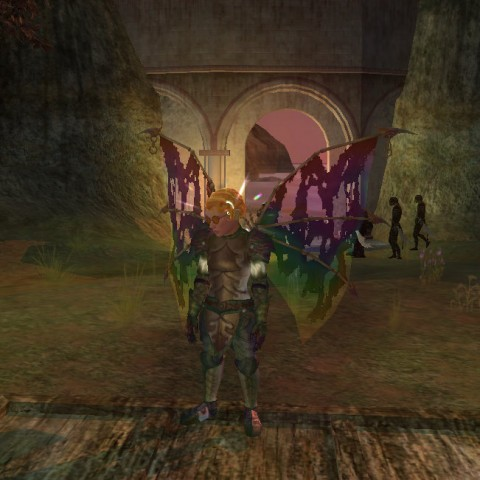

# EQ2: The Outpost of the Overlord

*Posted by Tipa on 2011-04-08 06:48:35*

Being the only player in the Outpost of the Overlord is like being the only kid at Disneyland. Rides aren't as fun without someone else there! But at level 10, there's absolutely nothing that gives my little coercer any experience.

Once she leaves the Outpost, though, it's gone forever. No characters can start there any more, and this beautiful little island will never see a new struggling newbie, nobody will plead for help with the cave or the pirate or the graveyard, and one of the most wonderful starting experiences I've ever had will be forgotten.

Remember when you got to the island in a boat after being fished out of the water by passing traders, thus starting your long association with the Far Seas Traders to whom you literally owed your life? Remember when you'd just figured out how to move around on the ship when drakes attacked? When you finally came safely ashore, someone demanded of you your class -- fighter, mage, scout or priest. The original Four Archetypes of EverQuest 2. The same four you see in Rift, today. As in Rift, you soon specialized -- and then again, finally choosing your subclass at level 20 after having been given a brief look at every choice along the way.

I wasn't one of the ones who hated the archetype-class-subclass system. I liked the tests and challenges, made leveling a new character fun. But, like the Outpost of the Overlord and the Queen's Colony. those little bits of adventure are gone forever, like the Glory of the Empire, the song my Freeport Bard had to sing to some orcs to earn her Troubadour stripes.

