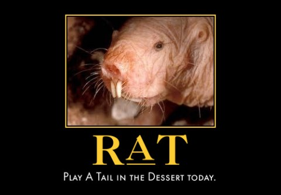

Back to: [West Karana](/posts/westkarana.md) > [2011](/posts/2011/westkarana.md) > [January](./westkarana.md)
# Daily Blogroll 1/6: Fair and Balanced edition

*Posted by Tipa on 2011-01-06 06:00:20*

Soooo.... [how about that Massively article](http://massively.joystiq.com/2011/01/04/rift-beta-events-impressions-from-the-staff/)? Did it make you mad as hell?

Meh. I had a look at my site analytics today, just to see if people were coming here to read about the so-called controversy and you know? More people came to read my view of Velious through frost-covered glasses. That reinforces what I've always known about MMO fans. We just want to get online and PLAY GOOD GAMES.

The article did spark a lot of good discussions about Rift itself and the general desire (or lack of desire) for games that follow the World of Warcraft model vs those that are more original. You'd think those people hungering for originality would have appreciated Star Trek Online more... but oh yes, [they did](http://massively.joystiq.com/2011/01/03/massivelys-2010-players-choice-awards-results/).

2011 will bring a fair amount of non-WoW-like MMOs (Mythos, APB Reloaded, TERA Online) and a few WoW-like MMOs (Rift, Star Wars: The Old Republic). (well, [maybe not Mythos](http://forums.redbana.com/showthread.php?p=835196)). Time will tell which people prefer.

On to the blogroll.

**A Tale in the Desert**

Speaking about MMOs that are, seriously, NOT WOW, there's [A Tale in the Desert](http://www.atitd.com/). No killing, intensely social, and if your idea gets enough votes, the devs will implement it in the game. Basically, you play an ancient Egyptian just trying to get by with nothing but what you grow or make yourself. And, the game eventually ENDS. Then restarts with new stuff, with everyone starting over at zero with nothing.

Stargrace of MMO Quests was intrigued enough by the idea of MMO devoted to crafting that she took the plunge, and narrates [a cool video about her first few hour](http://mmoquests.com/2011/01/05/tail-in-the-desert/)s in the game.

You really can't get more sandbox than a game set in a desert. Not affiliated with the new indie MMO, A Tail in the Dessert.

(Made with [Automotivator](http://wigflip.com/automotivator/))

**Rift**

You'd think after yesterday's kerfuffle that opinions on Rift were either "been there, done that" or "OMGBESTGAMEEVER", but now that the dust has had some time to settle, some saner voices who have been through a good bit of what we've been able to play so far are being heard. 

Syp of Bio break [expands on his comments](http://biobreak.wordpress.com/2011/01/05/rift-details-and-schmetails/) from the Massively post and shares how the game opens up once you hop off the rails and get to exploring the world. Teljair of Rift Junkies writes about [how the game has changed and improved during each beta](http://www.riftjunkies.com/2011/01/05/my-beta-experience/) -- more than a marketing tool, Trion Worlds is actually using beta feedback to make massive improvements to the game.

**Overstimulation**

Zubon at Kill Ten Rats had a great piece about [games that just really try too hard](http://www.killtenrats.com/2011/01/05/matting/) to fill every single moment with excitement and fun. Do people really appreciate slack time in games? Back in the EQ days, gameplay was very much terrifying danger mixed with lots of downtime and social stuff. But these days, I'm not just playing a game. I'm playing a game, maybe watching The Daily Show, sometimes talking on the phone or listening to music or chatting with friends on IM or Facebook, and I do things very much on my own schedule.

**Aion**

Making other Aion players look like the slackers they are, [a Chinese player managed to ding 56 in Aion 2.0](http://news.mmosite.com/content/2011-01-04/aion_2_0_player_reached_level_56_and_broke_wtf_record.shtml) when the level cap was just 55. Aside from letting people play with their displayed level, Aion 2.0/2.5 claims to have new anti-bot code that will make the Aion world a place free of spam.

If this is true, they could make more selling this tech to other game studios than they make off Aion itself. Seriously. I played Warhammer for a couple of hours and was continually spammed.

**World of Warcraft**

[Blizzard has applied for a license](http://www.tradingmarkets.com/news/stock-alert/ntes_netease-applies-for-cn-license-of-wow-cataclysm-earliest-debut-in-q2-1402285.html) to operate the Cataclysm expansion in China. If all goes well, Chinese gamers will be able to explore the latest expansion later this year. Expect Blizzard to proudly announce 13 million players at that time....

Hey, like those World of Warcraft battlegrounds? Turns out there's a patent that covers running tournaments online and storing player information, and WoW is infringing on it. So's Zynga, makers of fine Facebook games like Farmville and CityVille.

Got to give it to ~~patent troll company~~ "inventor company" Walker Digital, [they have guts](http://techcrunch.com/2011/01/05/walker-digital-zynga-activision-and-blizzard/).

**MilMo**

Inside Social Games [takes a look at the latest Facebook MMO, MilMo](http://www.insidesocialgames.com/2011/01/04/more-mmos-come-to-facebook-with-milmo/). Based on the popular Unity engine, MilMo seems a fairly low ambition MMO, a game without any real goals, levels, or more than the most basic variety of quests.

We'll keep an eye on this game and see how it improves. Meanwhile, click on the expanded version of the screenshot in the article. Though partially blocked out, you can kind of get the impression that local chat is about as dysfunctional as that in any other kid-focused MMO. Figures.

**Lucent Heart**

I know you're as anxious as I am to start playing Lucent Heart. The wait was too much for me; I went searching to see if I could play the game RIGHT NOW. I found [the Japanese Lucent Heart site](http://lh.gamania.co.jp/entrance/) and tried to sign up for an account, but the hiragana captcha foiled me. Typing the hiragana in another program and cut/pasting didn't work; the ALT-xxx method didn't work. I guess I'll just have to wait.

---

Well, there seemed to be a lot of news today, but when I looked back on it, it was mostly about the Rift commentary. Bored now.

