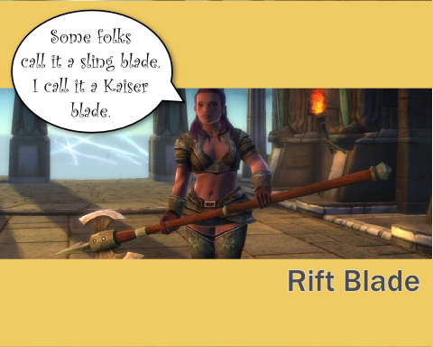

Back to: [West Karana](/posts/westkarana.md) > [2011](/posts/2011/westkarana.md) > [January](./westkarana.md)
# Daily Blogroll 1/27 -- Inevitable Backlash edition

*Posted by Tipa on 2011-01-27 06:00:43*

Yeah, I've been MIA for a couple weeks now. Work time is creeping into home time. It's so cold when I get home that I find myself cuddling up with blankets and a cat on the couch, watching Netflix (tonight: the Canadian comedy "[Slings & Arrows](http://en.wikipedia.org/wiki/Slings_and_Arrows)", season 1). I'm not wild about this "winter" thing in general. I haven't been able to get on the bicycle for a few weeks now, and it's really making me antsy.

Anyway, Rift beta 5 is underway. I logged in last night and made a warrior on the Belmont server and met my guild, Black Company. Played up through level 9, got caught up in some rift fights, had a little fun, but you know... I'm losing enthusiasm for the game.

Does that sound bad? I vowed to play Rift up to the level cap in the company of a guild and see all there was to see. Shouldn't I be really excited?

I was really excited when it was me discovering a world of mystery. I was pretty damn pleased to try out different souls and make my own unique class. I was jumping for joy when I realized one didn't need to grind quests with the rifts opening everywhere, just handing out adventure and experience.

But now, you can get a dozen decent build suggestions everywhere you look. There are guides for all the dungeons, all the quests, all the warfronts. By the time the game ships, the game will be completely known and over-examined. It will be SPOILED.

I'm still going to play Rift, and enjoy it. I just see that it's going to become the same damn thing as with WoW, where my refusal to learn anything about the game other than what I discover for myself makes me look like a raw clueless newbie to everyone unfortunate enough to group with me. I really hate that feeling.

**Rift**

Lots of people writing about the Rift beta 5 event, but why help ruin the game? I'll be writing about it when I play through it when it goes live. But, I DO want to point out what must be the most underwhelming rendered official movie for Rift that I've seen so far:

Courtesy IGN [via Rift Junkies](http://www.riftjunkies.com/2011/01/26/rift-cgi-trailer/). Poorly animated and really, it reminds me a little too much of EverQuest II's pre-release trailer -- [and not in a good way](http://obeygiant.com/headlines/mr-brainwash-life-is-beautiful-exhibition). Perhaps because the EverQuest II launch trailer was SO MUCH BETTER at setting up the world.

So, yeah. Yank that video, Trion, and put up a better one.

The Superblogger known as Elementalistly has been expanding his MMO tracking from just XFire to Raptr and beyond. He's stopped trying to guess sub numbers from the XFire/Raptr figures and so it's much cooler now. [New this week](http://simple-n-complex.blogspot.com/2011/01/rift-champion-of-raptr-and-x-fire.html): Rift and the newly F2P Champions Online.

And a note for Rift bloggers: You don't have to paste the patch notes on your blog. We get it, you see the patch notes and figure, hey, free post. Just post a link to them on the official site if you must, but it would be better if you took some time to explain the impact of the changes.

**The Blogosphere implodes**

[A bunch of bloggers and other interesting people](http://biobreak.wordpress.com/2011/01/26/bloggers-breakfast-at-pax-east/) are getting together for breakfast outside of Pax*East this spring. So much geekery in one place could suck Boston itself into a black hole of awesome :)

**Quest Hubbing**

Way back when, the ever ironically-named EverQuest actively made it difficult, [if not flatly impossible](http://oldunsolvedquestsineverquest.yuku.com/forums/1/Unsolved-quests), to do and complete quests. It could take MONTHS to solve some of the epic quests -- to even figure out what the steps were, much less finish it.

When World of Warcraft introduced the whole concept of quest-oriented adventure, where NPCs would tell you with no hesitation all about their quests and exactly what they required with no puzzle solving needed, it was seen as a revolution in gaming. Continuing on with that tradition, WoW now often will provide you transport to the area to save on having to spend any time not focused on fulfilling the quest instructions.

Melmoth of KiaSA thinks that, maybe, [the whole quest hub thing has just gotten out of hand](http://www.kiasa.org/2011/01/26/stepping-off-the-conveyor-belt/), and that now, games seem entirely unable to conceive of a method of in-game storytelling which doesn't involve clicking through a quest, killing stuff, and returning for a reward. Unfortunately, his proposed solution is essentially the Warhammer Online [kill collectors](http://warhammeronline.wikia.com/wiki/Kill_Collector), famously described in Paul Barnett's "[Bears Bears Bears](http://www.youtube.com/watch?v=jJOrSr6Q3_o)" video.

**The Death of the MMORPG Genre as We Know It**

Sure, everyone knows what an MMORPG is. It's a game like WoW, right? But then, some people consider Second Life, a virtual world, an MMORPG. It's been claimed that game portals like Clone Wars Adventures are MMORPGs. It's gotten to the point that any online game in which you might encounter another player is called an MMORPG. [Ardwulf laments the blurred focus of the term](http://ardwulfslair.wordpress.com/2011/01/25/words-fail/), but doesn't offer any suggestions.

Here's mine. For me, an MMORPG allows me to create a unique character in an online, shared world. There is a story of some sort which my character experiences through adventures which gradually make my initially weak character powerful enough to take on advanced challenges. Unique character, shared online space, progression through a story, and some variation of the "[Hero's Journey](http://en.wikipedia.org/wiki/Monomyth)".

Outspark's [Fists of Fu!](http://fistsoffu.outspark.com/landing/007) requires me to choose one of the four pre-made characters. NOT an MMORPG. Second Life has no story or character progression -- NOT an MMORPG. DDO has story told through "modules". It IS an MMORPG, likewise Guild Wars. The only advancement in Clone Wars Adventures is paying for a subscription to become a Jedi. NOT an MMORPG. EVE Online definitely has character progression and a story, though most people are only vaguely aware of what that story might be. It IS an MMORPG.

Now if I can just get everyone else in the world to agree with me...

Keen was wondering a few days back [if short MMOs can be good MMOs](http://www.keenandgraev.com/?p=4694). Which is kinda weird because one of the shortest MMOs I have ever played is the most popular MMO on the planet. One of the things I really liked about WoW back in the day was that I could finish it -- new character through to clearing Molten Core -- in just a couple of months. Compare that to the year to 18 months in EverQuest to go from new character to end game raider.

So -- an MMO even shorter than WoW? That's pretty hard to imagine. Maybe DCUO is shorter than WoW, somehow, but as far as the time taken to get to all the content, I'm thinking it's pretty much the same.

**EverQuest $$**

KayJay at The Banhammer [has some strong words for SOE](http://www.thebanhammer.net/?p=105) regarding the collector's edition of the upcoming Destiny of Velious expansion. After Feb 22nd, SOE will be charging $90 for the digital collector's edition. Most collector's editions for that price come with maps, art books, CDs and the like, and SOE has even been known to include little pewter keepsakes in the box. This times, it's house items, fluff pets, appearance items and mount illusions. Nothing for the mantle!

**Star Wars: The Old Republic**

Bunch of news about this title. First, the folks at Gamespy have an extended look at the current state of the SWTOR beta -- they really like it, though they admit it's [WoW with lightsabers](http://pc.gamespy.com/pc/bioware-mmo-project/1140497p1.html), but not in a bad way.

MCVUK.com is reporting that [the game should be out in September](http://www.mcvuk.com/news/42719/Old-Republic-out-in-September), which is about what I was expecting. A lot of people were thinking it would be out in April because [EA said at a tech conference](http://www.swtor.com/community/showthread.php?t=232427) that they release the game in the financial year that started in April. Didn't mean April, but plenty of people made that leap.

Lastly, [investors are feeling quite paranoid about SWTOR's chances](http://www.gamasutra.com/view/news/32605/Analyst_Wary_EA_Investors_Betting_Against_SWTOR.php). Suspected costs of $300 MILLION dollars, a subscription fee in an increasingly F2P world, large percentage of profits funneled straight to LucasArts, and EA's dismal track record with MMOs (Warhammer Online being the issue here). Also given the recent failure of other hideously expensive MMOs such as APB, which cost a mere $100 million. A pittance!

I just did a little back-of-the-envelope scribbling. Let's say SWTOR is wildly successful and gets a million players to pay $15/month essentially forever, the game is that good. Let's further say that after paying salaries, facilities, the LucasArts tax and so on that EA makes $5 clear profit of that monthly subscription. Steady one million subscribers all paying full subscription price gets them to pay off their initial investment in just five years. Then add in the expansions, one a year, and their development costs... there's almost no way they can possibly make back development costs.

Well, there IS a way, only one way -- and that one way is a CASH SHOP. I've said this before and will again -- this game is gonna be CASH SHOP'D seven ways from Sunday.

You thought EQ2 was bad.

**Lucent Heart**

Gaming Blend has earned my undying enmity by [getting into the preview beta](http://www.cinemablend.com/games/Preview-Lucent-Heart-Legend-Zodiac-29614.html) for the NA launch of dating sim/MMO Lucent Heart.

> The combat is designed for casual gamers in mind (mainly female gamers) so twitch skills aren’t required the way it is in games like Fallen Earth, Tabula Rasa or Allods Online

Well, I'd have thought TR stopped twitching YEARS ago...

Hey, don't be a stranger and I'll try not to be. Keep warm and keep gaming!

