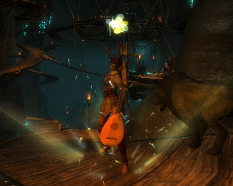

# Rift: Who am I, this time?

*Posted by Tipa on 2011-03-03 07:46:57*

[caption id="attachment\_6250" align="aligncenter" width="480" caption="Striking a Power Chord in Deepstrike Mines"][/caption]

I only had a chance to play for a little while last night. The guild message of the day told us to complete dungeon runs to finish off some guild quests, so I went off to the Stonefields looking for a Deepstrike Mines group.

DSM is a dungeon filled with undead who are using kobold slaves to mine sourcestone, the heartblood of Telera. There's a couple tricky fights in there, especially the last boss, who tosses out crystals that you must either run from or destroy, depending on the color. Everyone likes maximum dps there.

As a rogue with hundreds of possible soul combinations available, figuring out how to market myself to a group is a puzzler. I think my best contribution to a dungeon is in my ranged bard/ranger spec, what with pretty awesome buffs, decent second healing and ranged/pet dps. For those times when groups are just calling for DPS, I have a secondary assassin/bladedancer/riftstalker spec.

So I yelled that I was either baranger buffs/dps or assassin dps and got a group straight off.

Here's where the fun begins. Every player in the group could handle more than one role. The warrior knew he was the tank, and we did have a cleric who switched over to a healing role, but we two rogues and a mage rounded it out, and between us, we could tank, crowd control, buff, heal and dps -- if we set our specs correctly.

On the way through the dungeon, we each switched specs a couple of times, looking for the best group for the challenge. If it looked like we had healing and tanking handled, we'd all switch to dps specs. If it was a crowd, then crowd control would begin to happen.

When we got down to the crystal-hurling boss, we were all in dps mode. Those of us with the option switched to melee dps to boot, me in assassin, the other rogue in nightblade. We had problems with the boss' PBAOE. So we'd move to range. DPS on the crystals wasn't high enough. We wiped three or four times. Once we got our specs worked out, though, it was easy.

Someone noted, when we finally won, that we seemed to be taking a lot less damage in the last fight. Someone else pointed out I'd switched to bard for the last fight, and was buffing and group healing throughout. It took us awhile, but we did manage to form the best group for the fight, eventually.

That's the power and the danger in Rift groups. When anyone can fill multiple roles, and swap through them on a whim, how do you market yourself and once in a group, how do you decide who will play which role? The bard soul isn't seen as particularly necessary, but that's only because players don't yet know how amazing our buffs are; but going deep in the bard tree does limit opportunities to be incredible at dps.
