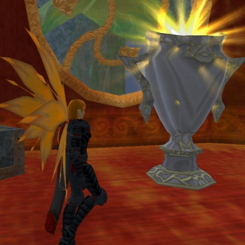
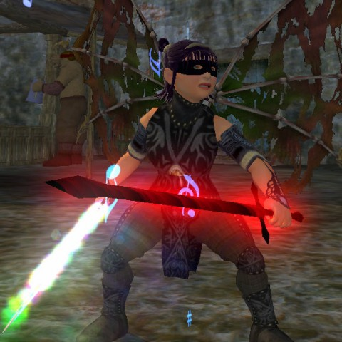

# EQ2 Fortune League: #WINNER

*Posted by Tipa on 2011-03-10 19:38:24*

> Oh, wicked, bad, naughty Zoot! She has been setting alight our beacon, which, I just remembered, is grail-shaped. It's not the first time we've had this problem.

-- [Monty Python and the Holy Grail](http://www.sacred-texts.com/neu/mphg/mphg.htm)

Is [Fortune League](http://apps.facebook.com/fortuneleague/) a social game? The "fantasy raid party" game is on Facebook, after all, but just putting a game on Facebook doesn't make it social -- not by itself. It seems to me that social games require other people to play. When this came up on Twitter a few days back, I thought that the whole reason why they were called social is that, by definition, they couldn't be played alone.

By that definition, Fortune League is not a social game, but it is social in an entirely larger way. The value of each hero in your six member party changes both on how well their race/class combination does in the actual game, and on the demand (or lack of demand) for that race/class combo within Fortune League itself, which varies with the needs of the particular adventure and the daily opportunities.

It's also social in the way almost any Facebook game is, in that you get talking to the other players. I'm in the Antonia Bayle Champions league, a "guild" for those of us who play on the Antonia Bayle server. Through that I've met Zack, who is stationed in Afghanistan for another month and plays Fortune League because he cannot play EQ2 where he is. He is one of the top ranked players globally. And then there's a bunch of us lesser lights who struggle through.

[caption id="attachment\_6278" align="aligncenter" width="480" caption="Small Wings of the League"][/caption]

Inspired by [Stargrace's victory in the first adventure](http://mmoquests.com/2011/02/12/tattered-wings-eq2/), I was spurred on to see if I could figure out how to play the game and to win at it. Four(!) spreadsheets, two Python scripts and three weeks later, I'd made it not only into the top 20% (to earn the wings), but the top 40 players for the adventure to win the Fortune League cup, the glowy trophy in the first picture.

You can spend money in the game, but money won't move you in the ranks. All money buys you is the ability to trade out characters more often than free players. I did buy a couple of trades to catch up -- while I was learning the game, I made some disastrous missteps. Once I'd sunk money into the game, though, I was determined not to leave without getting the cup.

Sure, it's just going to sit in Scatter's room in Kelethin, but there's that thrill of progression, you know? I started out really sucking at the game, through my own study I managed to find [a winning strategy](../../../index.php/2011/02/13/eq2-how-to-win-at-fortune-league/), and I bet real money that it would be good enough to win the one lasting reward from the game.

[caption id="attachment\_6279" align="aligncenter" width="324" caption="Stats of the Wings of the League"][/caption]

The wings themselves aren't too bad. They are a fabled back item with passive featherfall, and a clicky "sky glide" which, I think, gives you the gliding powers of a Fae for 30 seconds. Perfect thing to keep in your appearance slot to easily swap into your main back slot when you need a glide more than you need stats.

We're into the third adventure now; I don't plan to spend any money this time around, and I'm not doing as well. I wouldn't play it at all anymore, except I like chatting with the other AB players and congratulating each other on good moves, or sympathizing with runs of bad luck.

So, maybe Fortune League is a social game after all.

