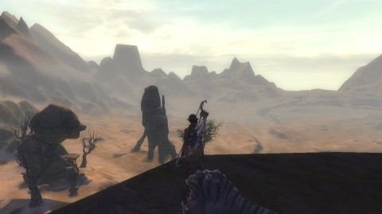
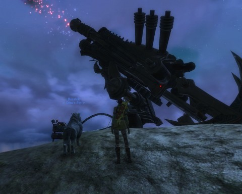

Back to: [West Karana](/posts/westkarana.md) > [2011](/posts/2011/westkarana.md) > [March](./westkarana.md)
# Rift: Imagine a world without quests...

*Posted by Tipa on 2011-03-21 06:19:13*

[caption id="attachment\_6293" align="aligncenter" width="480" caption="Droughtlands"][/caption]

Pictured is the Droughtlands, from a high vantage above the desert floor on a plateau called Lantern Hook. There's a neutral city within it, and a dungeon ("The Fall of Lantern Hook") beneath it. I had no idea where this place was until a crafting daily sent me here, but it's a nice place. The area is around my level (39) and I could skip the Moonshade Highlands and work on Droughtlands quests, just like I skipped out of Scarlett Gorge to work on Scarwood Reach quests, and Scarwood Reach quests to work on Moonshade Highlands quests.

And why not? Aside from the experience, there's little reason to do quests. The nigh-inevitable destruction of the world is only a handful of years in the future. In the original timeline, the Guardians had the upper hand against the forces of Regulos, and THEY LOST. They were destroyed while undead swallowed the world. Only a last few Defiants, by sending reincarnated heroes with borrowed souls into the past, threw the dice of the fate of the world one final time...

... so that I could pick mushrooms around a lake. 

Just like World of Warcraft, every living thing you see has a quest to kill it, so you don't WANT to kill anything or do anything until some NPC tells you to do so. The difference is with the rifts, invasions and footholds; when you see one of those, you drop what you're doing and wade in, because THIS is the fight against the future, THIS is you doing what you are meant to be doing.

Then, unless you find yourself in a dungeon (and this past weekend, I have both main healed and main tanked a dungeon, as bard and riftstalker), you look for a bunch of NPC chumps with green punctuation over their heads, find out which local fauna they hate or flora they need gathered, and set to your task.

Doing pointless boring quests was half the reason I left WoW. The other half was being abused by the so-called "community".

Here's an example -- a quest series I did, as a ranger, with a random bard (yay public groups).

There's this village of dead dwarfs. You can tell they are dead because they have their opacity set to 50% and their colors are desaturated, but they don't bemoan their fate or give dark warnings of the hereafter or fear that their soul will be swallowed up by some needy Guardian Ascended or something. In fact I'm not sure what they were about. They just stood around, except for a couple who patrolled, and you just know death hardly interrupted their routines.

Anyway, there are three treasures in this village that we need to burn, for some reason. These treasures -- a chest, a book and a doll if I remember right -- are on the front stoops of the houses, because you can't ENTER houses in this game; like WoW, there are no doors, which is an innovation Ultima Online delivered in 1997 but has been slow to make its way to newer games. There may have been a reason why we needed to antagonize these dead dwarfs, but I can't imagine it really was a turning point against the forces that would destroy the world.

Seriously, I'm trying to save your lives, NPCs. If you have a trinket that will help in that fight, JUST GIVE IT TO ME.

The quest hub mechanic is Rift's weakest point. What would the game be like, I wonder, without quest hubs? Where what quests did exist, were integral to the plot of the game? When I get sent into a fairy wood to pick mushrooms, I'm not thinking "Yay! Bringing the fight to Regulos!". I'm thinking, "this quest sucks. I am wasting my time."

[caption id="attachment\_6294" align="aligncenter" width="480" caption="A big gun"][/caption]

Quests are not meant to challenge players. They are just meant as busywork to keep people in the game while they are waiting to do something fun. They could be removed and just replaced with a mechanic that would deliver XP, coin and the occasional trinket to you as long as you were online with no difference to total enjoyment of the game.

Except when quests go BAD.

There's a quest chain in Moonshade Highlands where the Defiants and Guardians are fighting over the control of a few cannon and some monitoring devices. As part of this, you (the Defiant player) capture a Guardian NPC and bring him back to Timberveil (Defiant outpost) for torturing. You then torture the NPC until he commits suicide rather than reveal more information, after which you skip merrily to a ridge and fire cannon at Guardian emplacements.

I was so shaken by this quest that I almost stopped playing. Did Trion think that American players would be so blasé about torture after Guantanamo that it means nothing to us any more? I did the quest hoping to see some sort of repercussions for this, some feeling or sense that we, as Defiants, perhaps have gone too far, that we must not become the monsters we fight. But, no. There was nothing. It was just another stupid quest. Burn a child's doll, pick a mushroom, torture an NPC to death. I proved I will do absolutely anything if an NPC asks me to.

Take away the quests hubs. Replace them, perhaps, with set pieces that advance the plot of the game, or fer chrissakes help the Defiants and the Guardians set aside their differences so that they can band together to SAVE THE WORLD. The reason everything fell apart to begin with was Defiants and Guardians seeing the conflict against Regulos as a zero sum game where they could not win unless the other lost.

I won't even get started about what the Warfronts say about the motivations of the two sides, while the true darkness gathers unchallenged. Not this post, anyway.

