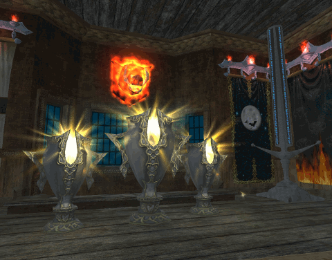
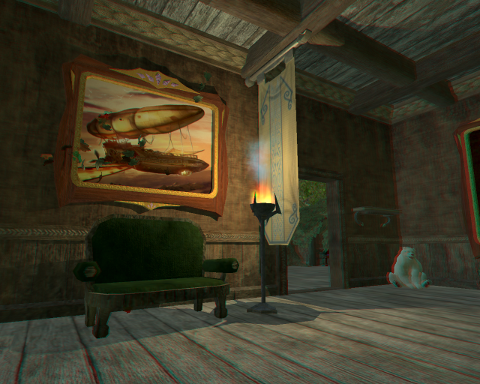

# EQ2 & GIMP: Animation tutorial

*Posted by Tipa on 2011-03-29 19:55:32*

I do log in to EverQuest 2 now and again. Mostly for two things -- to keep Scatter's spell research going and to redeem the AA scrolls I win by playing Fortune League on Facebook.

Every three and a half days, Scatter gets a new spell level. Every week, she gets another couple AA. It's like EVE Online. Actually, though, Fortune League has a hard limit of 21 prizes you can win before your prizes no longer show on your Fortune League prize wall. I'd figured out a way to show the additional prizes, redeemed them, and hurried into EQ2 to claim and apply them.

It's such a homey place, Scatter's inn room in Qeynos Harbor. She moved from Kelethin a few weeks back because the acorn rooms just weren't exciting me, and I could never find anything in Kelethin. 

Anyway. Homey place. Front room is the bar, where all my critters are drinking and holding polite conversation. In back is my bedroom, made up to look like a forest glade. And to the right as you come in, the trophy room, with my three Fortune League trophies beaming beatifically, front and center. I wanted to bring my inn room to my blog. But how?

[caption id="attachment\_6303" align="aligncenter" width="480" caption="This is a blue/red anaglyph 3D image. Get your funky glasses on!"][/caption]

3D is all the rage, but not many people have the red/blue glasses to see it. WTF, right? But there ya go. Besides, with all the glowies and moving things in the apartment, it's really hard to find a scene still enough that two screenshots would look identical except for position. It had to be animation.

And the price for this animation software would have to be "nothing". I'm not paying six hundred bucks to Adobe for Photoshop to put images on my blog.

I gave up Photoshop a couple years back when my pirated version stopped working. I never felt good about using pirated software ANYWAY, and "everyone does it" really isn't a persuasive argument to someone who might conceivably wish to sell her own software at some point. So I've been using GIMP as a replacement. GIMP is a free and open source photo/picture editor, roughly comparable to Photoshop for the things most people need. Its name is an acronym that stands for "GIMP Is The Stupidest Name For A Paint Program, Ever".

Anyway, it's free and has thousands of plugins. The plugin to make red/blue anaglyphs was free; I can make them with a single click now. With Photoshop, it was a long process (though I could have made a PS macro to do it, I know).

Animation is a built-in plugin. It's under the Filter menu. Here's how I made the trophy room animation at the top of the post.

First, I used FRAPS to take a half dozen screenshots a second apart. You could just take screenshots with the PRTSCRN key; I just happen to have FRAPS available.

I opened GIMP and dragged the screenshots, one at a time, into the drawing window, making a drawing with a half dozen layers, one screenshot to a layer. I then resized the image to 480 pixels wide -- I knew it was going to be shown here, no need to make the file any larger than it had to be.

GIMP supports a few animation formats, but the one that browsers know to start animating when they load is called GIF animation. This is important.

From the Animation entry in the Filter menu, choose Blend. Just click OK to the dialog it shows. This turns the half dozen screenshots into a movie with frame interpolation to keep things running smoothly. The animation will be in a new window. Choose Filter > Animation > Playback to open a playback window, click the Play button, and if it looks good, close the playback window and return to the one with the animation in it.

Filter > Animation > GIF Optimization. This will select the minimum rectangle in your picture that contains changing information. If you were moving while taking screenshots, every frame will be 100% different from the previous frame and cannot be optimized. But in this case, there's no need to redraw the floor and carpet every frame -- it doesn't change. This option displays the floor just once.

File > Save As. Save it as a GIF file by typing nameofyouranimation.gif. Since the GIF format does not support layers, GIMP will ask if you want to flatten it or save it as an animation. Save it as an animation. It will also note that it cannot save full color images, and needs to either index the colors or change it to grayscale. Choose to index the colors (the default). 

Click the Export button, find it on disk, open it in your browser and go oooh and aaaah. You've got a cool animation, and you didn't have to spend any money on it.

