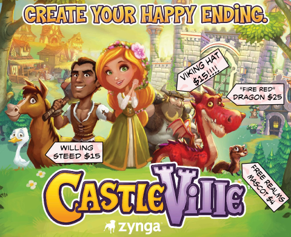

Back to: [West Karana](/posts/westkarana.md) > [2011](/posts/2011/westkarana.md) > [October](./westkarana.md)
# Daily Blogroll Oct 12: No time for heroes edition

*Posted by Tipa on 2011-10-12 05:00:25*

[caption id="attachment\_6566" align="aligncenter" width="480" caption="Magic Castle for Sale: Sold!"][/caption]

A few days ago I was trying to define what I thought of as an MMO. I started off thinking it was just a realtime, online game with other players, but as the day went on, thinking about it more, I felt it had to include a persistent avatar representing the player that could be named and customized. I was pretty confident that nailed the essential nature of an MMORPG.

Well, Zynga's newest semi-interactive "Ville" game is going to bring MMO gaming to Facebook. [Via Massively](http://massively.joystiq.com/2011/10/11/zyngas-castleville-hopes-to-enter-mmo-territory/), 

> You can build your castle, show it to your friends, and craft things like potions or armor. You can follow the game’s story and its characters. You can trade and barter with friends by visiting their towns. And you have to defend your town against beasts who are outside the walls. The game has more personalized storytelling; players explore the world around them. You meet characters and make them happy and unlock new characters as you progress.

“In short, Zynga is bringing massively multiplayer role-playing games to the mass market,” Jackson said.

If this sort of non-realtime probable clickfest is the future of MMOs, then the genre is dead. It does sound like, after CityVille and Empires & Allies nudged into SimCity and Civilization territory, that it will be returning to the avatar-based gameplay of Farmville and Frontierville. Of Frontierville, [the NY Times writes](http://bits.blogs.nytimes.com/2011/10/11/zynga-releases-new-games-and-a-new-platform/):

> Cityville, its biggest game, has picked up a little steam recently with 13.5 million daily users, according to AppData. FrontierVille, however, has been sliding faster than a pioneer bitten by a varmint. Introduced in June 2010, FrontierVille peaked with nine million daily players but now has about 5 percent of that.

So there's a winning strategy right there, I guess. Zynga has to keep pumping out the games ever faster because people tire of them ever faster. How fast Zynga can shovel new games at us now? [They have 2500 people writing them](http://venturebeat.com/2011/10/11/zynga-launches-a-broadside-of-10-new-social-and-mobile-games/)!

But there's more stuff to talk about than Sims Medieval clones! After the break!

Like, **let's talk about Kitty Kash**! The blogs lit up yesterday on the news that [a new WoW pet, bought with real money](http://us.battle.net/wow/en/blog/3665632/Sneak_Peek_Guardian_Cub_Tradable_Pet-10_10_2011#blog), could be sold to other players in-game -- the first time something bought with cash could be transferred to anyone else. ]

Tobold thinks [this could possibly kill the gold black market](http://tobolds.blogspot.com/2011/10/world-of-warcraft-introduces-real-money.html), but color me dubious. I buy the Guardian Cub for $10, put it on the auction house for 10,000gp, hoping to get a 1000:1 gold to dollar conversion going. But there's hundreds of Guardian Cubs being sold on the AH! So I keep dropping the price to get a sale. 5000gp. 2500gp. 1000gp, and it sells for that. I could have gotten a lot more gold from a gold seller for my $10. Not only that, since a Guardian Cub has no in-game function, it's a commodity that can only fall in price, since more enter the system than leave through owners binding them, which instantly drops their value to zero.

On this tenth anniversary of the launch of Dark Age of Camelot, one of the first of the "second wave" MMOs, former Mythic head Mark Jacobs allows that [he was never opposed to the free to play business model](http://www.mmorpg.com/showFeature.cfm/loadFeature/5684/page/1), it was gold sellers he couldn't take.

> "I've never been against F2P," he continues. "What I was, and still remain strongly opposed to, is gold farming in games, especially MMOs, that weren’t designed from the beginning to handle those kind of transactions, and also to the groups that seek to profit from such transactions. What I really dislike isn't so much the gold farming / selling itself, but certain behaviors that occur in games where this happens."

I guess the real question is, who said he was against F2P in the first place? I'm missing something here. Maybe it's because DAoC was a subscription game? But back then, they ALL were.

**Chris of Levelcapped** is back with a rant against [the people who would minmax all the RP out of the G in MMOs](http://www.levelcapped.com/2011/10/11/think-about-it-putting-the-rpg-back-in-mmos/). He references [a Wizards of the Coast blog](http://www.wizards.com/DnD/Article.aspx?x=dnd/4ll/20111011) which argues that any dungeon party -- in D&D, anyway -- should have room for people who want to play to help their fellows, or just to have fun or play out their own kind of story without being hyper focused on damage and performance. 

I'm not sure if that has ever been tried in a MMO, to be honest. Not since EverQuest defined the Holy Trinity (well, we must remember the EQ group would typically include a general support character of some sort. This was dispensed with in WoW.)

I'd write more, but I have an early, all-day leadership training meeting tomorrow. Maybe I'll talk more about that tomorrow, but for today, here's nerd goddess Felicia Day being an action hero.

