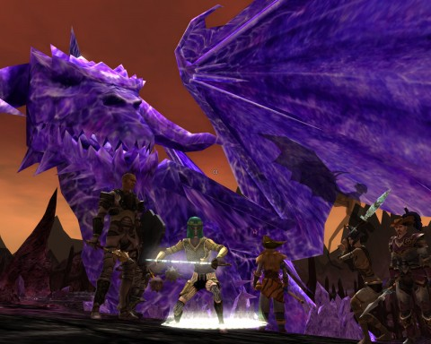

# DDO: Holding for Giants

*Posted by Tipa on 2011-09-20 06:41:40*

[caption id="attachment\_6525" align="aligncenter" width="480" caption="Frozen dragon"][/caption]

Giants, they are big. They are big and very powerful. They swing I-beams like 10' rods. They could and do crush the life from insects such as we without thinking about it. They freeze dragons in stone forever.

So why is it again they need us to do their dirty work for them?

Sunday before last, I was knocked out on my couch after [a whale watching trip](https://picasaweb.google.com/brendahol/WhaleWatching9112011?authuser=0&feat=directlink "Whale Watching") 30 miles off the coast of Boston and missed the rest of Team Spode's first encounter with the Ruins of Gianthold.

No such excuse this time. I was there with my 115 hit points, all rarin' to go pick some locks and disarm some traps and attack things sneakily. 115 hit points -- because of the new DDO user interface, I know exactly my stats, which were vague, unit-less bars before. I have fewer hit points than anyone else on the team! Fewer even than that halfling sorcerer! I guess I'll have to put some points into constitution or something; ever since I left the defined leveling path to take that level of fighter, I've been on my own, stat-wise, and everything just goes into dexterity.

This may not have been the best survival strategy.

Anyway. Our team encyclopedia, Lessah, was not available, so we wandered around the Gianthold ruins for awhile, killing whatever we saw. We found a weird structure like some sort of ruined [orrery](http://en.wikipedia.org/wiki/Orrery "Orrery definition") and a spiral path that led to the top. Like, anything was going to keep us from climbing to the top of it. Spode could have tossed Gleek up.

Now that I'm thinking back on it, that could be our new trap finding system. Usually I just send the paladin ahead and disarm anything he lives through. But he *could* also just toss the halfling down the corridor ahead of us, which would be handy for the false floor traps. Something to keep in mind. A wise adventurer finds many uses for her companions.

Oh, stop with the tongue clucking. I'm a drow. Get over it.

At the top of the orrery was the entrance to the Prison of the Planes. Within was a hearty giant with a smile on his face, a twinkle in his eye, and some sort of fungal rot going on with his toenails. Yuk. So Mister Toejam is too skeered to go into the place, and he sends us instead.

Now at this point, Lessah would helpfully explain every detail of the encounter. Directionless, we were forced to figure it out for ourselves.

We fought up a tall tower, noting rooms barred by lightning shields and other rooms that were empty. We met a group of demon hunters led by a Rakshasha and...

*begin standard Rakshasha rant*
The first AD&D Monster Manual listed Rakshasha as shapeshifters. The illustration showed a tigerman dressed in a smoking jacket, but nothing was ever said that they would always appear as a tigerman (smoking jacket optional). And yet *every* *single* *time* they appear in DDO, it is as a tigerman.
*end standard Rakshasha rant*

Anyway, they were unhelpful in the extreme. We got to the top room, locked, but pick-able, the only time in the dungeon where roguely skills were required. Oh wait. Turned out there was another time. I'll get to that in a minute.

Inside the room were some levers and a dial. All of us randomly started flicking levers and turning the dial, because this is proven to be the best way to solve a puzzle. Realizing the futility, I started flicking shurikens at the light fixtures while sensible Ulan figured it out. The lightning fields blocking the way into the central atrium flickered off, and we all piled in and...

Wow. There's nothing there.

Well, at the bottom, in a socket, was one powered-up sphere. Which would fit into the sockets outside each of the empty rooms we explored.

Ding!

Up we went, into the first one. We powered it up, and this boring guy came and would only talk to a lawful person. So that was yawnful, but it gave us two new powered spheres for the one we placed in the door.

This was going to be a cakewalk! We skipped merrily to the next room. Ulan stood outside to flip the switch while the rest of us wondered who would be talking to the boring NPC here!

Switch flipped. Death ensues. I can't see a blasted thing, and without spells and without melee, I'm flipping useless. My cleric hireling is doing his best. So anyway, we all die, Ulan gets us up again. We decide to use a hireling to flip the switch, but when the bleeding starts, the hireling zaps himself on the lightning shield trying to get in to help.

Then I have a bright idea -- a ROGUE idea. *I* stand outside and flip the switch. I keep my hireling *inside* and order him to heal who needs healing, while I stay outside in perfect ease and comfort. This was the SECOND test of my rogue talents. And in the end, I didn't get quest credit for either of them. Ripped off.

This was the winning strategy. With that we cleared all the rooms, got all the powered spheres we needed, and I had the honor of flipping the final switch for the final encounter in the central atrium. Unfortunately, there was plenty of time for me to get together with the group. But as luck would have it, I could actually hit the boss that appeared, though he did have a nasty habit of teleporting around the place instead of standing still so I could backstab him more easily.

That was the Prison of the Planes. Compared to the hell that was the Tomb of the Wizard King, this was an actual *fun* dungeon, one we figured out on our own. It turns out this was a flagging dungeon, one of three we'll need to finish in order to qualify for the raid at the end, so we'll be visiting it once again when Lessah is back. We're looking forward to it!

