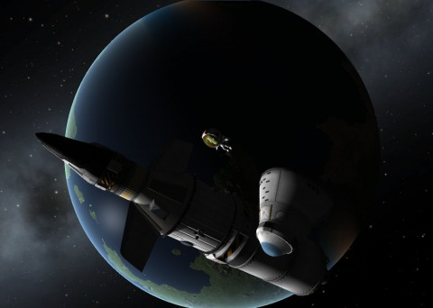
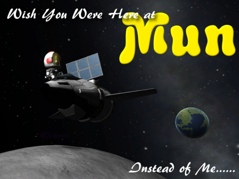
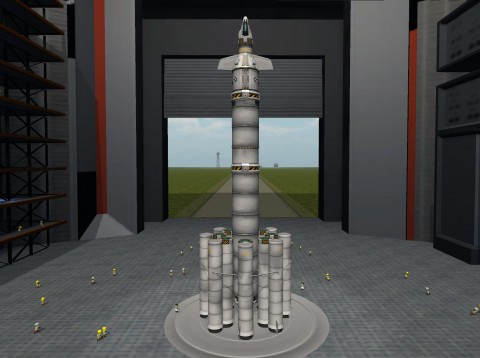
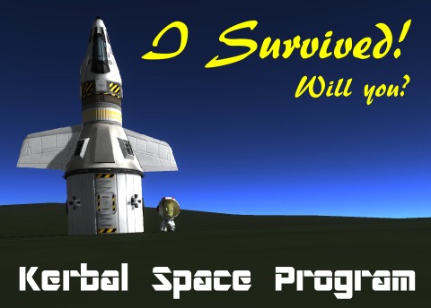
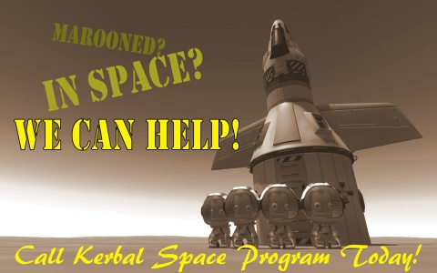

# Kerbal Space Program: Marooned

*Posted by Tipa on 2012-12-13 08:12:31*

[caption id="attachment\_10508" align="aligncenter" width="480"] Rescue![/caption]

There's this movie that used to come on TV occasionally when I was a kid called "[Marooned](http://en.wikipedia.org/wiki/Marooned_(film))" -- stars Richard Crenna, Gene Hackman and other famous people. Three Apollo astronauts are trapped in orbit with air running out. A desperate rescue mission on a military rocket that is in no way ready for launch is proposed. It's a really great movie.

I didn't set out to remake this movie in Kerbal Space Program....

After upgrading to the full version of Kerbal Space Program, I was testing different rocket designs to try and make orbit gracefully. There's a lot of new kinds of rockets, so I was trying to get stuff that looked like the space shuttle launches going (way too unstable for KSP) or just stacking stuff as high as I could get to see if that helped (unstable and heavy). SOMEHOW I managed to get my guys into orbit. With no fuel left for a return. And without RCS thrusters to help de-orbit -- I didn't know how to use those, then.

So this is important. Always have RCS thrusters and RCS fuel available on your last stage.

In KSP, you can leave your current flight and go back to the Kerbal Space Center and do more research or flying, what have you. This lets you leave satellites or space stations in orbit so you can return to them later, or do other things while planetary missions are in progress. I did this, leaving my Kerbals in orbit. My new mission -- this being a sandbox game, at the moment you make your own missions, and this was mine -- rescue those Kerbals.

I needed a new rocket, but first I needed to learn how to meet another object in orbit. I watched this video by Scott Manley maybe three times to understand everything he was doing. It is NOT as easy as he makes it seem. But his techniques DO WORK.

Also, how does he get away with such a simple looking rocket? That's not what mine is like.

[caption id="attachment\_10510" align="aligncenter" width="480"] Interceptor v1.5[/caption]

Here's mine, version 1.5 of a series that went from 1.0 to 1.8. But this was the best. Command pod is an airplane type, because in "Marooned", they are met in space by an experimental space plane. Wings because they look cool. Below that is the passenger module, big enough for four Kerbals. This module includes radial parachutes and RCS thrusters. Connecting the two are a ASAS, an anti-spin ring, and RCS propellant.

Below that is the second stage orbital maneuvering section, with a tank of fuel and a "poodle" engine. 

Below that is the main stage with a heavy lifter engine and two layers of solid rocket boosters to help this thing get through the thick part of the atmosphere. This rocket gets right to orbit with about half a tank of fuel left in the orbital stage -- enough to get to Mun, or to do a fair number of orbit changes.

So this was last Sunday.

Even with the tips in the video, I could not get anywhere near the marooned Kerbals. It was very frustrating. I'd spend hours working on new rockets. Once I came within 2km of the lost spacecraft, but I just couldn't match orbits

If you've followed along on Google+, you've seen these postcards before. I needed to make something out of each night's adventures.

Anyway, last night I figured out [Hohmann transfer orbits](http://en.wikipedia.org/wiki/Hohmann_transfer_orbit) (for which there is support in game) and was able to quickly switch to higher and lower orbits to catch up to and meet the other craft. Then came the agonizingly slow matching of orbits when the ships were about 20km apart. One of my docking tests of the previous night went well until the two ships crashed. There may have been an explosion in space. Thankfully, no Kerbals died, and I was testing docking in a ballistic trajectory and not in orbit so everything was always going to come back to Kerbin.

It would have been a tragic irony if the rescue attempt ended in a fiery collision. So I wasn't going to let that happen.

Having finally learned what all the markings on the nav ball meant, I was able to align my direction of travel with my target, and use the vertical and horizontal abilities of the RCS thrusters to line everything up perfectly. You can't chase the other ship. Have to kill relative velocity, then use left/right and up/down thrusters for positioning.

Finally the spacecraft was in sight, and then there we were. I used "[]" to switch to the other ship and evaced a Kerbal. He let go of the hatch ladder and just floated senseless in space. Another quick look at the keyboard reference -- ah, have to turn on his jetpack with "R".

With that, he was able to bump into the passenger module hatch, grab on and board. I repeated this twice more for the other Kerbals and used the last of my liquid fuel for a quick retroburn.

I wanted to come down at the Kerbal Space Center, and after jettisoning my orbital stage, was using RCS thrusters to pick my landing spot. When it looked like I'd miss the KSC and land in the water, I panicked and made sure I'd hit land on the previous continent, because I wanted a screen shot of all the Kerbals alive, and on the land.

I was ready to give up and rescue these guys later, but I couldn't stop thinking about them up in orbit, confident they weren't forgotten. It took me three real life nights, and 26 game days, to rescue them.

But I'm happy.

Next mission: build a plane to go get them and bring them back to the Kerbal Space Center.

