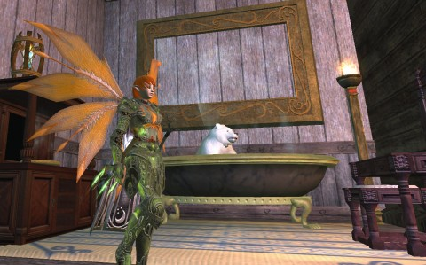
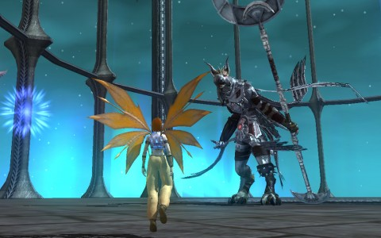
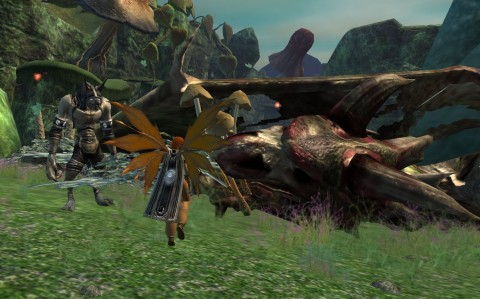
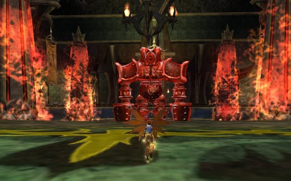
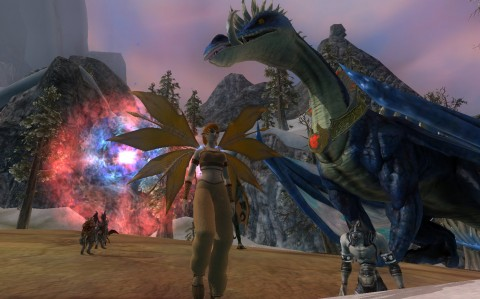

Back to: [West Karana](/posts/westkarana.md) > [2012](/posts/2012/westkarana.md) > [December](./westkarana.md)
# EQ2: Ding 95! And just in time!

*Posted by Tipa on 2012-12-29 20:33:16*

[caption id="attachment\_10536" align="aligncenter" width="480"] Scatterfall at 95/95/318[/caption]

Dinged 95 Berserker on Scatterfall today. That's the max level with the Chains of Eternity expansion. She's also a 95 Carpenter, and has 318 Alternate Advancement (AA) points -- two short of the max. Though she was boosted from 190-something to 280 when she hit level 90 and used one of the special potions that came with the expansion, so I DID cut some corners, there.

I really wanted to finish with her leveling today; tomorrow starts the New Year's double experience rush, and her having max adventure and crafting levels will give an additional 20% leveling bonus to every character on the account.

I started playing Scatterfall as my main back for Halloween, when she turned 60 doing the Nights of the Dead quests. She was a level 10 Craftsman at the time. Prior to that, I hadn't played her for two years, except to log her in to redeem my rewards for winning in the short-lived EQ2 Facebook game, Fortune League. It was free three or four AAs every week from that game.

Two months of mostly casual play, maxing out both adventure and crafting levels isn't bad. The big chunks of yummy experience and fast leveling, though, came to a grinding halt at 90.

I use the word "grinding" here on purpose.

[caption id="attachment\_10538" align="aligncenter" width="480"] Facing Drinal, final boss of Chains of Eternity[/caption]

Saving the Ethernere -- the place where souls rest before being brought to the planes of their Gods, back when the Gods still cared -- wasn't enough to level me to 95. Dealing with the surprise death of Rallos Zek and the absorption of his soul into the Ethernere wasn't enough. Pushing a Cazic Thule from a parallel universe back to his home reality to make Norrath safe for OUR Cazic Thule wasn't enough. It was ALMOST enough, but not quite.

I was willing to try anything. I went and used the Chronomage to temporarily delevel to 80 and went through Chelsith. My level 93 abilities and AAs made the dungeon trivial, even though everything was heroic and above my apparent level. Didn't even need a mercenary for healing. NOTHING COULD HURT ME.

I was INVULNERABLE to normal mobs, it seemed. There's dozens of people advertising powerleveling in player-created dungeons. I brought up the list, and every single dungeon on the top ten list told how many Dungeon Marks you'd get for it, how good it was for powerleveling, suggested group size for powerleveling and so on. I chose a short one, one room full of mobs and let me tell you, there is no class better equipped to deal with rooms full of closely-packed mobs that a berserker. Her main attacks are all AEs, she wears PLATE ARMOR, and carries a two handed sword that crits for 40,000+ damage.

So I went in there the first time with a healer mercenary, pulling carefully. By the time I finished doing DM dungeons, I was pulling everything in the range of my bow, all at once, the pull limited mostly by how many mobs the game could display on the screen without crashing. (Note to self: Close ALL OTHER PROGRAMS before doing this).

I quickly had enough Dungeon Marks for a new helmet and a new mount, and some armor for my defiler, but the experience still wasn't that great at that level. I went to bed last night just a couple bubbles from 95, and with no CoE quests in my log.

[caption id="attachment\_10539" align="aligncenter" width="480"] CSI: Norrath. Wuoshi's dead, who's the killer?[/caption]

I spent some time saving Thurgadin from an invasion of the Order of the Rime for no XP AND no rewards. Grrr. Wasted forty minutes on that. I finished the Blessed Scimitar of the Emerald Dawn heritage quest, solo, which required doing parts of three Velious heroic instances -- Iceshard Keep, Forgotten Pools and Crystal Caverns: Collapse, where Belghast and I had died so many times a few weeks ago. My record wasn't any better today. I finished the quest with a lot of experience debt (but luckily could erase it with a Wand of Forgiveness).

What finally did the trick was returning to the Withered Land and finishing some quests I'd left undone when I moved to Skyshrine. That STILL wasn't enough. So I did the "Free XP" quest at the Combine camp in Withered Lands; get quest to kill 8 wolves, go outside camp, kill first 8 wolves in sight, return, get 12K xp, repeat until ding. That's exactly what I did. It's probably the fastest normal experience in the game.

Since I gained the Tradeskill Prestige ability to track harvest nodes, INCLUDING the '?' collection nodes, I've been making a lot of cash selling those on the broker. People especially don't want to return to the Withered Lands once they've managed to escape the place, so while out killing wolves, one eye would be on the tracker for plat for the harvesting.

So, DING and also KA-CHING. It all works out.

[caption id="attachment\_10540" align="aligncenter" width="480"] Sleeper's Tomb, solo version[/caption]

I'm not sure why they still call this Sleeper's Tomb. In game lore, Kerafym the Sleeper has been awake for centuries, hell-bent on his prolonged revenge against the Claws of Veeshan who kept him penned in there for no worse crime than existing. I think there is a raid that does go back into the past, but I dunno.

The Chains of Eternity expansion (and Skyshrine), though, have this really cool mechanic where they have several versions of each new dungeon. There are solo versions, Advanced Solo versions (slightly harder), Heroic versions (group required, with better loot), and Raid versions. When you do the solo versions, you get a thumbnail sketch of what the dungeon and its bosses are like. When you do them in a group, you already pretty much know how things are going to go, relieving that awkwardness of coming for the first time to a dungeon and just having no clue; especially embarrassing if you're supposed to be pulling mobs and leading the way. That is, if you're the tank. That is, if you're me.

I haven't done a lot of group things. Some things with the guild; a couple random groups through the dungeon finder. The last one I did was a total success, but I was 90 at the time. Once I leveled to 91, I got moved to the next tier of dungeons, and if I was expected to tank and hold aggro against level 95 mobs and players, I would need to be level 95, too.

So that's still to come.

[caption id="attachment\_10541" align="aligncenter" width="480"] A dragon I did not kill.[/caption]

So what's next? I looked back through my screen shots, looking for the earliest shot of Scatterfall that survived my last purge, and it was from 2010. After EQ2 closed Fortune League, and I stopped playing, I moved back to Wizard101, Final Fantasy XIV, more W101, Star Trek Online, Rift, GW1 and GW2, The Secret World, Pirate101... and what was common to the ones I stuck with, was I was playing alongside other people whose names I knew, whose playstyles I knew. Games in which I mostly soloed were games I eventually stopped logging in to play -- because if nobody cared if I was there or not, it's easy to also stop caring.

This is the challenge. To stick with EQ2, I'm going to have to become a lot more engaged. Aside from a couple random dungeons and some occasional fun with the guild, I soloed my way from 60 to 95 with a lot of help from the Age of Destiny mercenaries.

There is the fun of leveling a new character, of course, who will likely be my Defiler, Etha. She is sitting at level 68 at the moment. She is on another account, though, which means she won't be able to take advantage of the veteran's bonus I've just achieved until she's moved. 

That leaves my assassin, Brightknife, who I played in [Stargrace's](http://mmoquests.com/) guild back in the day. She is level 40 at the moment.

First priority is getting Tipa's tailoring to 95 (sitting at 90 now). You remember Tipa, my namesake previous main troubadour. There are awesome and uber troubs out there, but mine wasn't one of them, and I haven't the heart to beat that drum again.

After the sheer power and survivability of the berserker, though, ANY other class is going to be a step down. I have heard good things about the other tank classes, like Shadowknights and Paladins, but... already have a good, max level tank. Time to gear her up, but level some other archetype.

And instead of me having a healer merc to keep me alive while I tank, I'll be having a tank merc that I'll be keeping alive through healing. I leveled a Freeblood Fury up to 20 doing that; it was a challenge! Especially since the tank mercs are far inferior to player tanks.

