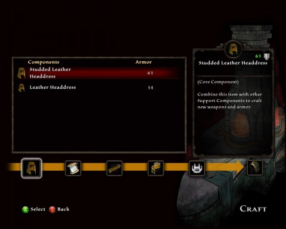

Back to: [West Karana](/posts/westkarana.md) > [2012](/posts/2012/westkarana.md) > [February](./westkarana.md)
# Crafting in Kingdoms of Amalur: Reckoning

*Posted by Tipa on 2012-02-14 08:11:06*

[caption id="attachment\_10105" align="aligncenter" width="480" caption="Recipe screen"][/caption]

I've really been impressed with Kingdoms of Amalur: Reckoning's crafting. The whole game has actually impressed me more than I thought it would, so good job, Big Huge Games, 38 Studios and Electronic Arts.

There's a couple kinds of crafting common to RPGs; one is where there are fixed recipes and the same item is produced every time -- EverQuest, World of Warcraft and Skyrim share this model. This turns crafting into a commodity. In MMOs that use this model, there's no particular reason to go to any specific crafter to get something made. If they have the skill, they can give you the item, identical to that produced by anyone else.

RPGs like Star Wars Galaxies have a model where the general function of an item -- a template -- is provided, but the actual details are determined by the crafter and their skill. Reckoning follows this latter model.

[caption id="attachment\_10106" align="aligncenter" width="480" caption="Making a hood"][/caption]

Equipment in Reckoning is created via the Blacksmithing skill. Items can be made with from 2 to 5 components, depending on your skill. Each component adds another stat or effect to the item. In the screenshot above, I'm making a new hood for my rogue. I start out with the base component, a leather headdress. Components can be found as loot or by disabling traps (with high detect hidden skill), but are normally created by salvaging unwanted gear. 

I toss almost everything I find into salvage, because I like having all my options available when I go to the forge.

At each step, I make decisions about the final product. Here I select a high armor class headdress over a lower armor class one. I will make some trash loot for selling with the trash components.

[caption id="attachment\_10107" align="aligncenter" width="480" caption="Comparing the finished product"][/caption]

The final crafting component is a gem, found as loot or created with sagecraft. I'm trying here to replace a Might-based helm (from a set) with a Finesse-based hood, so I can at some point switch from my Might/Finesse build to a Finesse/Sorcery build without losing all my gear. It was important to me to not lose the old helmet's innate health regeneration, as your health doesn't regen quickly on its own.

Luckily, I had stumbled onto the formula, through experimentation, for +1 health regeneration gems.

[caption id="attachment\_10108" align="aligncenter" width="480" caption="Name it!"][/caption]

If I didn't like what I made, I could have backed out the entire process and lost nothing, or tried different components, but in this case it's a clear upgrade and is a great alternative to the old helmet.

All that's left is the naming. The hood joins the rest of my "Terrapin Hide" armor -- almost everything I equip has been crafted. In a couple of levels I'll unlock master crafted gear... and I fully expect that to bring me through the rest of the game.

No, you aren't required to craft. Decent gear drops throughout the game. But if you want the best gear available at all times, you will need to come to the forge. It's painless.

## Comments!
---
**bhagpuss** writes: I'm intrigued to see the generally positive response Kingdoms of Amalur: Reckoning is getting, especially since the game only exists as a calling card for Copernicus.

The whole concept of crafting in an offline RPG seems very odd to me, but it makes a lot more sense if it's a trial run for the system that the MMO will use. Does it look like the kind of crafting system that would work in a multi-user environment with a functioning virtual economy?

Indeed, any thoughts on how the MMO might turn out, based on what you're seeing in Reckoning?
---
**Ahtchu** writes: While it might indeed be a calling card for Copernicus, two thoughts:
1. It is very much a complete game unto itself
2. With the exception of EvE and choice Eastern titles, all MMOs have had calling cards (albeit perhaps not intended?)
It's refreshing to see such creativity and freedom involved with the game (at least in some departments). I'm saddened by the lack of world freedom (invisible walls amuck), things like crafting which are truly a cornerstone but often done poorly are well done here.
Thank you for this post, Tipa.
---
**Bronte** writes: As someone who just started in Amalur, I thank you for bringing this to my attention!
---
**Yarr** writes: I was really interested in this game initially, but the demo was so bad I've put this on the "buy from Steam at 75% off sale" list, so Christmas 2012 most likely, or maybe even by their summer sale. I won't go into all the problems I saw in the demo other than to say I'm shocked a company would release something in that state so close to actual release.

I think somewhere in there is probably a decent, if not great, game. I've been watching TotalBiscuit's play through on YouTube and he points out some of the good things the game does and hopefully he will show something from beyond the area the demo was in. There are some good ideas here, but just wrapped in a pre-2004 era game. I've pretty much written off the MMO version of this if the low detail cartoony graphics, poor voice acting, wonky console controls, and beaten to death lore are anything to go by. Sadness.
---
**Tipa** writes: @bhagpuss I don't know if any system from KoA:R will make it into the MMO; my understanding is that Reckoning was well on its way before 38 Studios bought it and replaced the lore and art assets with its own. The systems in place are very un-MMO like. For one thing, they make your character too powerful and self-sufficient; important for a single player game, poison to an MMO.

@Bronte thanks!

@Yarr the demo was hideous. It was a leap of faith to buy the game based on the demo, but it's a leap I am glad I made. Again, I don't think this game tells us very much about the MMO. They are two different games that share a common setting, from what I understand.
---
**David C.** writes: I downloaded, installed, played and delete the Amalur -demo- yesterday. Few things bugged me: it looks like a game done for console, modified to run on PC; too much talking/cinematics, bored me to death; invisible walls (hate it!). I also had problems controlling the character, getting it to attack what I wanted, etc. Perhaps I should have giving it more time.

Crafting seems interesting! Sadly, I did not get even close to it...
---
**Tipa** writes: @David C I don't think you got a wrong impression about the game. The game clearly WAS done for a console. The cinematics ARE boring (but skip-able), invisible walls and lack of a on-demand jump mean you are forced to take winding paths to where you need to go, and sometimes you attack seemingly random stuff -- one hit to go on a mob and suddenly you are spinning and leaping for something new.

Even with all that, I still think the game is pretty fun (though I haven't played for days atm...) As an advertisement for an MMO... I don't think that works very well.
---
**Josh** writes: I think you guys are being too negative when it comes to the "invisible wall" piece of the game. I do agree that it gets a bit annoying when my character can't even jump off of a 2 foot tall ledge, but it definitely doesn't ruin the game. You have to look at the overall story to the game and playability. For a game that didn't have hardly any advertisement and was pretty much unknown to most people, it's actually pretty solid. 

Remember that the Fable line of games used the invisible wall piece and was very successful both financially and critically. 

As far as crafting goes, I just recently starting looking into that skill. I even went as far as redoing my entire characters fate to reinvest in that skill. I got to the point with my mage armor and staff/chakrams that the game was getting boring to me. I am the type of player with upgradeable characters that needs constant variety and I just wasn't getting it. I haven't been able to craft anything better than what I currently have equipped but am hoping that I will find some useful salvaged pieces soon to craft something better than what I find in shops or random drops.
---
**Tipa** writes: I think of the wall issue like checkers -- you can only move certain ways and so on. What I really object to is the whole business about being led around -- the only reason it's done is to hide how small the zones really are, like the holodecks in Star Trek. If I may be so nerdy.

Once you have smithing pretty high and are making good progress on sagecraft, almost all dropped gear becomes fodder for the salvage machine. Helps control inventory anyway :)
---
**SimpleSimon** writes: Back to the crafting-specific-bit, I haven't been able to salvage anything other than whites. Admittedly, that's after only a few hours of playing to level 3-4. I put only one point in blacksmithing so far, so I am curious to find out if I need more points there (the descriptions say that one may use more materials in creation, but nothing about colors from which one may salvage) or if there is something else I am overlooking.
---
**Tipa** writes: Yes, you need to put more points in in order to salvage higher level stuff, and you will not be able to salvage any yellows or most (if not all) purples even when you max the skill.
