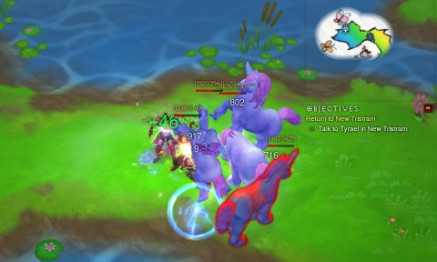
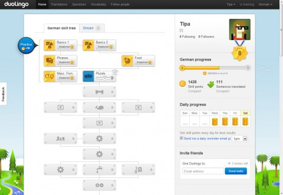

Back to: [West Karana](/posts/westkarana.md) > [2012](/posts/2012/westkarana.md) > [October](./westkarana.md)
# Game Log: Been awhile

*Posted by Tipa on 2012-10-06 19:48:57*

[caption id="attachment\_10278" align="aligncenter" width="480"] Whimsyshire[/caption]

I have to reluctantly admit that Diablo 3 became somewhat less fun when we stopped with Hardcore Mode. It was totally necessary that we go normal mode, because we just weren't progressing, having to restart over and over again. There are other games, of course. Getting a million gold in the auction house, dropping 300K on a marginal tunic upgrade because why not? People rerolling after farming Inferno for a few weeks have more than enough gold to waste on my junk, so I let 'em.

Doing the quest for Diablo 3's "cow level", Whimsyshire, an extra level of sunshine and rainbows, was a nice way to spend a Sunday. I return, now and then, when I'm bored or I've gotten some new upgrades and want to check DPS. I haven't gotten any of the legendary items, but I have seen them on the auction house and I am not impressed by the stats.

The secret to the auction house? Know when you have something worth having, figure out the maximum you'd ever pay for that yourself, multiply that by 10, and list it. Free money.

[caption id="attachment\_10279" align="aligncenter" width="480"] Duolingo[/caption]

The folks at Duolingo have a unique way of teaching a foreign language: turn it into a game. Game-ification isn't a particularly new idea, and applying that to languages is a concept as old as flash cards. Duolingo combines drills, rote translations, transcription and pronunciation (with a microphone) with a fairly new technique to improve retention, and an interesting ideal: to get learners to translate the Internet, one sentence at a time.

See, each lesson introduces a small amount of new vocabulary and phrases. Once you've mastered that, you're given a usually skill-appropriate sentence from a foreign blog or news post to translate from your foreign language to your native language. You're graded on how well your translation matches the best rated translations from other learners, and after twenty people have translated a sentence, the best is used. This usually works out well, except for sentences that only make sense in the context of another sentence that you may not have translated or fully understood, if you did have a crack at it. Then there are the people who just go to the original web page and have Google translate it and use that for their translation.

This is the downside of game-ification. People cheat at games. Anyway, you can see that even though I took three years of German in high school, (er, drei Jahre Deutsch studiert ich im Gymnasium), my level of retention after the past thirty years was pretty low. But I'm keeping at it, halfway to level 9.

English speakers can learn German, French or Spanish. Spanish or Portuguese speakers can learn English.

Anyway, I find I don't really have anything to say about MMOs these days, but I've decided to just blog what I'm playing, we'll see what comes of that. I'm playing more than D3 and Duolingo, but ... let's not let writing these things become the three hour affairs that just turn tedious after awhile.

## Comments!
---
**bhagpuss** writes: Since I first discovered West Karana when I was googling for information on Wizard 101 I was wondering whether you'd be playing Pirate 101? \r\n\r\nCurious also about your comment above "let’s not let writing these things become the three hour affairs". Did you mean the length of time it takes to write a post? Three hours would be about my average! Sometimes it's the whole day. Generally I'd as soon write as play, so that's not usually a problem, although GW2 has turned that on its head somewhat.\r\n\r\nI signed up for Duolingo but it doesn't play very nicely with NoScript. Curious to know if you find you actually retain much of the language information from a process like this? After trying many ways of learning languages, I still find the one that actually makes things stick best is working through a 1950s-style school grammar with pencil and paper! Gamified or online language learning seems to work while I'm doing the exercises but leave virtually no memory after.
---
**Tipa** writes: Still flabbergasted anyone still reads this :))\r\n\r\nI played Pirate101 in the alpha and a little bit in the closed beta, and will certainly play it when it goes live Monday. Still, though, it is a kid's game, and while I really love the tactical strategy battle aspect, it is substantially simplified and doesn't have the same level of strategy as Wizard 101.\r\n\r\nYes, writing a post takes three hours, or more, because I get continuously sidetracked. "Writing a blog post" becomes "arranging an evening's gaming". Which isn't a bad thing, but what's not in there is "having fun gaming".\r\n\r\nIt's hard to tell how effective Duolingo is because I came in knowing German to some degree, and it's only been a couple of weeks. Knowing that I wasn't starting from zero, I was thinking about going with French instead. The advantage of French is that there is a French-speaking province just four hours away where I could actually use the language (even though the Canadian dialect is different from the Parisian one). For German, I can only replay "Run Lola Run" without the subtitles...
