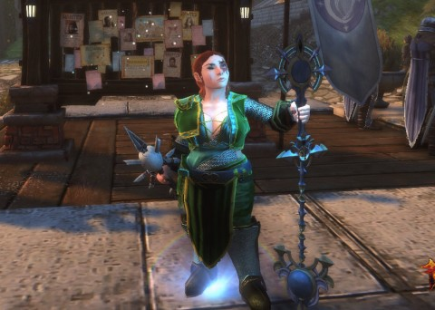
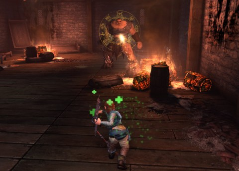
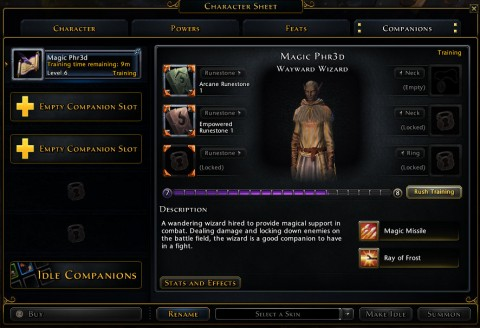
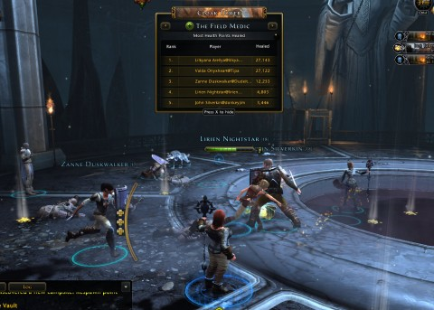
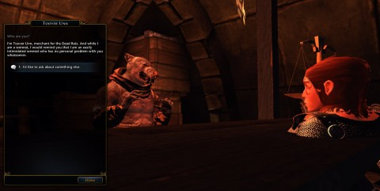
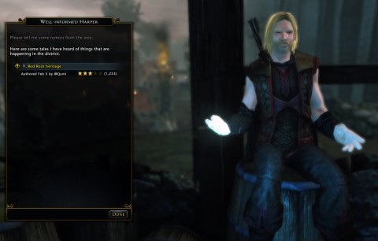

Back to: [West Karana](/posts/westkarana.md) > [2013](/posts/2013/westkarana.md) > [February](./westkarana.md)
# Neverwinter: It's Forgotten Realms, but is it D&D?

*Posted by Tipa on 2013-02-10 10:42:48*

[caption id="attachment\_10665" align="aligncenter" width="480"] I'll heal you, but it might hurt a little bit.[/caption]

This is the first beta weekend for Cryptic's "Neverwinter", an action-oriented MMO set in one of the more famous of the Forgotten Realm's cities. We've seen Neverwinter brought to life before in "Neverwinter Nights" and its sequel, titles that kept their relevance by offering every player the chance and opportunity to create and run their own dungeons for themselves and their friends.

It's absolutely the reason that Cryptic chose Neverwinter as the base for their game, as players can create their own adventures through the "Foundry". Starship captains have been using the Foundry in Star Trek Online to make adventures for well over a year now, but that was just a tech test compared to the tools on offer in Neverwinter.

Foundry wasn't live, though, so I'll just focus on the gameplay.

[caption id="attachment\_10666" align="aligncenter" width="480"] Say hello to my Lance of Faith, Ogre![/caption]

Neverwinter is loosely based on the fourth edition rules for Dungeons & Dragons. You can choose your race from halfling, dwarf, human, elf, half-elf, drow and the demonic tiefling. The drow race was not available to choose during this beta. Character appearance was as good as I've seen anywhere else; you'll be able to make your character look exactly how you like. Stats were rolled in a simplified manner; there are maybe a half dozen potential rolls that focus on your class' prime statistic and the two secondary ones. It is not explained in the game how the secondary stats affect gameplay, so I felt it was just best to roll the highest possible number for the prime stat... which is how I play the real D&D, too, so there's that.

Importing your paper character probably won't be possible. Especially if it used any classes or races from beyond the Players Handbook (PHB) (and it's missing dragonborn and eladrin for PHB1 races, too).

In D&D4e, each class has a couple of preferred builds. Neverwinter makes the choice of build for you. For instance, the PHB suggests "Battle Cleric" and "Devoted Cleric" as preferred builds for the cleric. Neverwinter offers only "Devoted Cleric". Similarly, fighters are restricted to "Guardian Fighter" or "Great Weapon Fighter", wizards to "Control Wizard", rogues to "Trickster Rogue", and nothing is yet known about Ranger, though it looks from the character creation screen that that's next. No information about the Paladin or the Warlord.

The abilities have all the familiar names from D&D, with their own twists to fit them into an MMO environment. "At Will" powers are bound to the two mouse buttons and can be held down and spammed. "Encounter" powers are on cooldown timers. "Daily" powers work of "Action Points" that are gained in battle when using the other powers. When your character gains enough powers to not fit into the available slots, you can easily change them out in Neverwinter or at a campsite within a dungeon.

There are no mana bars, even for spellcasters. Your abilities are based on timers and action points and nothing more.

[caption id="attachment\_10667" align="aligncenter" width="480"] Magic Phr3d, a Companion[/caption]

You won't adventure alone, in Neverwinter. There are queues for certain events (like the Orc Assault on Neverwinter) and dungeons (like the Cloak Tower) that automatically fill in a party and put you where you need to be.

But even when you're grinding out quests, you don't need to go it alone. At level 16, you gain the ability to hire "companions" to fill needs. You can choose from fighters, healers, rogues and wizards. I chose the wizard, because D&D clerics stand in the front lines (or would, if Neverwinter allowed them their scale and plate armor. Chain only, for Neverwinter clerics.) Though you can only have one active companion at a time, you can keep several "on deck".

My companion didn't come with the name "Magic Phr3d". I kinda imagined him as a teenage kid from the "real" world who woke up one day in the magical realm of Farune as a wizard, and is really excited about it. He was level 1 when I hired him, and every time he levels, he has to be sent off for training, which takes increasingly more time and takes increasingly more money. At level 8 (vs my character's level 20), he is fairly good at slowing monsters down so I have plenty of time to debuff them and wear them down before they get close enough to hurt.

Companions don't take up group slots -- they are more like pets -- so dungeons crawls in a full five person party can get pretty crowded.

[caption id="attachment\_10668" align="aligncenter" width="480"] Finishing up Cloak Tower[/caption]

The elephant in the room here is Turbine's Dungeons & Dragons Online (DDO). Cryptic shoots across its bow by using the same font for Neverwinter as Turbine does for Lord of the Rings Online. But the games are very different.

DDO tries, as much as possible, to pretend you and your party are experiencing a game played in some other reality by people around a table. A DM sets the scene as you enter a dungeon; levels are slow and hard to come by. Daily powers can only be used a limited number of times between rests. Traps and puzzles are as integral to a dungeon crawl as monster fighting. Combat goes in rounds, and the actual dice rolls scroll by. 

Neverwinter is a more standard MMO. Levels come quickly; my DM was shocked when he found he reached level 4 in the tutorial, where in our Adventure Company campaign, he'd regretted us getting to level 4 by the end of the six months we played. I easily got to level 20 after a few hours play, and the top level looks to be 60, a level impossible in actual D&D. Where solo play is discouraged (but not impossible) in DDO, solo play is easy in Neverwinter. 

Granted, the only group instance I found so far was Cloak Tower, and the balance could shift toward more group play as the levels rise. But I doubt we'll see dungeons that take an entire play session to run, as we often did in DDO.

DDO is much better at presenting preferred builds, or allowing you to customize your class, or even multiclass. Neverwinter has the few preferred builds it offers, and never allows you to leave the reservation or multiclass (as far as I have seen).

Even with the compromises DDO had to make in order to turn a pen-and-paper game into an MMO (such as mana bars and wildly inflated health), it gives a better Dungeons & Dragons experience than Neverwinter.

[caption id="attachment\_10669" align="aligncenter" width="480"] Toover the Were-Rat[/caption]

As a MMO, Neverwinter is fairly standard. You get quests, you go out and kill things. You get frequent solo instances, but also a good mix of open-world adventuring where your character can help out (and be helped by) other characters with loot and experience for all. Because Cryptic limits the builds and classes available, classes remain fairly distinct and each has a role in a group, while having plenty of tools to make soloing a valid play choice.

What sets Neverwinter apart is its missions created with the Foundry. While not available to the beta testers this weekend, they have a wide variety of player-created missions available, and these are heavily leveraged by "job boards", but also bards and bartenders who will gladly offer up adventures that start nearby.

I played a couple of them, and the ones promoted by Cryptic were of fairly decent quality, with good writing and plot that tied in well with the lore of the game, though the actual adventures were of the standard smash-and-kill variety. I don't know if the Foundry supports roleplay missions. Won't know that until the Foundry opens up.

[caption id="attachment\_10670" align="aligncenter" width="480"] A Well-Informed Bard offers player-created quests[/caption]

Cryptic's Neverwinter is a good-looking, polished game offering modern MMO conveniences mixed with a healthy serving of D&D. The pace is fast, the powers iconic, the loot abundant and the grouping easy. While it's not as faithful an implementation of D&D as Dungeons and Dragons Online supports, it is definitely D&D. The first implementation of the fourth edition rules I've seen so far.

If the adventure-crafting tools offered to the players are able to create the quality of adventures created by the Cryptic game designers, then Neverwinter could come out from under the content limitations which hamper other MMOs, especially at the end game and with group content.

If the player tools only really allow for "go here, kill that, grab this, return for reward", though, it may not be as much of an advantage as it seems. The high quality of the Foundry missions for Neverwinter's sister game, Star Trek Online, gives hope that we'll see some truly excellent content here as well.

Neverwinter will be free to download and free to play. Special mounts, armor and other stuff will be available from the cash shops, but (at least in beta) leveling did not feel constrained by my checkbook. There were no "lockboxes" to be seen -- these are treasure chests that require real money to open and may contain something very nice but usually contain trash -- but I expect they're on their way. Even a F2P game must make money, after all. As long as they don't broadcast to the world when someone opens one and gets something good, as they do in STO. That's really annoying.

