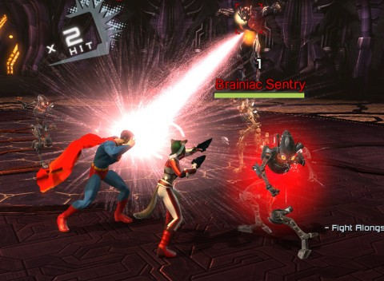
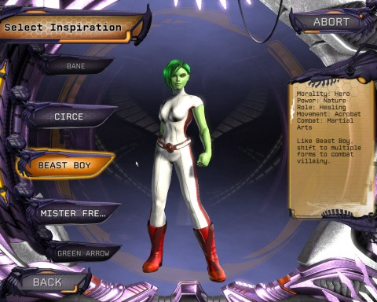

Back to: [West Karana](/posts/westkarana.md) > [2013](/posts/2013/westkarana.md) > [January](./westkarana.md)
# Team Spode Decision Time: DC Universe Online

*Posted by Tipa on 2013-01-01 09:28:00*

[caption id="attachment\_10550" align="aligncenter" width="480"] DC Universe Online[/caption]

Nobody in Team Spode is actually asking me to document our choice of a new game, and it will ultimately be decided by some sort of weird consensus. But, the search itself is fun.

I thought it would be cool to take a quick look at the games under consideration, starting today with DC Universe Online (DCUO).

DCUO is a free to play superhero game set in the DC universe. I want to say DC comics universe, but DC stands for Detective Comics, and Detective Comics Comics would be as redundant as an ATM machine, into which you enter your PIN number.

The DC Universe includes iconic heroes such as Superman, Batman and Wonder Woman, and equally notorious villains like the Joker, Lex Luthor, Bane, and so on.

You, the player, were a normal human living a normal life until Superman's old enemy, Brainiac, an immortal AI, arrived to conquer Earth. Brainiac then kills all the super heroes of Earth and all the villains of Earth and pretty much every living thing on Earth, making reality safe for his legions of robots.

Everything dies. The end.

But, wait... Lex Luthor somehow survives. He steals some Brainiac tech and escapes into the past just before Brainiac's invasion, and tries to bring together an untrusting Justice League. Frustrated, he uses the tech to grant superpowers to random people, including you, the player. Given superhuman abilities, you can choose to take on the role of a hero or a villain, be mentored by the most famous names in comics, and save the Earth.

[caption id="attachment\_10551" align="aligncenter" width="480"] Foxforge[/caption]

This back story echoes the most iconic of the early superhero games, 2002's [Freedom Force](http://en.wikipedia.org/wiki/Freedom_Force_(2002_video_game)). The widespread popularity of this sort of tactical hero game led inevitably to Cryptic Studios' 2004 hit, [City of Heroes](http://en.wikipedia.org/wiki/City_of_Heroes), the first superhero-themed MMO.

CoH players used the game's legendary character creation system to precisely duplicate heroes and villains from the DC and Marvel comic continuities. This bothered Marvel enough that they sued Cryptic for massive trademark infringement, where it was revealed that some of the infringing characters named in the suit [had been created by Marvel themselves](http://en.wikipedia.org/wiki/City_of_Heroes#Suit_by_Marvel).

The suit was settled for undisclosed terms, but given that Cryptic soon started work on a new game, Marvel Universe Online, we can imagine that creating such a game was one of the conditions in the suit, where players would be free to use Marvel properties. Marvel eventually canceled development, and Cryptic used the game engine developed for MUO as the basis for their post-NCSoft take on comic MMOs, Champions Online.

Still, there was a huge demand from players to play in the iconic universes of DC and Marvel. DC enlisted Sony Online Entertainment to develop the game, side by side with the best artists and writers in the industry, to finally develop a game where players would be encouraged to play Superman, or Wonder Woman, or the Joker, or Catwoman, or whomever. Or roll their own.

I downloaded DCUO for free from Steam, though you can get it directly from the [DCUO home page](http://www.dcuniverseonline.com/). It's also available for the Playstation 3, a decision that enforces a very simple control scheme that allows for both game controller and keyboard play.

You don't have to choose an existing iconic hero or villain for your template, but for new characters, it streamlines the process somewhat. I chose as my template Beast Boy, the shapeshifting, annoying little brother character in the Teen Titans. This gave my character, Foxforge, martial arts abilities, shapeshifting, the acrobatics travel power (can climb up and jump off anything), and a greenish color scheme. Heroes with Beast Boy as their template take on the Healing role in groups, though every character can fight effectively on their own.

You get some basic ability to change your uniform, but unlike City of Heroes and Champions Online, your uniform changes with gear you equip, and is best thought of as the starting clothes all new MMO players usually immediately replace.

Character creation dropped me into the extended tutorial. As a recently empowered human, I was brought into one of Brainiac's orbital harvesting facilities to be separated into my component parts. For SCIENCE. Outside, superhacker Oracle (nee Batgirl, nee Barbara Gordon), while trying to crack the harvester electronic countermeasures, managed to break me from my cryo tube. Learning to use my powers as I escaped from the ship, I eventually met up with Superman, and together we wreaked havoc (nascent villains team up with Lex Luthor, I believe).

[caption id="attachment\_10552" align="aligncenter" width="480"] As quiet as a fly on the ceiling[/caption]

DCUO is a frenetic button-mashing game. Two main attacks map to the left and right mouse buttons (or the appropriate two buttons on game pads), and combos unlocked during gameplay trigger off specific combinations of left/right button presses, taps and holds. Before she'd left the mother ship, Foxforge gained a power to hurl enemies in the air -- done by tapping and holding the left mouse button.

Shift button defends against attacks, tab key locks onto enemies and keeps you facing them. Everything is streamlined toward making fast, fluid fights, as full of action as possible.

I have played DCUO before. Beneath its four color costume, DCUO is not too different from your standard MMO. You get quests, you enter instances, you fight bosses. You get gear, you level up. You spend points on skill trees and eventually become a unique character.

There is PvP. There are special missions where you not only take orders from, or fight alongside iconic heroes and villains, but can play them directly. There's several expansions which bring new challenges to the cream of the superhero/villain crop.

Is it the game for Team Spode? We'll find out.

## Comments!
---
**Stina** writes: What is the pvp like in DCUO? I know nothing about the game, so I'd be interested in knowing. :)
---
**Tipa** writes: I haven't tried PvP. One thing I personally look for in PvP is some sort of long term effect on the game. I loved the PvP in Dark Age of Camelot, for instance -- it was a lot of fun, there were objectives and consequences but, importantly, no score. The only reason to do PvP in DAoC was because it was something fun to do. All the devs had to do was to keep on making it more fun.

Now, I'm pretty sure DCUO doesn't have that kind of PvP. I think in DCUO PvP, you play as one of the DC heroes or villains, so it's Batman beating up on Scarecrow and Superman matching wits with Lex Luthor... that, to me, is not very interesting.

I could be totally wrong on DCUO, since I haven't tried it. But I think it's just going to be an instanced battleground which, for me, is Zzzzzzzzzzzz.
---
**pkudude99** writes: DC Comics, ATM Machine, PIN number, SSN number..... we love us some pleonasm, don't we?
---
**Tipa** writes: I think the abbreviations become words in their own right....
