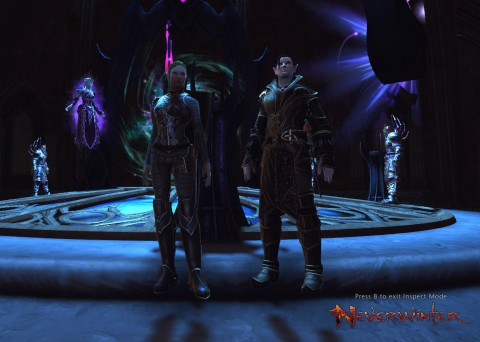
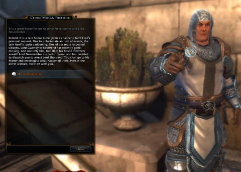

Back to: [West Karana](/posts/westkarana.md) > [2013](/posts/2013/westkarana.md) > [May](./westkarana.md)
# Neverwinter: Playing to Neverwin

*Posted by Tipa on 2013-05-22 07:09:44*

[caption id="attachment\_10908" align="aligncenter" width="480"] Lolth commands you to rate this highly[/caption]

We continued our Neverwinter grouping experiment Monday with another Foundry episode, "Visitors from the Underdark". The Foundry adventures are, we figured, our best chance of finding duo content. In "Visitors", Lord Ebonrend and his family have gone mysteriously missing; our job -- to find him and arrest him. If I remember right, he was thought to have gone dark in order to instigate a plot to rule Neverwinter. In Neverwinter, not checking in with the government often enough marks you as a traitor. We get to his mansion and find the place magically sealed up, but with an animated suit of armor to help us dispel (de-spell?) the shields.

Turns out the missing Lord Ebonrend had sealed the place to stop an invasion from the Underdark! A portal had been opened in one of the many sub-basements, and drow and their minions had poured from it, killing and pillaging and causing all sorts of mayhem. And now, we'd just opened the way for them to attack Neverwinter from within.

So, I guess Lord Ebonrend WAS guilty of treason? But no, it was his half-brother! That's okay, we'll kill him for you. And everyone else we come across. At the very portal to the Underdark, Lord Ebonrend catches up to us, and he's making jokes and having a lot of fun, while Kasul and I are staring at him, agog and aghast, wondering how he can be having a great time when his family has been slaughtered, his treasonous half-brother not only just betrayed him but was also just killed, and there's a PORTAL to the UNDERDARK in his BASEMENT. But no, he's decided it's open mike night at Lolth's Bar and Grill.

[caption id="attachment\_10911" align="aligncenter" width="480"] Clerics are Lord Neverember's hatchet-men[/caption]

The mission tried to get us to head straight into the sequel, but we were dubious. We returned to Neverwinter and continued on to the Tower District.

This orc-infested area steeps players in the lore of the Many-Arrows orc clan. It includes the Orc Assault skirmish and every player's first actual group dungeon, the Cloak Tower. The content outside of the skirmish and the dungeon were meant for a solo player; with the two of us, progress was pretty quick. We did the skirmish a couple of times, me trying each time for the tank ranking and Kasul for the damage ranking. We each did respectably. 

Just before we headed into the Cloak Tower, we reached level 16 and were able to hire companions. I chose a healer, and Kasul chose a wizard, ~~and Lord Neverember branded us as traitors~~. We and our level 1 companions queued up for the Cloak Tower, a place of enduring silence. It is said that the player that utters even one word in the Cloak Tower will be ~~marked as a traitor by Lord Neverember~~ shunned by all the good people of Neverwinter, but all our reputations ended the night intact, and with me on top of the tank chart and Kasul on top of the damage chart, our rightful spots.

Next week: I believe we have some city plots to work through before we head to the bandit hills. And also, more foundry! Maybe we'll do the next chapter of the Underdark arc. 
