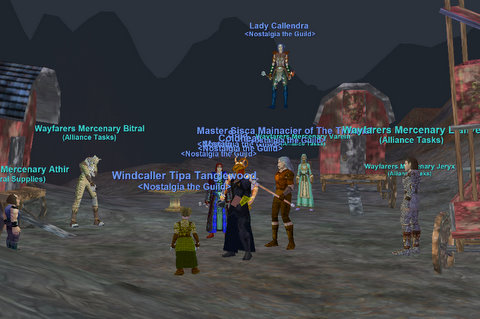
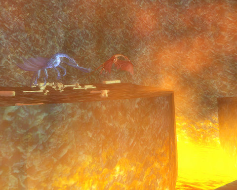
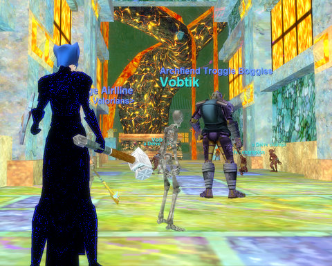
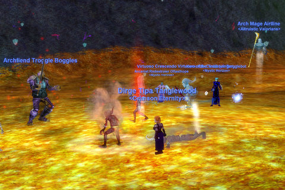
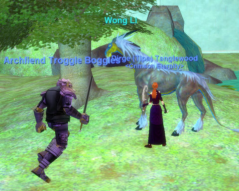

# EQ: The Lurkers of Lavaspinner's Lair & more

*Posted by Tipa on 2008-09-27 10:49:29*

Another Friday, another entirely new zone, and we still are ages from seeing more than a fraction of the game.

Last week, we started doing the faction quests that open up the main mission arc of the Dragons of Norrath expansion. The first brought us to Stillmoon Temple, deep inside the Broodlands. Last night, though, we stayed a little closer to home, and headed into Lavaspinner's Lair.

A Lavaspinner is a particular kind of spider formed of cooling lava and sent forth by their queen, Volkara, one of DoN's earlier raid targets, to entrap unwary explorers in their burning webs to use as food for her young.

Our job was to kill those spiders and grab some of their webs -- eight for each person who needs. And while we were there, maybe some blood from the higher-level Delve drakes guarding the nests in the northern part of the lair.

So, basically, an entire night spent getting uncommon drops from hundreds of mobs, because they are collection quests, the ABSOLUTE WORST kind of quests ever written in any MMO. The kind of quests that you don't want to do in a group because it will take forever, but this being EverQuest, not the kind of thing you can do alone. Not at level 60, at any rate, and not Lavaspinner's Lair.

Things went fairly well before we kind of all slipped into a pit, so that wasn't good. Most of us died. On the way back, we were jumped by a bunch of mobs and a couple people died, cleric camped and those of us still alive evaced. Coldheat logged back in and rezzed the two with him, but then they got a respawn while the rest of us were fighting back. It was after eleven, we were all still kind of disturbed by the presidential debates -- no matter what side you were on, it was pretty disturbing -- so we called it, ported out or summoned depending on our live/dead state, and logged.

Final tally: 3 AA for me; bought Ambidexterity and have a point left over. Spending those points earned me some new AA titles, so I switched from my epic title to Huntress, just for fun. Huntress Tipa Tanglewood.

Since most of the screenshots I took last night were craptacular (why isn't that word in the dictionary!? It should be!), I logged on my rogue, also by some wild coincidence destiny cannot explain, named Tipa Tanglewood, on Erollisi Marr, and headed into Lavaspinner's to take somewhat better screenshots (the one up above is an example. See how good things can look when stuff isn't trying to kill you?).

While there, I got to chatting with Egat, and then someone piped up in general chat that they needed to kill Emoush, which, I believe, is the second Dragons of Norrath raid. I was *right there*, so I asked if they could use a lowly 70 rogue -- they could, I was in, and off we went.

Emoush is a huge rock dervish at the far end of a goblin temple in the Broodlands. This temple pops up in a lot of different quests and missions; it's beautiful, sure, but it's way too large for goblins. It's very hard to believe they made this themselves. More likely it's something they robbed from the dragons. Still, they're there now and are about as friendly to strangers as these kinds of places normally are, so in we went, spreading death in dark puddles staining the stainless marble floors.

This used to take four groups back in the day. Seriously.

Emoush has a posse. Three goblin shaman who won't allow him to come to harm. They're pretty protective of each other as well, but they have a code of battle they follow. They can instantly restore one another to full health, but they will only do so if their buddy has been dead for more than thirty seconds or so. So all three have to die more or less at the same time, or they will just revive each other. We knocked them all down to about 10% one at a time, then did some absurdly awesome dps to vanish their hit points.

Emoush awoke, enraged, and with an urge to kill. I was going through my book of disciplines, firing one off and going on to the next. I may be only 70 and my gear may date back to Uqua, but I can still deliver a righteous stabbing when I want.

If he's not killed in two minutes, he manages to revive all his shaman protectors who instantly resume protecting Emoush from all harm. We got Emoush -- a (former) RAID mob -- down to 20%, re-killed the shaman, and sent Emoush back to hell to keep them company -- no problem.

One of the people in the group needed Gimblax, the first raid in Dragons of Norrath. Even before I quit, this was easily done by a single group. In fact, we rogues of Crimson Eternity would get the mission, sneak up to him, and then take turns tanking with Nimble on (immunity from melee for about 20 seconds) while the others stabbed, evading off to the next rogue when Nimble wore off. It was an easy way to farm radiant crystals and faction tokens.

So I snuck this time back into position, waiting for the SK tank to finish feigning to the mob. When he got there, we slayed. And that was the second (former) raid done.

I was enjoying my first Tipa group since like 2005 so much, I stuck around for another Stillmoon Temple mission. I did this a LOT back in the day; a rogue can make some of the yuckier bits go by much faster by using their ability to soundlessly sneak all over the temple.

We did it in record time and that was several dozen more crystals to my name. Crystals, used for buying DoN gear, used to be worth a lot of money, and that cash I did have in EQ came largely from running missions and selling the crystals. I doubt they have much, if any, value now, but those were good times.

When I turned in the faction token for that mission after, I went from warmly to ally with the Norrathian Keepers; this opens up every one of the DoN missions to me.

Not that there's much point in them these days, but it's another milestone.

It's fun days like this that make me miss EverQuest. The sort of casual fun, exploration and (dare I add) competence that has been mostly drained from modern MMOs which abhor risk or danger while also ramping up the pace. So you do less, but look busier.

And I'm not being sarcastic when I ask, when is someone going to make an EverQuest killer? Dark Age of Camelot came closest, but ever since, the genre has focused more on graphics and fluff than deep gameplay. EQ is not a pretty game, never really was -- but it is so deep. Impenetrably so, really. People new to EQ have real trouble with it.

And that's why I wonder, where are the EQ killers -- the games that have EQ's scope, depth and challenge -- but are somewhat less exclusive? Maybe one implies the other, but I'm still looking. EQ2 is a good game, but it's not EQ. Vanguard is -- well, it was supposed to be the EQ killer, but it missed the mark. WoW's wild success has made the very thought of a challenging MMO anathema to developers; after all, who wants to go after a market of 100,000 when you could go after 10,000,000? I sure couldn't make that argument.

But as a player, I very much wish someone would.

