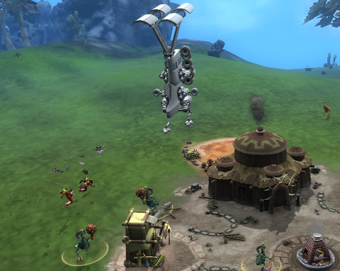

# Will the rise of User Generated Content be the real "WoW-killer"?

*Posted by Tipa on 2008-10-01 15:42:37*

  
*Maracas aren't as good at warding off intergalactic invaders as I thought they would be.*

While out gathering the day's meals, my duckling tribespeople were startled by a huge contraption which WALKED on white, clanking legs down from the sky and sucked up the food animals that were being kept in the pen behind the main hut. It then buzzed the village twice and stalked back up into space.

It was [Ogrebears](http://ogrebear.com/)' starship. Later, when my little ducklings had ascended to space, I was given a mission to suck up some of the Ogrebears creatures into *my* starship. Their terrified yelps couldn't save them from the power of my abduction ray.

That was SPORE. As a game. it's okay. As a way to get millions of people creating their own content and sharing it with their friends, of unleashing their creativity and playing games in a way that engaged people's brains instead of numbed them, it was amazing.

In three weeks, [LittleBigPlanet](http://blog.wired.com/geekdad/2008/10/geekdad-gets-ha.html) will play the same trick by giving kids and adults all the tools to make pretty much any arcade game they can imagine, along with all the awards and prizes, and share them with their friends (and anyone else). 

Warhammer Online decided to vastly de-emphasize the scripted encounters common to older games in favor of boosting the PvP game. The PvP game -- the part of the game where your opponents are other players and not computer-controlled automatons -- is considered by Mythic to be very much more compelling than the part of the game where you find a clump of Wuzzits and press a key repeatedly until they are all gone.

It's not that WoW is the only game that encourages repetitive and meaningless killing -- its predecessor, EverQuest, was widely mocked for focusing on exactly that -- but that it took such great delight in it. The Deadmines is a fantastic little story, but it always plays the exact same way. The fight against the dread dragon Onyxia was so scripted that a video where a raid leader berates his raid for not following the script exactly enough was one of the most widely circulated WoW videos I ever saw while I played reveals just how ingrained this has become.

The game devs have long assumed the path to big success was in leading the player to the rides, then letting them have their very tightly managed fun.

EverQuest 2 shares a lot of things with WoW. But, you can decorate your home limited only by your imagination. You can dress your character however you like (depending on your class). Lord of the Rings lets you also choose from among several outfits of your own design and build your own house. Likewise Vanguard. Star Wars Galaxies lets you design almost anything you like to your own specifications. Chronicles of Spellborn will let you from the start design your own look. City of Heroes will let you write your own missions -- complete with a villain of your own design.

Yet in Warcraft, every character looks the same. There are no houses, no outlet for creativity. Only in the battlegrounds (and the upcoming open PvP zone) are the players set loose to be free.

There is a new generation of MMORPGs coming. It won't be marked by super real graphics or ever-more elaborately scripted raid encounters. The new games will hand over some of the keys to the playground to the players. And, absolutely 100% guaranteed, what the players will do with them will astonish.

I've talked about this before, and people have said it's impossible, but it's not. It's already happening. The days when you could log on to your MMO and depend upon a scripted experience, the same as everyone has, are nearly over. Within five years, the quests I run will be the quests YOU wrote. And FINALLY, a dozen years too late, 3D MMOs will be up to parity with the text-based MUDs that inspired them.

And once we're up to date with the state of the art of a dozen years ago, we can move forward into something truly new.

WoW is a dinosaur, bigger than anything that came before it. A hundred feet long, tall as a tree, thundering footsteps and a trumpeting call proudly proclaiming it master of the prehistoric.

But we all know what happened to the dinosaurs.

They just couldn't adapt.

