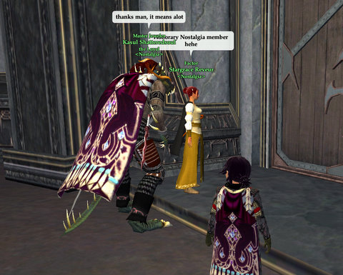
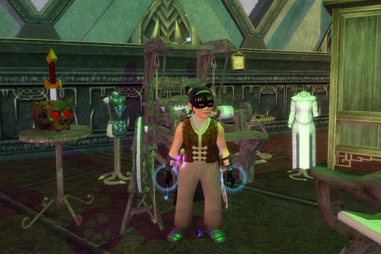
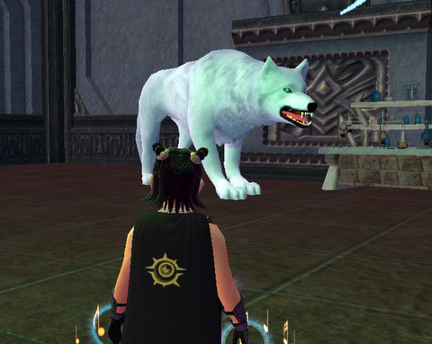
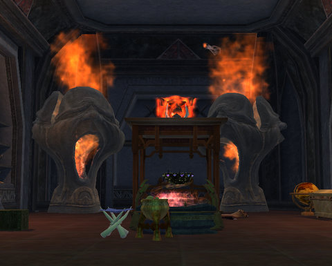

# EQ2: Nostalgia Guild Hall mania!

*Posted by Tipa on 2008-10-09 07:25:21*

Since I barely did anything to help with the guild hall, compared with [Stargrace](http://mmoquests.com), [Kasul](http://shatteredblog.wordpress.com) and Ecor, I feel kinda embarrassed to be the first to blog about it, but there ya go.

If you'd been following Twitter yesterday, you'd have seen the drama as [Nostalgia](http://nostalgiatheguild.org) worked crafting writs so the guild could reach level 30 and be allowed to buy the smallest, cheapest guild hall. Even the smallest, cheapest guild hall is pretty expensive and perhaps 5-6x larger than the largest house you can buy. There is nothing small about any guild hall. They really are, large, stupid large, and omg wtf I need a map large.

Due to the heroic efforts of the Nostalgia crafters, the guild dinged 30 JUST before I got home. This was my first time home this week before 6:30; I've been trying to catch up with work and coming home later. The guild was parked in front of the guild hall, waiting for me :)

Since Dina doesn't have good enough faction to purchase her loom, I had to switch to Dora, who has max faction with Freeport's crafter society, to buy it.

We all donated status and some of us, coin, to pay for and maintain the hall. A couple of folks with too much status came by and donated some, and we now have enough status to keep the hall going for a very long time. Stargrace bought five amenities -- NPCs and other features you can add to the guild hall. Five is all we're allowed, for now. We got the druid who opens portals for you to any druid ring, an attuner that grants you a spell to port back to the guild hall, a fuel merchant, a rush order crafting writ giver, and a banker.

Because we are, after all, largely a guild of crafters, we went for the crafting things first.

I decorated my tailoring area a little; why not? After resizing the loom down to halfling size, I added a wardrobe for storing work in progress, a chair for when I get tired of standing, and a skull with a sword stuck in it resting on a small table because... well, because why not?

This is [Buddy](../index.php/2006/06/21/eq-betraying-qeynos-proving-my-worth/), [the giant dog who roams our hall](../index.php/2006/06/26/speaking-to-nagafen/), keeping it prowler free. I wasn't sure if he was really there or just my imagination, so I sat him right behind Stargrace as she was arranging books in the guild library. Her scream woke up people three guild halls away :) She said, "I was arranging the books when I heard some barking, and I thought someone had let their dog in here. Then I turned around and AGH!".

Good times :)

Earlier, I'd been packing up Dora's room when that STUPID FRIGGIN ZOMBIE jumped out at me from nowhere, so I'd already gotten my scream in. I need some Zombie Spray to keep those zombies away. Thank God my son wasn't home to hear.

My guild room looks like front row center at a Spinal Tap concert. It needs a lot of work. I want to get a dungeon-y feel to it. Giant flaming pig heads are an interesting choice for any modern bedroom...

The hall is still pretty barren, but if I know Stargrace, it's going to be something special in a little bit. You're all invited to the open house, when we have one :)

