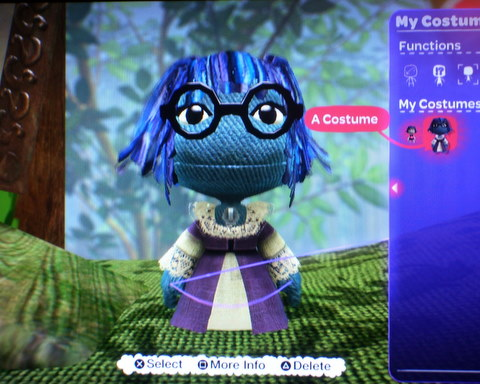
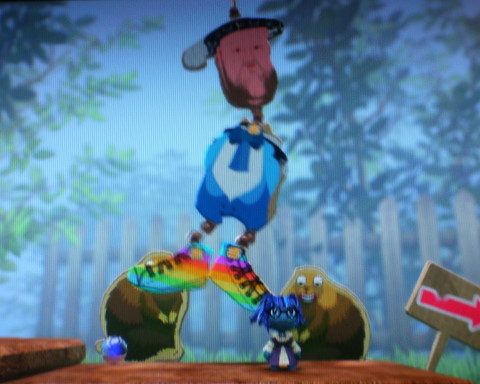
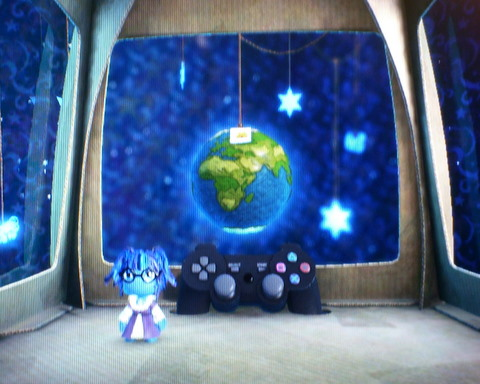

# LittleBigPlanet will make you buy a PS3.

What SPORE did for Civilization-type games, LittleBigPlanet is going to do for platformers. Nobody will play the game the same way you do, and the longer you play, the more the game will become a unique reflection of your own creativity and the things YOU find fun. Joe, June, Jane and Jack can play it some stupid boring way, but you can skip all those parts and just bring the FUN ones into the game. Or make your own. Or take someone else's and change it.

Because LittleBigPlanet isn't just a game, it's a thousand games, and you get to choose which ones become part of your own planet.

The game itself is narrated by British comedian Stephen Fry, who also narrated "Hitchhiker's Guide to the Galaxy", and he makes even the tutorial a fun, fairy-tale adventure. The tutorials themselves give little peeks into the sort of worlds and levels the player will soon be making on their own, and I gotta admit, if my kids were still kids, making fun levels for them to play would be the absolute most wonderful thing ever. Every level is like a new story, with your little Sackboy or Sackgirl as the hero (and of course, you can invite your friends over to play with you! Why not?)

This is my "pod", the room everyone gets. That planet hanging by a scrap of yarn is LittleBigPlanet itself, and using the PS3 controller in the back there, I can zoom in to any part of it and play the games I find. The pod can (of course) be decorated with the things you find in game, so even the menu screen for the game, which this is, will be as unique as the player.

I've barely touched the game, and the beta ends Sunday so I won't get to go very far in it, but what I've seen this far makes this game an immediate must buy. Along with Rock Band 2, which comes out around the same time, this is going to be a VERY busy month.

