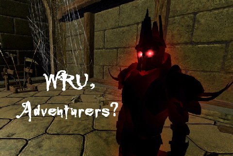

# Will EQ2's Shadow Odyssey repeat Warhammer's mistakes?

*Posted by Tipa on 2008-10-21 08:05:07*

The WAR bloggers are pretty united; they love scenarios, but people only appear to queue up for a couple of them out of all available. They love public quests, but if you want to do one, you pretty much have to get it started yourself. They love world RvR, but people would rather attack than defend. Mythic is hard at work balancing these things out, but, inevitably, this will lead to all new balance problems.

EQ2's new expansion, The Shadow Odyssey, has twenty new dungeons and associated missions. Some are easier than others. Some are way easier. Some way harder.

How is SOE going to learn from WAR's balance problems, and make it worthwhile for players to explore all the new content?

They haven't had a great track record thus far.

I have to admit, though, they totally nailed it with EverQuest's Lost Dungeons of Norrath. Back when that was popular, you could travel to any Wayfarer camp and get a group pretty quickly. Eventually, though, the Guk adventures dwindled, but the others kept their popularity until the Dragons of Norrath expansion offered newer missions, and LDoN died.

DoN totally screwed the pooch. Lower level players did that one Stillmoon Temple instance over and over. Can't remember its name. Max level players did Nest missions for AA -- one in particular. Took 30 minutes, you earned 3 AA with Lesson of the Devoted (the once a day, 30 minute double xp veteran reward) running. And that's ALL anyone did. Depths of Darkhollow had incredible loot and xp, but were really hard, so everyone did DoNs still. I have no direct knowledge of any expansions past that, so maybe they fixed it with The Buried Sea -- I dunno.

Looking at EQ2. Desert of Flames, Kingdom of Sky -- total success. You could go to any dungeon you wanted and get a group, no trouble. Echoes of Faydwer -- huge variety of dungeons, you could get an Obelisk or Crypt group without any trouble. For lower levels, there was always a Mines or Chamber of Innovation or a Kaladim or a Klak'Anon group going.

Then came the Rise of Kunark expansion. Karnor's Castle was immediately pegged as horrible xp, little to no loot, but immense risk, and even after a few attempts at rebalancing is essentially deserted to this day, a stark contrast to its enduring popularity in EQ. Chardok and Sebilis are open dungeons that nobody goes to unless they have to -- to get to the instances inside them. Korocust's Throne Room, Chardok's group instance, was popular when you could farm the boss once for each member of the group. SOE fixed that and now nobody goes there, either. 

Chelsith was popular for awhile, but now people cannot even remember its name. (Seriously. People try to describe it -- that one with the frogs and those tentacles... oh, you mean Chelsith? Yeah!). Actually, Chelsith is, in my opinion, a really great instance. I don't know why it isn't popular.

Crypt of Agony, Maiden's Chamber and Vault of Eternal Sleep (and Veksar to a dwindling extent) -- if you want a group in Kunark, those are your choices. Most of Kunark was devoted to quest chains which people do once, and then never return. So most of Kunark is entirely devoid of players. I thought that was a mistake from Day One, saw it coming, was totally vindicated. Nobody wants to be locked into ten levels of mandatory solo quest chains. That's World of Warcraft's gig, not EQ's. EQ is about grouping with friends and crawling through dungeons.

SOE seems to have gone to the clue store and picked up a six pack. The Shadow Odyssey is nearly ALL dungeon crawls.

But a month or two in, how many of these dungeons will still have groups? Will there be three popular ones and seventeen that nobody goes to? How will they balance them out?

Will they put class-specific armor in each of the dungeons? That worked for Echoes of Faydwer. Right up until Kunark was released and did an armor reset, you could always get an EoF group for a dungeon that contained a bit of class armor.

Lure people places with promises of their Master spells and abilities? That's the reason anyone goes to the Kunark instances. A rare Master on Najena can bring 400p -- or more -- in a single drop.

That's a carrot-and-stick approach, but it's what seems to work to get players to go someplace.

The question is, what's going to be the carrot that gets us to go to twenty separate instances?
