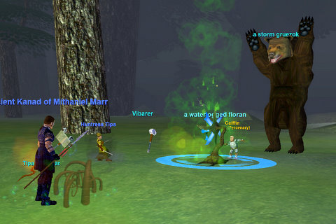
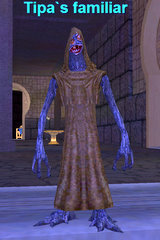
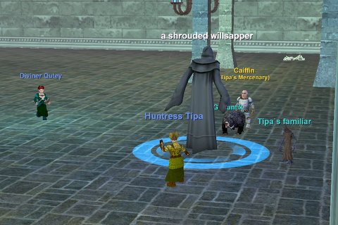

# EQ: Seeds of Destruction: Meet Caiffin, the Merc.

*Posted by Tipa on 2008-10-22 00:53:11*

So this screen shot entirely contains my philosophy of life. I'm in this really stormy place, and I'm fighting for my life, but some souless minion is trying to save me, but he's about to be eaten by a giant bear he can't see, and there's some huge guy with a "wide stance" lurking about, and someone not even in the screen shot keeping everyone alive.

That's it. Now you know everything important about me.

But seriously.

The mercenary hirelings in EverQuest's new expansion, Seeds of Destruction, are made of 200-proof AWESOME.

 I don't know anything about the new zones because, what the heck, I'm only level 61. I'm twenty five levels from the good stuff. But after I finished buying SoD (yup, no free expansion for me), second thing I did was to hunt up the Hireling trainers in the Plane of Knowledge. The first thing I did was to redeem the LDoN loot card everyone got for this ugly little pet that sometimes reflects spells cast at you back at the caster.

Isn't he sweet looking?

And then I went to PoK to find the hireling trainers. I opened the Find window (^F) and saw that there were hireling trainers for a lot of races, in fact, for every race that was out when Planes of Power was released. They are, or were, the guards of the Plane of Knowledge. I went straight to the closest Halfling trainer.

I was totally confused by all the options, but I THINK I have a picture of what it all means.

Hirelings, first of all, are your level; at least, mine was. It would be odd if I just randomly chose one that just happened to be my level, but I don't think chance had much to do with it.

Hirelings act like a group member. They JOIN the group, can take group buffs like any PC, are not counted as a pet, DO count as a PC for purposes of Leadership experience and abilities, and likely take a share of the experience as well. As far as I can tell judging from the windows, you can only hire one hireling per person at a time.

Hirelings have an initial cost (mine cost over 600 plat, but they have both cheaper and more expensive varieties) and a proportional maintenance cost (for me, 15p 3g every 15 minutes. Again, some are cheaper, some more expensive). You can suspend your hireling, which will remove him from the group and camp him, and the timer on the maintenance clock stops when he's suspended. After a few minutes, you can bring him out again. SOE says you can keep hirelings suspended indefinitely. I don't know if that's only while you are logged in, or what. He did stay with me through some crashes.

You can also dismiss your hireling, after which, I imagine, you don't have it anymore. You may also assign the hireling to someone else -- does this give it to them permanently? I didn't try it.

Hirelings have a rank -- Apprentice and Journeyman were the ranks I had available, I imagine higher level people have more choices. Within each rank are tiers -- Tier I through V -- which is a measure of how well they do their jobs. Tier I Apprentice hirelings are very very cheap, but do their jobs poorly. Tier V Apprentice hirelings do their jobs well, but don't have the abilities of higher ranks. Tier I Journeyman hirelings have a bunch of new abilities, but don't use them all that well yet. And so forth.

Both Healer and Tank hirelings are available; Healers can eventually even rez you if you die, which is a nice touch. I hired an Apprentice Tier V Tank and went searching for stuff to kill.

The most impressive magic done the entire evening was the magic that convinced [Stargrace](http://mmoquests.com) to re-open her EQ1 account :) She logged in her druid, and we went off to Grieg's End to see how he'd act under pressure.

He did really well. He was very sensitive to what I was attacking, so I could get him to change targets by changing what I was targeting. He would sometimes change targets himself, especially if I drew aggro. I don't know how many hit points he had, but it seemed to be a lot; Stargrace said he was easier to heal than an actual real tank.

Kanad logged in, so we figured we'd give him a REAL tryout, and we all met up in the Plane of Storms (btw, a level 61 character can zone into the Bastion of Thunder. Not sure we're ready for that yet, but we can zone in).

Caiffin did really, really well. Sometimes we had adds, a lot of them, but he'd be right there, taunting away. His taunt works a LOT better than a PC's.

SEVERAL bubs of experience. Stargrace's cleric dinged.

I'd rather have a real player do the tanking, because there's always going to be situations that need a real person making decisions. But for casual grouping and especially with only one mob at a time -- the tank merc does amazingly well.

I honestly didn't think SOE would dare give us a hireling that could even come close to taking the place of a real player. But, that's exactly what they did do.

And my hireling was the lowest rank -- an apprentice. I'd love to see what the high level ones can do. Tank raids? I really doubt it. Tank Riftseeker's? Bet they could.

Until we build the Nostalgia ranks up again, there's going to be a hireling in the team.

