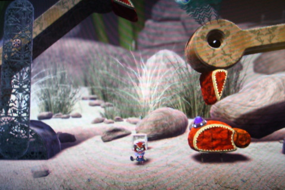
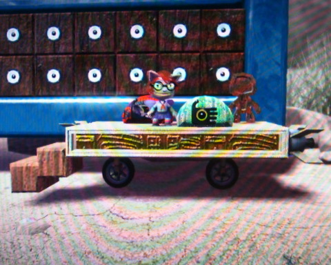

# LittleBigPlanet: Dippy Birds and Rocket Sleds

*Posted by Tipa on 2008-11-03 08:59:26*

I got frustrated trying to make my fire beetles for my Befallen Level 0 -- Commonlands level. They are supposed to be hard to kill unless they open their wings, exposing the insta-kill button beneath. Coordinating the wings, having the switch be protected until they are open, moving the beetle around, etc. These are hard problems.

And then I had this idea, it was right out of Jurassic Park, that scene where all the Apatosauruses are feeding in the trees at night, and one sneezes on the girl? Those long necks rising out of the tree canopy... what if instead of dinosaurs -- we used [Dippy Birds](http://en.wikipedia.org/wiki/Drinking_bird)?

I could just imagine a level built around them. Sometimes you're above the trees, sometimes below them. Running along their swiftly tilting backs... hanging on to beaks for dear life... yeah, that could work.

It didn't take long to bring one to life, and climbing around on them was everything I thought it would be. Now I have to make dippy birds of different sizes -- mine doesn't scale down well -- that do different things. Like breathe fire at you.

Tanglewood Labs, my private level where I develop stuff, is getting a little spread out, so I made a rocket car to get through it faster. Grab the red cushion to jet to the right, the green to jet to the left. Best thing? Get up to speed, and then jump off. You'll go running through the level like the Flash. Which is something ELSE I can put into a level. A place you can only get to by running real fast, by jumping off a rocket sled :)

This is awesome stuff. I just can't help thinking how wonderful this would all be if I could import critters from Spore into LittleBigPlanet. That would just be about the best thing ever.

