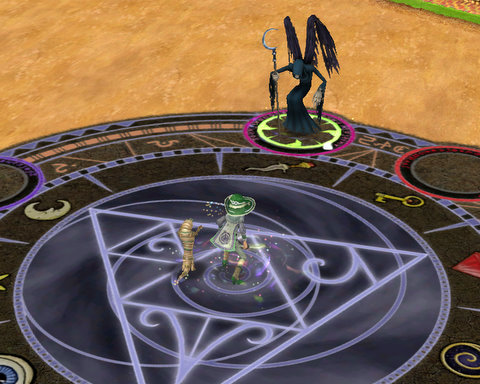
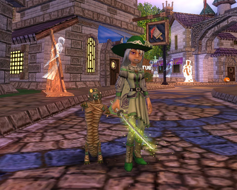
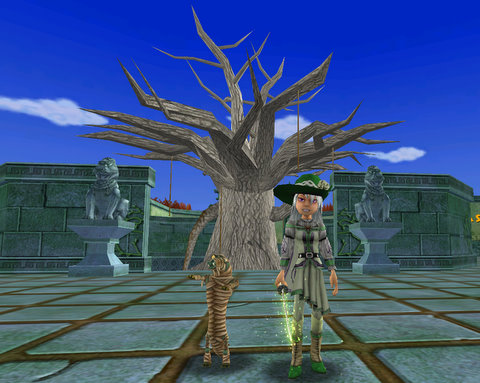
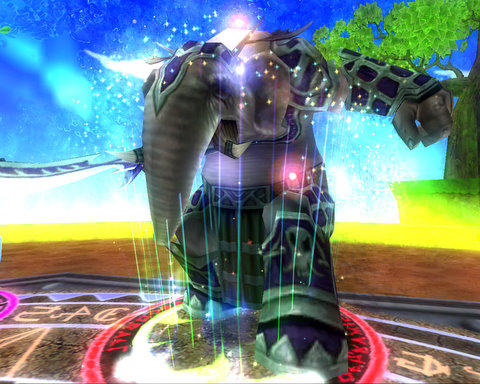
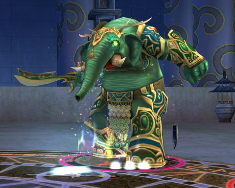
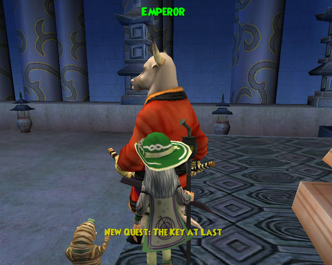

# Wizard 101: Stick a fork in it, it's done

It's done, it's over, and aside from finishing a couple of quests in Village of Sorrows and heading back into Shiritaki Temple for the blue oyster I missed, and of course, farming nameds for loot, I'm finished with Wizard 101. I hold the Spiral key to the world of Dragonspyre, and when it opens, I'll be there.

Well? I had to do SOMETHING while watching history being made!

I was working on some boring Kill X quests in the Village of Sorrows when a friend stopped by to help kill. He was carrying, instead of a wand or a staff, a glowing sword, and when he went to use it, he'd jump right into the middle of the dueling circle and attack the monster directly.

I HAD to have it.

We quested together for a bit and when we got to the next boss fight, it was Oyotomi -- the very demon that dropped my friend's sword! Oyotomi is just sitting RIGHT THERE out in the open in the Village of Sorrows -- anyone can just keep killing him for loot with no need to do an instance or anything.

I didn't get the sword on the first kill, so I just farmed him a few times. After the third or fourth kill, Death mobs being insanely easy for Life wizards to kill, I got my own Oyotomi's Jade Blade, the Life wizard's epic weapon. It gives a pip at the start of each fight AND bumps up the power pip chance, as well as hitting for 90 base damage.

I also managed to snag Oyotomi's Snowstorm Pendant, which summons a blizzard to snow your enemies with Ice magic. I quickly replaced my banshee pendant I'd been wearing since Firecat Alley.

After some more quests and general running around, fate brought me face-to-bark with the Tree of Life. It didn't look that lively, actually. I had found a curious dagger inside some named pig's belly, plunged it into the heart of the tree, and stood back in amazement as the act opened a portal into the Spirit Realm, where the Oni no Death acted to corrupt all Life.

I took that personally. Very. And I communicated my displeasure to the Death Demon in the clearest means possible.

Restored to health, the Tree of Life granted me one of its holy fruit with which to heal the Emperor. Along with the Emperor's shattered blade I'd taken from the War Oni, and the item from the Plague Oni (can't remember what it was :/ A book, I think.), the Emperor's wound would heal as well.

I was prevented from using these items by the sudden appearance of the Jade Oni. 7500 health. Innate 75% resistance to damage from Life spells. Herself a Life wizard. I looked at my deck full of Life spells and knew this wasn't going to be an easy fight.

I got her below 2000 health before I ran out of cards. My Sprite Guardian wasn't a lot of help. Every time I would set a prism to turn my Life magic into super damaging Death magic, my Sprite would send out the Rank 1 imp and waste it. So my centaurs, which should have been doing over a thousand damage each, with Lifeblade and the prism active, would end up doing about 112 damage.

I lost the first fight and rebuilt my deck around my secondary school, Fire, and all the elemental treasure cards I could cram into the sideboard.

The fight was extremely long -- secondary schools can't take advantage of power pips -- but I still had plenty of cards in my deck when the Jade Oni had the rug pulled out from under her. She didn't drop my epic robe, unfortunately, so I'll be meeting her again pretty soon.

I fed the Emperor the fruit of the Tree of Life and put his weapon and that other thing near him, and he was instantly, magically healed.

He said I had earned the Spiral Key for Dragonspyre, but, unfortunately, Malistaire had taken it from him when he fled Moo Shu. The Emperor's personal guard, the Jade Champion, cleared his throat and told the astounded Emperor that though he hadn't been able to prevent Malistaire from escaping, he had managed to wrest the Spiral Key from him.

He handed it to the Emperor, and the Emperor handed it to me, with his thanks.

---

So, level 43, likely to hit 44 by the time I finish up the last few quests and run Shiritaki Temple again. I am guessing Dragonspyre is meant for levels 40+, so I should be set to go when it opens.

That leaves me three weeks before Spellborn and The Shadow Odyssey to play some other game. LittleBigPlanet? For sure. But maybe, also, Guild Wars. I'd like to get somewhat deeper into Nightfall.

I've been all the way through Wizard 101 now, and I've been continually impressed by it, all the way through. A stunning achievement, and I can't wait to see what KingsIsle does next.
