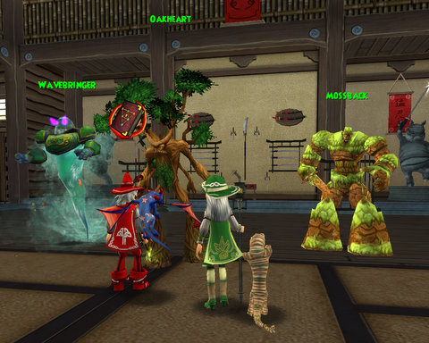
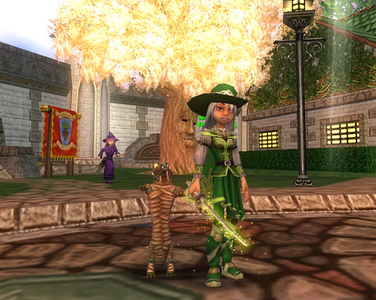

# Wizard 101: So, this is what addiction feels like

I really didn't INTEND to play Wizard 101 all night.

I just thought I'd log on and farm the Jade Oni a bit for my epic robe while watching the disc of Buffy Netflix sent me. Takes over half an hour for me to solo it (it being a 7500 health Life mob that resists most spells I cast at it).

There was someone about to kill her, so I joined in, then I spawned her again and killed her solo. A friend asked for help with Crusher and Meowiarty in Big Ben, so I ported to her and helped with those. After, I returned to the Jade Palace and there was someone hanging around, bored. We got to talking about the end game and the Kensington instance and stuff and he offered to help kill the Oni again (way easier with two people), and yay, got my robe :)

Then he said these dangerous words -- "So, what do you want to do now?"

Correct answer, of course, would have been to say "Oh, I have to log out, lots of other stuff to do!"

Instead, what I said was, "Oh, I have a couple of Village of Sorrows quests to finish up, and you said you needed to finish some optional quests in the Tree of Life?"

And that was pretty much it for the evening. Turns out that Jade Oni isn't the highest health mob in Moo Shu; there's an 8000 health mob in the Tree of Life that I'd never seen before. 

It was getting kinda late after we brought the Death Oni down, so i took my leave and chatted with a friend on Xfire for awhile.

W101 progress: Dinged 44, 45 is definitely within reach, got my epic robe and boots. Somewhat disappointed that the new robes share a model with the RMT robes, just a different color. The boots, though, are nice and are an excellent upgrade from the Marleybone boots I have been wearing.

No new pets, staffs or swords. 

I did sign up for the Shin Megami Tensei ("New -- Goddess Reincarnation") beta, hope I get in :)

