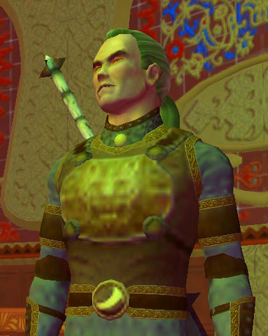
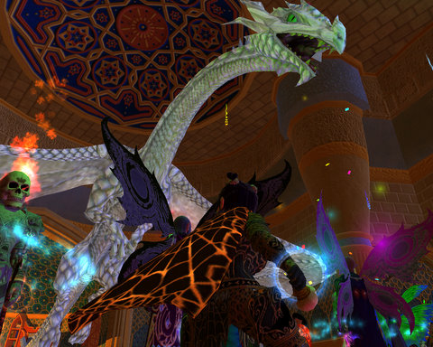

# Lucan do it if you try...

The Overlord Lucan D'Lere showed up at the EverQuest II Birthday Bash last night. Awestruck? You can say that. This is the man who saved us from the Rallosian Hordes and the Green Mist. This is the man who singlehandedly defeated the Avatar of War on Lucan's Mount in the Commonlands. This is the man who drove the orcs to their doom in Wailing Caves and sealed them there forever.

This is the man whose example and leadership convinced me to betray Qeynos and take on the long journey to Freeport, a journey that took me several days (the road was treacherous for a level 14 character in the first couple weeks EQ2 was live).

Here's a song to our beloved immortal dictator:

> The wind of freedom's in the air
Where Lucan rules us, cruel but fair
With fearsome strength and steely glare
(his spies are watching everywhere)

Pour the wine and serve the meat!
Our enemies run in full retreat
'Fore the force of Lucan's heat
(jackboots stomping up the street)

Raise cups to Freeport! She's the best!
We shall conquer all the rest
Lucan, put us to your test!
(or drag us off to vile arrest)

Polish maces, sharpen knives
Sheep will sleep where rebels thrive
For freedom's bliss, forever strive
(Fight, my friends! Fight for your lives!)

That wasn't actually the song I sang at the birthday bash, but since I didn't write it down, there's this one instead. I'd actually written a birthday song while [Stargrace](http://mmoquests.com) and [Kasul](http://shatteredblog.wordpress.com/2008/11/12/happy-4th-birthday-eq2/) and I were relaxing in the stately Nostalgia guild hall before the party, but I hadn't written it down. Too bad I didn't write down the second one, though. That was a lot better.

Dragons? Yeah, there were dragons. Here I am, making this one angry enough that it soon fled. You know, Halfling power. You don't want to get in the way of Halfling power. It's the power of PIE.

They had LOTS of pie there. And many kinds of beers, and a cool sobriety drink that I wish I could have taken home from the party. Pillows for pillow fights, ice cream you could eat and ice cream cones to cause great fun with everyone else in your raid when you attack the dread beast Drazzleflurg with them instead of your epic.

Happy 4th Birthday, EQ2!

