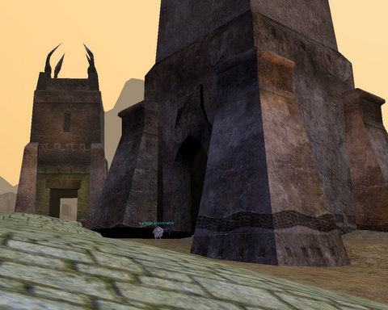
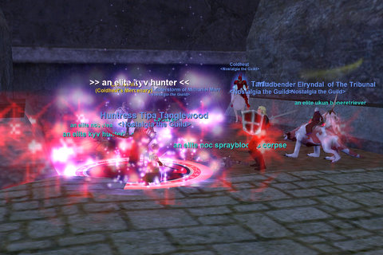

# EQ: The Wall of Slaughter

Being a Drogorn civic planner must be the most interesting job in the world. I can just imagine the presentation at the planning meeting:

"Well, Jim, what do you have for us today?"

"Well, today -- something really exciting -- here's the plans for the new Elementary school!"

"Oh, very good. Very good. This covered walkway -- very interesting, that. Protect the kids from foul weather! Quite considerate."

"Ah yes, I am very proud of that, indeed. I call it 'The Wall of Slaughter'."

"The Wall of ... WHAT did you say?"

"Sorry? Bad name? I suppose I could call it the 'Hallway of Vivisection', if you think that would flow better."

"!"

"The 'Corridor of Crucifixion?'"

---

Anyway, Nostalgia's tour of a small percentage of EverQuest's 1500 zones continued this week with a trip to the throbbing nerve center of the Omens of War expansion, the Wall of Slaughter, which connects Noble's Causeway, an excellent spot for mid 50s folks, with the Muramite Proving Grounds, an experience spot for 65+ folks, and the Citadel of Anguish, the expansion's single locked raid zone. It was a good turnout; for a time, we had a full group of real people and no mercenaries! But our little electronic friends were there when we needed them. Turned out, in fact, that EVERYONE had a mercenary in their pocket!

You see them everywhere in EQ now. It's amazing how much the game has been changed by mercenaries. They aren't just used by us lowbies.

It was also one of our most deadly nights. Our first wipe came when Niiko accidentally pulled a raid mob, Velktorin, to the group. Velktorin isn't that tough of a kill, we used to kill him while gathering for Anguish, but he's a little beyond a single group. Our single group, anyway.

But Azeroth has a greater pull on his heart than Norrath, so he was soon back in Warcraft, leaving me to pull, which went well, for awhile, until I pulled that stupid discordling with that 1200 point AE, PLUS several friends. 

So that wasn't great.

Aside from those slip-ups, we did fairly well. I dinged 64, Coldheat dinged 63, Mantis' newly transferred enchanter Elryndal got 6 AAs, and our new pally tank Talfu got several AAs as well. Talfu also got a nice 40/40 aug and a Muramite Rune for his last 68 disc; I got a 40/40 aug of my own; and Coldheat got a nice upgrade to his helm.

There were scattered groups throughout the zone. Not nearly as busy as it once was, but not entirely dead, either. Perhaps they were all on their way to Riftseeker's Sanctum, which is a hot zone (and well above our level).

Next week, we're going to take a trip to the Plane of Earth and see if there's any fun to be had there.

