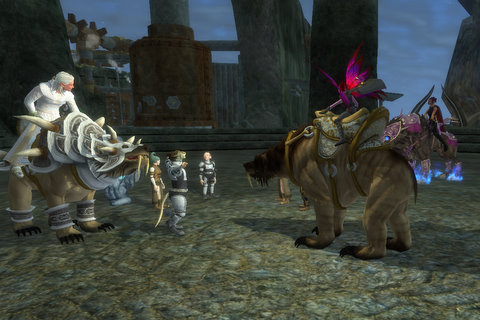
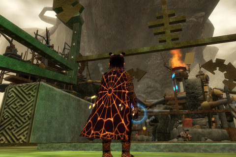

# EQ2: The Shadow Odyssey... bare beginnings

*Posted by Tipa on 2008-11-19 09:39:47*

What looks sillier than a very tiny fairly, with an even tinier fairy stuck to her shoulder, riding a huge, massive bear into a huge, massive bear convention with a group of gnomes in a steampunk city made out of mega-works and rusted iron?

Not much, actually. That's pretty much as silly as it gets.

Or maybe the retailer support for EverQuest II's latest expansion would be a little sillier. I went to Best Buy and two Gamestops last night hunting up the retail box. In between the hundreds of WotLK boxes, and many Hellgate: London boxes, the rows of Lord of the Rings Online boxes, the huge Warhammer Online displays (with collector editions!), were two copies of Rise of Kunark and one copy of Secrets of Faydwer, last year's EverQuest expansion.

All these places seemed a little confused -- they'd clearly never heard of EQ or EQ2. And these were game store employees? Stargrace said when she went looking that the people she met just assumed it was a different name for WoW's expansion.

Finally, at the second Gamestop I tried, the girl I asked about it had no clue, but the guy standing next to her said he had some in the back. They hadn't put them out yet, and only he knew about them. He popped into the back and brought out a copy just for me :)

I have a copy coming from Amazon sometime this month (with the pewter dire bear figurine, which I expect to be about the same size as the race car in Monopoly), but didn't want to wait until then to get into the action.

After loading in the DVDs, I STILL had over an hour of patching to do, which only slowed down MORE when I ran Wizard 101 over the top of it. Plague Oni had to die again. And no, he didn't drop any useful loot. And no, we got no experience from it. A big fat "0 XP" floated into the sky as we completed each subquest.

Then my UI didn't work :/ By the time I got everything working and in shape, it was 11PM and after running around just a little -- slowly because of the lag of fifty thousand people in game at the same time -- it was bedtime.

But the game's installed, both computers are patched so I can two box, I'll probably be bringing Dera over from Befallen so I can get the Rise of Kunark band back together (no way I could have usefully soloed all those quests on Dina alone), and I spent some AAs on the new tree.

If I'm reading it right, bards can allot their new AAs to give a 30% boost in out-of-combat run speed over and beyond what they currently have. This would bring me to 86% run speed with JBoots on. Races with a inherent run speed boost could get to *91%* run speed, all the time.

YES. THIS is what bards have been asking for for four (4 4 4? hmm) years. To be the fastest things in the game. We had it in EQ. And now we have it in EQ2.

Tonight, we're hoping to do a crafting mission finally :)

And that was my first half hour in TSO.
