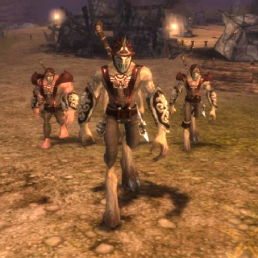

# Chronicles of Spellborn pushed back to January

*Posted by Tipa on 2008-11-19 09:56:12*

I don't think that anyone is really surprised by this, but [Massively](http://www.massively.com/) reports that the launch of Chronicles of Spellborn in North America, UK, Oz, NZ and South Africa has been [pushed back to January](http://www.massively.com/2008/11/19/spellborn-american-launch-date-pushed-back-closed-beta-starts-t/).

However, the closed beta will now start on the 27th of this month.

Europe (aside from the UK) will still see the full, live game on the 27th.

So, if the game is LIVE, WTF do we need a CLOSED BETA for? The game will be LIVE. We can just head over to any of the Euro sites covering the game and read all about it. How you can have a closed beta for a live game that will ALREADY have an English version (along with their German and French versions).

It just staggers the imagination. "Open beta" I could understand, to keep people in the game as they bring up their servers and what-not. But the point of a closed beta? I dunno.

Still hoping to get in -- to the closed beta, I guess -- and it's nice to hear anything at all about the game's North American release, but such a big deal was made about delaying the game's worldwide release so that Acclaim could roll out the NA release same day. And now they aren't going to even be able to do that.

So what was the delay for, in the end?

[Full details of the NA release](http://tcos.com/en/news,id91,new_north_american_release_date_spellborn.html) are copied below:

---

Los Angeles, CA (November 18, 2008) – Acclaim Games officially updates the release schedule for The Chronicles of Spellborn MMORPG (Massively Multiplayer Online Role Playing Game). With additional testing and ongoing game improvements, Acclaim’s release schedule has been updated with Closed Beta testing to begin on November 27 and a new release date scheduled for January 2009. Acclaim’s licensed territories for Spellborn will include North America, United Kingdom, Australia, New Zealand, and South America.

When the European countries go live on November 27, Acclaim will simultaneously start Close Beta testing in its territories and then go live in January 2009. Both launches will have the exact same product versions featuring identical Freemium models but with a different release date to accommodate additional testing for a smooth official release. Extensive testing of the game will ensure players receive the highest quality gaming experience at launch.

With players around the world eagerly anticipating the launch of Spellborn, the game has undergone some key upgrades to allow more players to participate and enjoy the various features of the online game. In all regions, Spellborn will be a “Freemium” game, with a Free to Play zone and a required premium subscription service in order to access the full game past the Free to Play zone.

The Spellborn game client will be completely free to download and install, and will feature the special Free to Play zone with no time restrictions (only level limit). Key features of this Free to Play zone include the following:

• Free players are limited to the starting zones Hawksmouth and Aldenvault.

• A gameplay limit occurs at Fame level 7, when free players have progressed approximately 90% towards Fame level 8.

• Upon reaching this limit, all character progression is blocked and the player will receive a pop-up informing them of this block and what is obtainable beyond this with a premium subscription.

The following elements will be explicitly blocked:

• Players will be unable to gain Fame in any way or form, frozen at a fixed amount.

• The player will be able to accept quests, but not able to complete any objectives/quests.

• Able to kill mobs, but the player will receive no kill credit. This means, no fame reward, no pep reward and no item reward.

• Unable to travel beyond the zones Hakwsmouth (*sic*) and Aldenvault.

Players who want the full game experience and wish to go past the zone restrictions must purchase a premium subscription option priced at $15 per month to open all game content. This Freemium model will allow many more players to experience the gameplay before choosing the premium subscription to access the full array of game features and content.

Initial feedback from the MMORPG player community has been excellent, and the development team is taking this feedback to make various improvements to the game.

