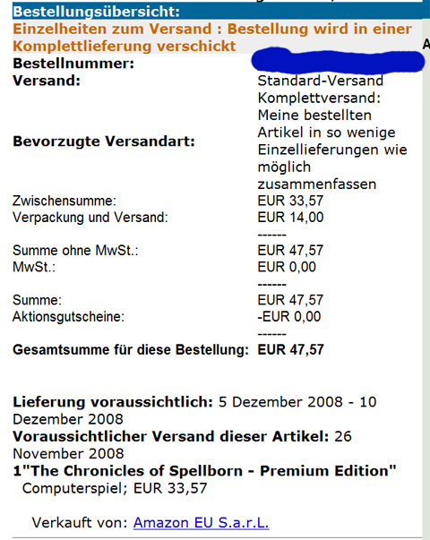

# How far would I go to play Spellborn?

Would I order the mainland European version of the game from Amazon Europe? And pay extra for the collector's edition?

Maybe.

Costs less than US$60, so cheaper than a console game.

I hope they let me play it. Why wouldn't they? It's not even going to be out in the US for months. They can cut me off then, if they feel strongly about it.

Or, you know, invite me into the closed beta, but I don't like those odds. I've been sitting in the queue for the European closed beta for a couple of years now.

And anyway, there won't be a collector's edition in the US (or any edition; download only, right?) so no matter how it turns out with the playing, I'll have something to tide me over until next year.

I promise a complete "Unboxing Spellborn" post when it arrives somewhere between Dec 5 and 10.
