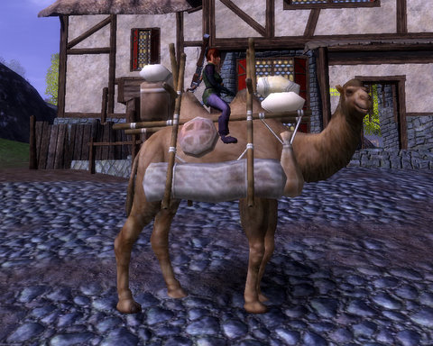
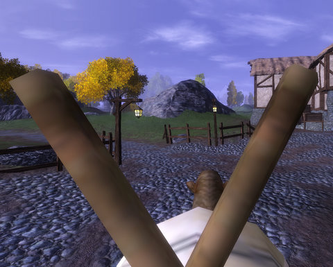
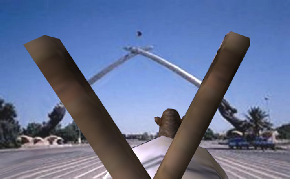
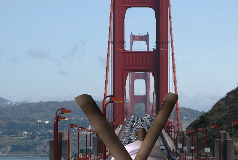
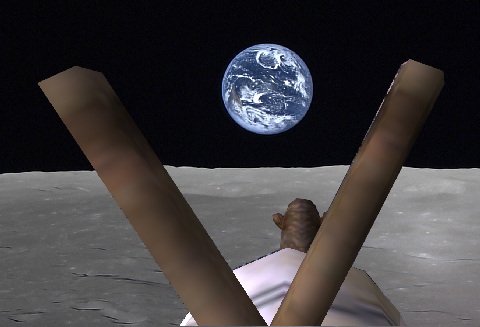

# Vanguard: Telon on Camelback

*Posted by Tipa on 2008-11-25 09:12:18*

[Stargrace wrote](http://mmoquests.com/2008/11/25/meet-spit/) that everyone who plays Vanguard was given a camel. I've never had a camel before. They say about Vanguard, that you can just pick a direction and start walking, and nothing's going to stop you. Anyplace you see, you can walk to.

So I got some provisions from the kind merchants at the Village of Trush, packed up the bags, left a note for my family so they would know that I was okay, and I climbed up on the camel and looked all around.

Everything looks so small from on top of a camel's back. I can't believe I used to run everywhere. Now I ride my camel. She is so smart. Sometimes when we're riding, I fall asleep, and when I wake up, we are someplace else. And it's pretty funny, because sometimes they don't speak any language I know.

Sometimes they shoot at me. Camel bears me swiftly to safety.

Once when I woke up, we were surrounded by people trapped in metal boxes, and they were being made to cross this bridge to some hellish continent on the other side. They did not seem happy, but they did seem resigned to their fate. I turned camel away, and went in the other direction, away from that forbidding wasteland of noise and fumes.

I never know where I'll be when I wake up, but I trust Camel to keep me safe.

