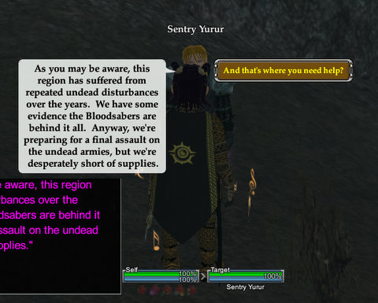
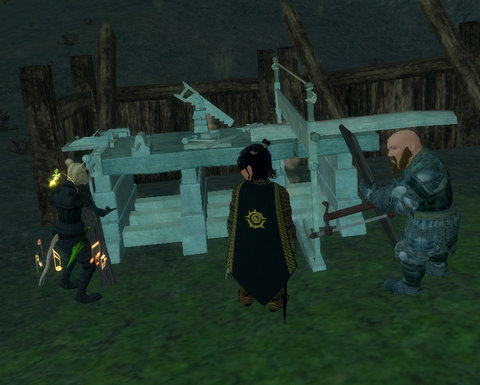
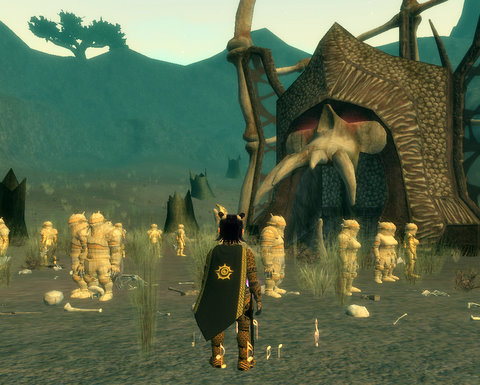
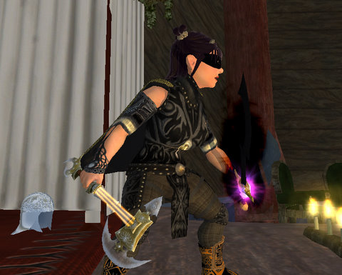

# EQ2: The Firemyst Village crafting mission

While I love MMOs, the idea of playing a game where wanton killing is the only path of advancement just seems morally wrong. If anyone acted like that in the real world, they'd be shut away. Yet in MMOs, it's meant to be heroic to kill as much as you can, until killing itself becomes so humdrum and ordinary that nobody ever talks about it. Even killing a god is just a means to an end. At least EverQuest had the decency to be shocked when players finished killing the pantheon of Norrathian gods, when Druzzil Ro reset time itself so that it never happened. The gods remembered, though, and left Norrath rather than serve as the Raid Target of the Day for a new generation of adventurers.

  
*The dwarfs went through all this trouble of building crafting workstations and laying in supplies before they remembered they didn't know how to craft.*

In my perfect MMO, every kill mission or raid would have a peaceful way to finish it, through cleverness, or trickery, or puzzle solving, or maybe even just by crafting. In fact, kill missions would be so unusual (in my perfect MMO) that when you got one, it would be appropriately serious. Even though The Shadow Odyssey's three crafting missions just have you craft twelve each of nine different things, one for each craft, it's a start.

I was kind of hoping for something a little more dynamic from the crafting missions. Like, you have half an hour to equip a village to fend off a dragon attack. Will you focus on armor, weapons, or resist gear? Or will you make some special spells or abilities? Or a combination? The things you made would determine how the encounter went, and you could definitely lose if you made the wrong things or not enough of the RIGHT things.

  
*I turn my back for ONE SECOND and Goudia swoops RIGHT IN and steals my crafting station!*

There's no urgency in current crafting missions. You can solo them. It will take you about three hours to do so, but that's okay, no rush. Take all day!

Not to say that running the missions isn't worthwhile -- you can get crafting books as rewards that let you make and upgrade TSO gear for FAR fewer void shards than would normally be required. Plus the special crafter gear sold in the Village of Shin requires the tokens earned from running crafter missions. New, five-use recipes are sold there as well. I'm not entirely sure how recipes with uses work -- I guess that means I can make five things from those recipes before I have to buy them again. It'll be awhile before I reach level 79 so I can scribe them, though.

  
*Too bad the dwarfs didn't ask us to make them some decent looking armor. What are these, the Terracotta Dwarfs of Firemyst Valley, or something?*

The night before last, we were all still locked out of all crafting missions, even though we'd cleared our lockout timers. That was a little disappointing. Last night, Kasul was STILL locked out. Why? Makes no sense, but there it is. Stargrace and I decided to try duoing one. She logged in her dirge alchemist for the run, because doing a crafting mission when you're already at max level is just wasting good experience. I've leveled from 63 to 67 tailor purely through TSO crafting quests and missions. For most of that, I didn't have to harvest anything or buy any fuel, because the crafting missions supply everything you will need, for free.

With me doing the outfitter items and Stargrace taking on the scholar items that Kasul would normally craft, there was a big giant gaping hole of the craftsman items in which neither of us had any but the minimal artisan skill. It must have taken me a good five minutes to make one item that just didn't want to be made, but I eventually muddled through, and if the Heavy Shields I made weren't quite dwarven quality (the foreman took a LONG TIME to approve my craftsmanship), they served to fend off the undead hordes that were attacking the encampment.

  
*Don't look at my feet. Oh no, you looked ><*

Afterward, I had the faction and the tokens required to GO SHOPPING! The crafting faction merchant in the Village of Shin had these sleek armors of a kinda unique design that also boosted crafting skills, if you wore a full set. I bought the vest and pants of the Midnight set, getting server discoveries on them both. Guess they aren't that popular.

I noticed that the new shoulder armor for the Tier 1 Sackcloth and Tranquil Sackcloth sets looked really fantastic, so I chose that for its looks. I'd love to have bare feet, but I'm not sure if you can buy the appearance-free armor from the Void Invasion merchants any more. I'll have to check up on that. I still have three banners to spend, and I'm pretty sure the "bare feet" shoes cost only one or two.

|  |  |
| --- | --- |
|
 *Sackcloth Armor* |
 *Tranquil Sackcloth Armor* |

While it's not exactly gi-like, the Tier 1 armor sets do have a fairly unique appearance that a young monk or bruiser might really enjoy.

Crafting missions? I've done all three of them now. They aren't terribly exciting, but it's very nice to do missions with decent rewards that don't require killing. I'm hoping for a lot more of this type of content in the future.

