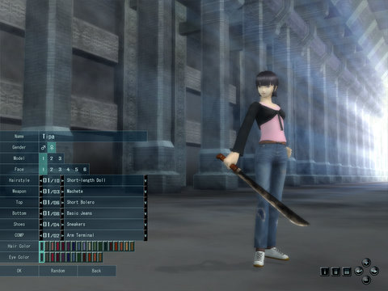
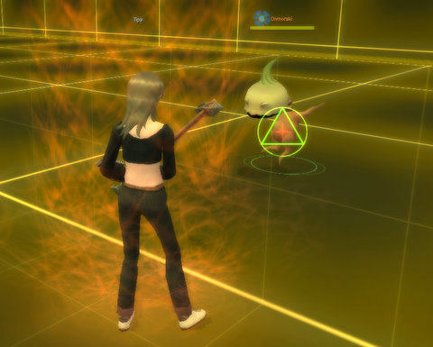
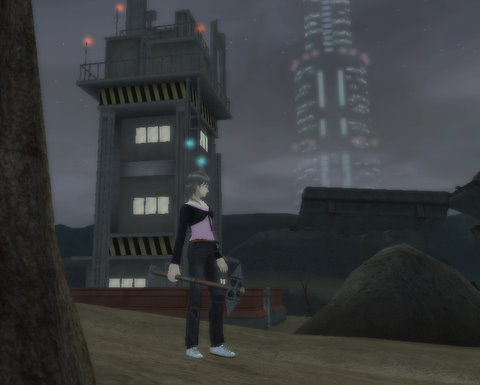

# Megaten: Very briefly

*Posted by Tipa on 2008-12-03 09:40:12*

Aeria Games never had me sign a NDA for Shin Megami Tensei: Imagine (or in fact, ever, for any of the games I've beta'd), so, given that I'm just barely out of the tutorial, here's some screen shots. Remember, this is from closed beta and what it looks like now may be 100% different by the time it ships. At least there will likely be less Japanese in the cut scenes... (Who or what is Nizero?)

Character creation -- what you see is what you get. Three body sizes, six clothing options, three weapon types. Around 5% of people polled on the Megaten site said they were going to go with blunt weapons, as opposed to slicy or stabby weapons. So I went with the big old two handed hammer.

Like all SMT/Persona games, you start out in a Tokyo that has been destroyed by demons. The remaining residents of Tokyo keep falling back more fortified positions, and at the start of the game, have been forced to abandon Home II for Home III. Only DBs -- Demon Busters -- can possibly take back Tokyo from the demonic onslaught. And that's where we come in.

Here, I'm preparing to cook a plucked turkey with an onion head with a fire spell, as kind of a late Thanksgiving. It looks all Tron-y because this is a Virtual Battle simulator used as a tutorial.

Finally out in the grim, post-apocalyptic real world, just outside the gates of Home III. My task here is to find the lair of a bunch of pixies and convince their leader to accompany me back to the refuge.

The world of Shin Megami Tensei is one where technology and magic mix -- like the old RPG Shadowrun, magic has returned to the world. Unlike Shadowrun, you aren't forced into specific roles. SMT uses a skill-based system, so you can learn virtually any skill you like, though there is a limit on the number of skills you can learn, though not the type of skill. The more you do something, the better you get at it.

Combat is very fast paced, and requires you to choose attacks based on how things are going, second-by-second. You might open with three quick attacks, which knock back your opponent, then get into a counter stance if it looks like they are coming right back at you, which will knock them back AGAIN, or a guard stance so you can set up more attacks while blocking their attack, or charge up a rush attack and follow it up with a quick attack if they are taking their time, or instead charge up a fire spell to keep them interested... the sorts of attacks they prefer will greatly affect what attacks you choose. They are shooting or casting spells? Maybe a dodge would be a better idea right at the moment...

With a demon ally, you can switch between both your own character and the demon, coordinating attacks at high speed. I have no idea how that will go, because, I haven't figured out how to capture a demon yet ><.

(I was going to write about EQ2 today, too... curse these late night beta invites...)

