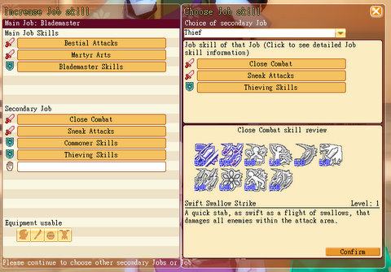
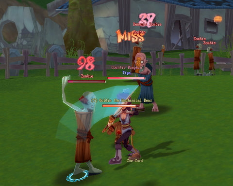
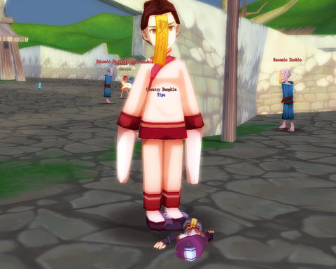
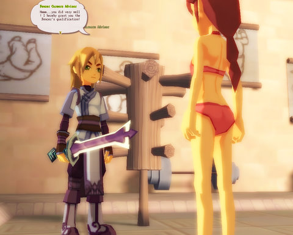
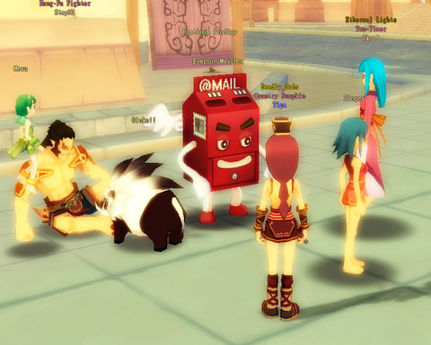
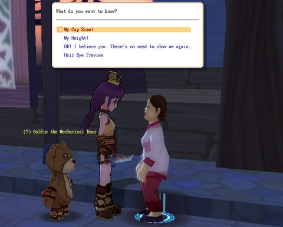
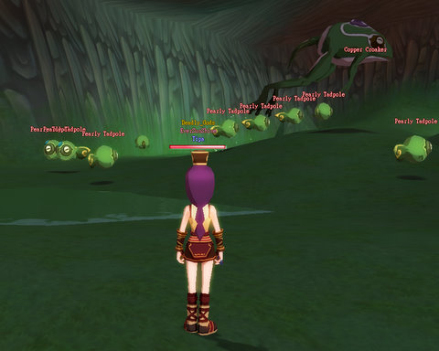

# A little this, a little that: Building a character in Dream of Mirror Online

In Dream of Mirror Online -- DOMO -- there's no real need for alts because your character can change classes to any they have unlocked with a free class change at your friendly local Career Advisor, such as the one in the dojo in Eversun City. But even then, your main job is just one aspect of your character. When you change jobs, you you can take up to five skill sets from the other jobs you have unlocked.

In the screen shot above, I've just switched to my Blademaster job (light tank that sacrifices health to build power). All three of the job's skill sets (Bestial skills, Martyr skills, and Blademaster skills) are available. However, I have *five* slots in which to place skill sets from other jobs -- here, I've slotted in the Commoner's harvesting and crafting abilities along with all of my Thief skill sets -- Close Combat, Sneaking Attacks, and Thieving Skills. The first two require that I have bought the skill on my Thief that lets other jobs equip daggers, but the Thieving Skills skill set lets me pickpocket mobs with Pilfer :)

In this way, you can build any character you like. Want heals? Slot in some Doctor skills. Want to buff people? Add some Musician in to the mix. Get to level 30 in a job and buy the skill, and you won't even have to change out your armor when you change jobs.

I was fiddling with jobs because I really wanted to be a Thief again, but after crafting an upgrade to my dagger, it became a level 15 weapon, one I could no longer equip. Without a dagger, I couldn't use most of my Thief abilities, so I reluctantly changed jobs back to Blademaster and set out to find the recipe for the dagger so I could make a new one. They went for 750 gold at the store, and I was far from having that kind of money.

Searching out information on the DOMO Wiki, I found the recipe could be stolen from rats in the Eversun Inn basement... a place I did not have access to. To get access required doing some investigative work in the Mortuary, which, being DOMO, required killing lots and lots of zombies.

This Leech Life turned out to be behind all the zombie attacks. Even though she was 15 and I was a 12 Blademaster, I figured I'd have a shot. I charged up my combo (another post), headed in, let the combo fly, and it barely made a dent in her health. She then made a dent in the sidewalk with my head.

Ouch.

While I was being dead at my bind point in Eversun city, I figured I'd go grab the Fencer job while I was there. Like the Blademaster job, all I had to do for the Fencer job was to defeat the trainer in combat. Which I did naked and weaponless. Another great advertisement for a stellar job opportunity, that.

I had enough money then from selling zombie drops to buy the dagger I wanted, so I did that and changed jobs back to Thief and got my old Thief uniform back out of the bank.

  
*Hey! I'm the creepy Eversun mail box! Stick something into my slot!*

I spent the rest of the night mostly doing quests in Eversun City itself for money and xp. They have a Job Counselor who points you to quests you may have missed -- has a list of all of them, actually, so any time you're bored and want a quick quest, you can head to this guy and he will fill you in on quests for your level.

There are some seedy NPCs in Eversun City. This old lady stopped me as I was passing and told me that just by looking at me, she could tell me my *cup size*. Because, that's a service I really needed? "A-", she told me. And, turns out there's a quest I can do for a title so I can tell the world (in NA, that title is "-A-cup Abuses Alcohol", apparently).

So yeah, I'll be rushing right out to do that one. Strangely, I don't see one for penis size for male characters. Maybe next patch?

The Eversun City quests brought me to the sewers below the city, where I got into some group AE action with five other people. That many people make quests go by fast, but when I died, I had trouble catching up to the group again, and by the time I did find them, they had already killed the slow-to-respawn boss of the dungeon, the Man-Eating Spider, and were off doing something else.

I watched "Oklahoma" on the other screen (a movie I was too embarrassed to watch while my sister was here) and killed Pearly Tadpoles for the rest of the night until the movie ended and I went to sleep. The spider never spawned, but this revenge-craving frog did, when enough tadpoles had been killed. I made level 14 on my Thief job, which puts me just an hour or two from level 15, where I can take on the quest to learn to fly on the weapon of my choice.

I also stole a BUNCH of recipes from the mobs in the sewer, and grabbed the alchemy pots I saw there as well. My mechanical bear is nearly dead now, though, so before I do anything more, I'm going to have to buy some Mechanical Bear Chow to heal him back up.

