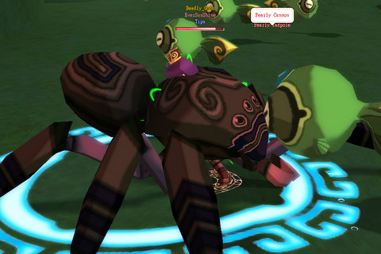
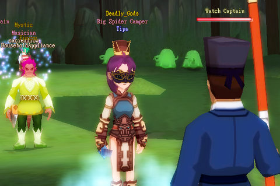

# DOMO: I'm a filthy camper.

*Posted by Tipa on 2008-12-09 22:23:22*

Dream of Mirror Online was down most of the night last night. When it came back up, I mostly just ran around collecting jobs -- after Norikue's cool suggestion to have Musician as my secondary job to give my pet somewhat more survivability, I figured I should definitely get that one. I stumbled onto the Shaman job (honestly, I didn't know that was the job quest until I finished it). 

I didn't feel like buying/making all the new gear I'd need for the Musician job (really missing those coupons that give you a full set of newbie gear for a job, lemme tell ya), so I put my Thief clothes back on and went exploring.

Flew around Placid Plain and some other zones for awhile, then decided to see if I could finish some of the quests that have been taking up space in my quest log.

The Man-Eating Spider in the Well Sewers dungeon -- the newbie dungeon in the game -- spawns very rarely, and I kinda swing by to look for it when I'm bored. Back when I was seriously working on the dungeon, there was no way I could have taken him myself (and earlier had died to the Revenge Boss in the area, the Copper Croaker, I blame my sister, whom I was talking to at the time). When I got to his spawn point, i saw a lot of suspiciously high level people in the area. I had picked up the (repeatable) quest to kill 30 Pearly Tadpoles on my way in, so I'd started on that when -- there it was. The Man-Eating Spider.

Should I back off and try to get a group for it, or should I just wade in and take it for myself?

Dropped a lot of goodies, and all of them were my goodies because, c'mon. Rare boss spawn in a hotly contested dungeon? EverQuest didn't teach me to waste any time, here.

I'm not sure anyone saw me kill him. I finished killing Pearly Tadpoles and went to the Watch Captain for my reward.

And he called me a filthy Big Spider Camper, and gave me the title to prove it.

I protested for awhile, but he was absolutely inflexible about it. Sigh.

I realized this morning that Dream of Mirror Online had become my New Shiny, like Wizard 101, EQ2, WoW, DAoC and EQ before it. So, thought I, still sleepy this morning, I should fire up Photoshop and make a New Shiny Badge!

I dunno why I do these things. I'm no artist. But all day at work today, I was thinking -- not of playing DOMO and not of SOE's new RMT initiative -- but on what this stupid badge would look like. So, with no fanfare (even though this is my 1001st post!), I bestow upon Dream of Mirror Online the least prestigious award in MMO blogging, the West Karana NEW SHINY Award :P

ANYWAY, now that that's out of the way, I got to thinking, just what is it that makes an MMO, or any game, really, a "New Shiny"? Why do I pass Age of Conan over to play Wizard 101? Why do I skip Warhammer to play DOMO? Why am I not on EverQuest 2 right this second?

First, it has to run well on my computer. Seems simple, right? But this one little thing is why I don't play Vanguard much. It runs like crap on my computer. You couldn't pay me to play a game that doesn't run smoothly on my computer. Seriously. I was supposed to write a Vanguard article, for money, but I just couldn't do it because the game runs so crappy on my computer. I get so stressed out about it, I start getting really angry. Finally, i refuse. If you can't make your game run well on my computer, I'm not gonna play it.

That one insight let me dismiss AoC and WAR right off the bat. I do not have an uber system. So I probably can't play your system-straining game.

EQ2 runs okay. DOMO runs fine. Wizard 101 runs fine. It's no secret.

Secondly, don't tell me what to do. The more on rails your game is, the less likely I am to play it. Wizard 101 gets a pass here because the game is too damn fun, but I'm not playing through it a second time because why? What has changed from the first time?

Not a thing. Same reason I couldn't play WoW after the first time I maxed a character. Why would I want to go through all that AGAIN? No reason. So I quit.

Third, be FUN. This is what EverQuest finally did to lose me. I'd come home from real work and have to log right in for my volunteer part-time job playing EQ. That was STUPID and it was making me crazy. I wasn't having any fun. I couldn't get groups on off times as, being a cleric, my class was the #1 pick for being someone's 2-box alt and if they could have swung it with the officers, everyone would be bringing their boxed clerics on raids (and they often did when we were short clerics). So I played EQ until it was no fun, and then I kept playing long after.

So, if your game runs well on my computer, doesn't force me into a certain path, and is FUN (to me), I'll probably give it a shot. Make some system busting game where I am forced to do what your designers thought I should do where my fun depends on other people not being jerks, you lost me from the start.

