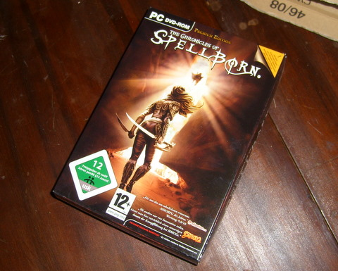

# Not sold in a store near you...

*Posted by Tipa on 2008-12-24 08:04:26*

... if you live in North America, South America, United Kingdom, Albania, Andorra, Australia, Bosnia & Herzegovina, Bulgaria, Croatia, Cyprus, Czech Republic, Estonia, Greece, Hungary, Italy, Israel, Latvia, Lithuania, Malta, Moldova, Poland, Romania, Serbia & Montenegro, San Marino, Slovakia, Slovenia, Spain or Turkey, anyway.

The art book is pretty :) Comes with a map and a flyer for the soundtrack CD, too. The art book is in English, the manual is in German, but both are written in a type that is too small for me to read, so I hope neither contained important info.

I haven't installed it yet...

