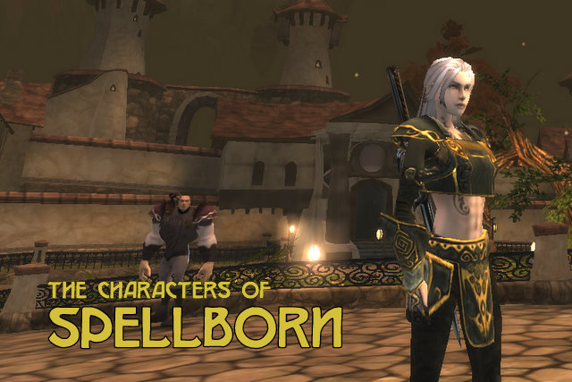
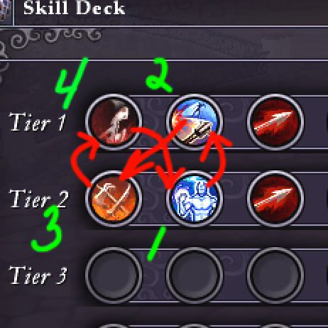

# Character design in Spellborn

*Posted by Tipa on 2008-12-30 22:58:09*

  
*Erisa, a spellcaster. Her name is an inside joke :)*

I said this morning that you almost need to be an artist to make a character in Spellborn. I've played with the character creator for an hour or so and a little longer in the game itself, and I believe that is true -- but with a catch. You almost need to be an artist to make a character in Spellborn... that looks good in the character selection screen.

In the game itself, the characters are so small and the action so intent on keeping the Reticule aligned and the Skill Deck and the whole game world so dim and desaturated that really... the characters tend to blend together.

Many character creators these days are pages of sliders for every physical dimension. Spellborn's gives you selections. You paint your character first in broad strokes; limited selection of bodies -- six human and two non-human -- then add tattoos and age lines, then the under clothing, then the armor, then the weapons, most of which can be colored. By the end, you have a character mostly unique, but still, somewhat the same as all the others. After all, every character draws their look from the same pool of gear you got yours.

Still, you can make some cool characters :)

|
 Stout Henry. Heavy human male model. Little armor, blunt weapons. |
 Tipa. Heavy human female. She looks as if she's been swinging a sword her whole life. |
 Willowy human female. |

|
 Holyoke. Non-human female. |
 The Incredible Holk. Yeah, I wanted to see if I could make a comic book character. Huge human male. |
 Thin human male. If you work at it, you can make some cool looking characters. THIS guy could tell some stories. |

I played Tipa a bit last night, but I wasn't really catching on to how to play a rogue. I feel I should be strafing or jumping around more, but my fingers aren't that nimble. Or I am TOTALLY missing the easy way of dodging incoming attacks and keeping the reticule centered on the target and watching the skill deck roll and ... because, omg, isn't that enough?

Oh yeah, and the rapidly shrinking red bar that represents my health.

So, tonight I played Erisa, the spell caster. She's an albino with glowing red eyes, and she wields a sword which was forged a hundred million years ago by the... She's no relation to you-know-who. Really.

When I finally dinged 2 (finally!), I didn't want to just toss all my new, shiny skill points straight into Mind because, could that be bad? I know that the subclasses you get depend upon putting some points in another attribute, so would that really be the best for me?

That's when I opened up the Skill Deck and the Skill Library and started going through the icons and noticed something... Hey, these things go together like pieces of a very small puzzle.

So, follow along on that diagram up above. If I start with that Life Tap -- that's a Mind spell. It boosts the power of Mind damage spells for 12 seconds and gives you a little heal whenever you damage a monster with a spell. The skill deck rolls to the first rank, I hit the Mind spell there does severe damage -- boosted by the Tap -- AND boosts Mind! Skill deck rolls back to the second row, Slash there is a Mind based melee attack, which has just had its power boosted! It rolls back to the first row, where if the Mind spell is ready, can cast that again, or hit Hack to roll the skill deck back to the second row so I can recast Tap and keep the heals coming...

So that's really cool. It all fits together.

Is Spellborn going to win the coveted New Shiny award? Well, not until it becomes available in the US. I don't really want to get TOO invested in a game when it's only a matter of time before the people at Frogster decide to cut off all us people outside of, basically, Nederland, Germany, France, and possibly Belgium.
