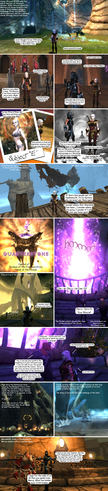

# The many worlds of Chronicles of Spellborn

*Posted by Tipa on 2009-01-03 17:35:40*

I've been very, very many places in Spellborn. I've reached level 11 and am closing in on level 12, working on Quarterstone quests while I gain more levels with which to attempt the Trials of the Vault again -- the spiders with the poison AE, they were the ones that got me, but I have some new spells now.

I thought it would probably be pretty boring having to EXPLAIN everything about the game, so I just made a comic. The quest in the comic is not a real quest, but goes to the same places as an actual House Rune quest (the actual quest deals with a lab experiment gone horribly, horribly wrong, and increasing tensions between House Rune and House Maul). I hope it gives a feeling for the world of Spellborn, both how it looks and the sort of things you do there. It is very much a story-based world, and the game is a heaven for roleplayers.

Here goes :) Enjoy!

