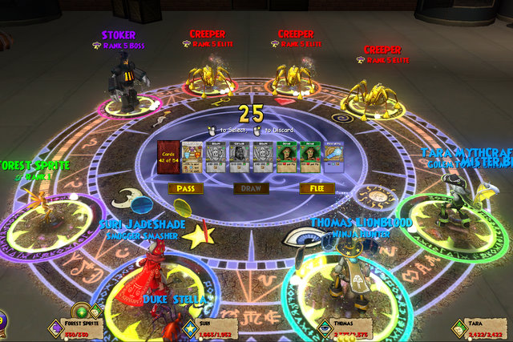
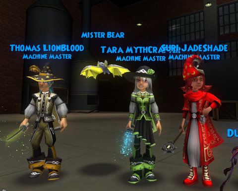
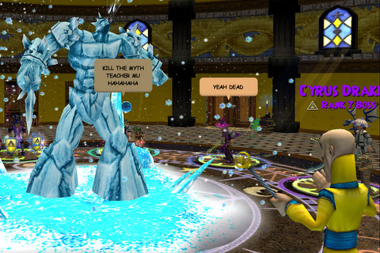
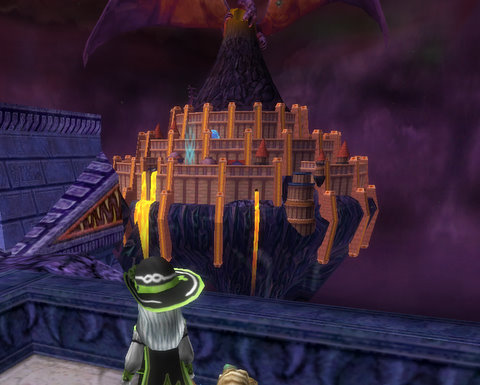
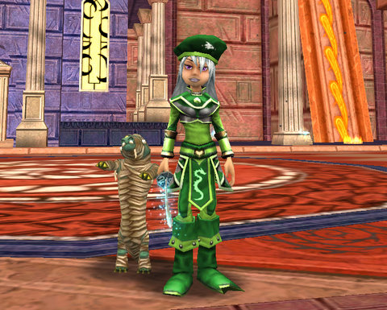
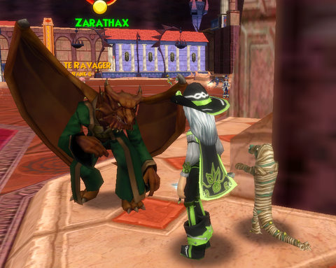
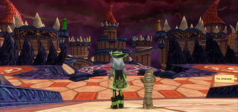

# Wizard 101: Kensington... and DRAGONSPYRE!

*Posted by Tipa on 2009-01-10 14:28:28*

I'm mad at my Sprite. Most of the time, she's a good pal. We go out in the world, fight evil, have a laugh, do magic tricks... Sure, sometimes she asks about boys, but I just laugh it off. She's not ready, you know? She just isn't ready for that thing.

But little Sprites grow into Pixies so fast these days, and I blame myself. I should have known, should have had "the Talk", before she met... Thomas.

Oh, he's a [Friendly Necromancer](http://thefriendlynecromancer.blogspot.com/), all right. VERY "friendly". So friendly that he took my Sprite from me. And I don't know where she's gone now. I just want her back. I just want to know if she's safe, if she's okay.

I guess I should tell you the whole story.

It's very hard in Wizard 101 to meet up with people you know outside of the game. You have to set a specific time and place to meet. At least you don't have to worry, in Wizard 101, about if you're on the same server as your friends -- server switching is transparent and automatic.

Thomas, who chronicles his adventures over on "[The Friendly Necromancer](http://thefriendlynecromancer.blogspot.com/)", told me through Facebook that he'd be on at a certain time and place, and so we met up in Moo Shu.

I hadn't summoned my Sprite. So I had no reason to be suspicious.

It was great meeting the famous Thomas Lionblood. We became fast friends and wondered what to do. We talked about the Oni loot problem. How hard it was to level. I thought [Suri](http://notadiary.typepad.com/wizardadventures/) would want to be here, so I sent her an email and in a few minutes she, too, was online.

I thought tonight would be a wonderful night to do Kensington, and Thomas and Suri agreed. We all knew it would be a long night. Kensington Court is the longest, most brutal and most punishing instance in all of Wizard 101. Nothing before it can prepare you for the pain, though Sunken City can come close if you do it when you get the quest. Moo Shu has nothing on it.

Kensington is fight after fight with mobs that have north of 2000 health each. And they come in groups of four. And they are all elites. And a lot of them heal themselves. And it takes about three hours.

Whenever I would cast my sprite, she'd be all "Oh, Thomas! Do you need a heal? Do you need another heal? What if you still get hurt? Will kisses make it better?" Poor Suri, who did most of the damage and took most of the aggro, would be perilously close to dying (while I charged up heals to keep her alive), and Thomas would be at full health, surrounded by four or five Heals over Time, and my Sprite tossing Pixies at him like she'd just come back from a fire sale at the Pixie Deluxe Warehouse.

It was kind of embarrassing, actually. She was just ALL OVER him.

It took so long that each of us had to go off and do other things in the middle. We managed it, though. We killed Stoker -- TWICE. We each got a good amount of experience (and I finally leveled to 46!) I discovered I had a bat pet I didn't know I had. Suri says I must have picked it up from Wavebringer during one of my Plague Oni runs... so they were worth SOMETHING anyway.

The only loot I pay attention to in Plague Oni runs is the shoes!

It was crazy late when we finished. Thomas had a friend who was in the middle of Counterweight West, so we went and helped him out. I was fading in and out of sleep by the time we were done, so I crashed...

Thomas, though, went on to Dragonspyre, just released on the Test server.

When I woke up, I went, too :)

There's a little mini quest you have to do before you can go to Dragonspyre. You have to go back and talk to Merle Ambrose, and he'll send you to talk to Cyrus Drake, the malevolent professor of the Myth school -- and brother to the villain of W101, Malistaire, former head of the Death school.

Cyrus sends you to meet him in the Myth tower, where he goes bonkers and attacks!

Some of the players just got a little TOO into it. I think they have teacher issues.

After what seemed like HOURS of loading, we were finally let in to see the Fifth World. Off to the left as you enter if the Basilica, home of the old Dragonspyre Academy, the most prestigious school of magic on the spiral. Gone, now. Destroyed. Enmeshed in Malistaire's evil. He tossed out the old dragons who ran the place, and now he is the big boss.

I ran down the stairs and right into Cyrus Drake! Taking up my sword, I prepared to fight, but he cautioned me against that, claimed that he had only fought us to make sure we were prepared for Dragonspyre, and that he would help as much as he could to defeat his brother. He couldn't come any closer to the city, though, or Malistaire would be sure to sense it.

We wizards would, once again, have to be the foot soldiers in this magical war between two brothers.

Time was short, and the need was great, so I did the only thing I could think of to do, the thing that would do the most good, the quickest.

I went shopping!

This is the Life outfit from the vendors. There was a store for rings, a store for shoes (!), and a store that sold both hats and robes. No pet store that I could see.

Many of the patterns seemed familiar, but there are some hats that look like dragon skulls... those are really cool. But we Life wizards just get a little green beret.

I think I know now how John Wayne must have felt.

After surviving a full-press Pun Ambush in the Library (I won't repeat them here... I don't want to draw out the torture), I was sent deeper into the city to talk with Zatharax, who told me I'd have to spark the crystals in six towers -- the towers of the old schools of magic -- in order to open the portal that brings me deeper into Dragonspyre. He sent me into a three dimensional maze of confusion.

Doors that teleport you places. Tower tops crawling with evil creatures. Twisting paths and dead ends. 

I could tell right away that this was a place of evil.

The experience from the first few quests was fantastic. I dinged 46 again almost immediately (my test character is somewhat behind my live character) and was a couple bubbles in by the time I was done.

It's more of the Wizard 101 magic. The monsters are tougher and the puzzles are harder, but it's still the same game. I don't know if they are raising the level limits. There were no extra spells sold by the professors, and I couldn't find a treasure card vendor (I may have just missed him). There are definitely more types of monsters running around, and though Dragonspyre looks fiery, there are monsters and bosses of all schools there; fire wizards won't be saddled with any unfair disadvantages.

What little I played seemed pretty bug free; Professor Moolinda Wu asked me to see her when I turned 46, but she didn't have anything to say to me (neither did the one in the live game).

I'm very much looking forward to playing through Dragonspyre when it goes live!

By the way -- what was that QUACKING I heard while we were fighting Cyrus DRAKE?

