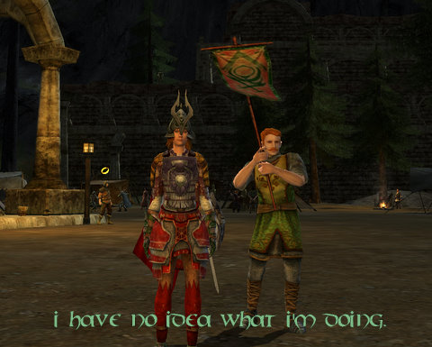

# Lord of the Rings Online: O Captain, My Captain

*Posted by Tipa on 2009-01-12 00:37:12*

I loaded Lord of the Rings Online back onto my computer (where it replaced Vanguard and Guild Wars; my disk space is such that if a new game goes on, an old game has to come off). I'm not sure how I felt about the game. I'd not left it on the best of terms; after a bit of excitement, LotRO had settled into a series of horrid grinds. Kill N of X. Run to some far off place, and then run back.

When I logged in and selected my Captain, who was still in the Ranger town in the North Downs where I'd left her nearly two years ago, though, I was thinking just one thought:

I had no idea whatsoever how to play the game anymore. I figured I'd better start from scratch, so I made a Hobbit Warden named Ettie. That's actually a kinda neat class, where you make various combos that are almost exactly like EQ2's Heroic Opportunities, except you can do them alone. The newbie quests were the same they were two years ago, and they weren't all that exciting then, so as soon as I got a handle on the game, I logged back on my Captain and took her back to the Lone Lands.

She's 33 and the Lone Lands is a zone for characters in their teens, mostly, but it's a good idea to get your bearings in a place you probably wouldn't die.

I actually remembered a couple of the quests. They were hard to complete because all the places were so overcamped when I played. They are emptier now, and I quickly finished a long quest chain given by a Ranger who is lazing about in the woods near Weathertop.

His excuse for not fighting: Someone might see him.

No, really. 

It's okay if the forces of Evil Incarnate see ME, though.

When he sent me on the half hour run back to near Buckland, I figured I'd played enough for one night. I can't take the post horses because my Captain is level 33, two levels from a horse, and that horse costs just about double the money she has now. Until the horse, money spent on expensive little jaunts across the Bree-lands is out of the question.

I have to show some orders to a Ranger there. And then, I have to (I imagine) run all the way back. So that's an hour spent on a Fed Ex quest which consists entirely of me hitting autorun and watching something on Netflix, steering every so often.

Crappy quests have always been LotRO's Achilles Heel with me. I've been told Elendim quests are a bit better. Once I think I can handle myself in a zone my level again, I'll head there and see how things are.

I do hope it's better. Otherwise I just look at games like LotRO, and then at games like Wizard 101, Dream of Mirror Online and Chronicles of Spellborn, and wonder why LotRO decided to go the route of grind and boredom when they could have written a fun game?

The kinship I was in was dissolved, I was informed. I got a ninja invite to another one as I ran out of Bree, but I think I can do without random invite guilds for now :P

