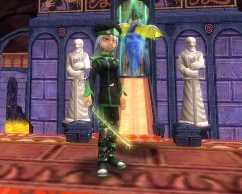
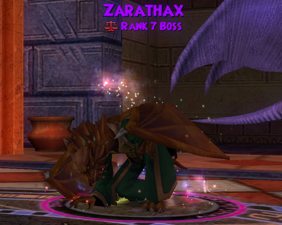
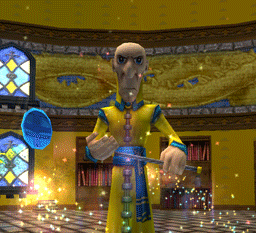
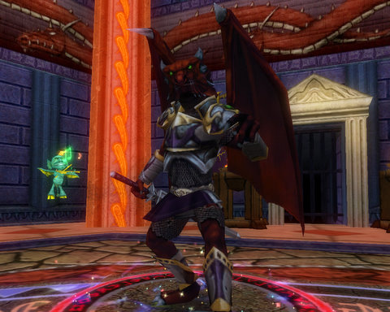

# Wizard 101: Dragonspyre Unleashed

KingsIsle brought the servers down. When they came back up again, Bartleby had discovered he now knew the way to the world of Dragonspyre, the evil Malistaire's last refuge. He doesn't call himself Malistaire, though. He is now the Necromaster, and Dragonspyre is the plaything he rules from deep within the Necropolis. Or so I imagine. I haven't managed to get to the Necropolis yet. Walls and... things.

Dragonspyre came along with the new Arena system and a new mini-game. I'll save those for another post. Tonight, I want to talk about... fashion!

It's hard to judge for yourself whether an outfit really "works". Too flashy? Mismatched? Too colorful or not colorful enough? How can you tell when you have an outfit that's gonna slay faster than an overclocked Triton with a blade, two traps and a circle full of power pips?

Friend invites. It's the Wizard 101 kudo currency. Walk around in your newbie gear, and nobody wants to be your friend. Add in some Unicorn Way stuff -- MAYBE. Krok stuff, now you're getting somewhere. Marleybone, Moo Shu, steady stream of invites coming in. This outfit I made from Dragonspyre trash drops had friend invites clicking like a Geiger counter in a watch factory. Votes are in, the General British commemorative Tabula Rasa uniform WORKS.

So, Dragonspyre is all about the new outfits?

Well, yeah. Oh, and about the leveling. And the whole freeing Dragonspyre from the clutches of Cyrus' bro. And now back to Ravenwood where Cyrus Drake explains just what he did to drive his brother crazy:

 Catch that? It's all that durn FINGER-WAGGLING! Nuh uh UH! Nuh uh UH! Heck, Malistaire, I'll kill him for you myself. Which I did, in an instance where I met Cyrus face-to-face, solo. But just when I was about to WIN, take his robe and wand and lesson plan (today's lesson: Summon a Troll) and hawk them to the poor, beaten-down Myth wizards who had to have HIM for a teacher.

But no, right as I had him entirely surrounded by angels and centaurs, he turns as yellow as his robe and claims he was just testing me. My Sprite is urging me to deliver the *coup d'etat**, and my sapphire blade is just dripping with icy power, it wants his death as much as I do. My previous career as a Myth wizard still leaves me screaming some nights because he would always get AFTER me in class, and then send me on quests from which he hoped I would never return, unless it was the oh-so-epic quest to get his LAUNDRY.

The wise words of Merle Ambrose stopped me then. In my mind, I could see him standing in his book-strewn office, looking at me with those piercing blue eyes, and saying, softly, "Tara..."

And I'm there in my best robes, staring right back at him, not turning away, not stepping back, right there in the moment, and in my mind I'm saying, "You asked to see me, Headmaster?"

He asks me to sit, and I start to explain to him that nobody sits in Wizard 101, but he stops me and says, "Tara... I'm afraid your time here at Ravenwood is done."

And it takes me a second as I wildly think that he considers me such an amazing wizard that he's graduating me early, but then I come to my senses. "It's about Professor Drake, isn't it." Ambrose nods. "He brought me ALONE into his TOWER and then he tried to KILL ME." Ambrose mutters, "I know, I know,". I interrupt. "He cast SPELL after SPELL on me. He is a GRANDMASTER ARCHMAGUS for the love of Pete. I'm just a STUDENT."

"All that is true," says Ambrose. "But we can't have our faculty being cut down by students. I'm afraid I am going to have to ask you to clean out your dorm room and report back to Bartleby, where your powers will be stripped and you will be returned to your home on the Spiral."

These thoughts swirl in my head as I hold Drake there on the ground, then I step back and let him stand. "Go to Dragonspyre," he says, "and join Malistaire. You have the same darkness in your heart I felt from him."

"I will," I said.

"So go!" he said.

"I'm going!" I said.

So I went.

Dragonspyre was a wizard Academy. Young wizards would learn the basics of their craft at Ravenwood. The best would then be invited to apply to Dragonspyre Academy. The time for parties and races around the Commons and that sort of stuff ended once you were enlisted and issued a uniform, books, and a duty roster.

The spirits who once ran and studied in Dragonspyre aren't going to let you in until you, too, become a cadet and do the work. Even dead, even with their world in ruins -- they have high standards.

KingsIsle really stepped up their game for Dragonspyre. The new enemies are amazingly detailed. Their animations are first rate. Petrov Gloomstrider lights sparklers and tosses them at you. Soldiers take mighty swings with their weapons.

Even the world itself is a little more challenging. There are secret shopkeepers hidden around, and even old Prospector Zeke isn't standing out there in the open (he doesn't have any new Crowns gear, by the way. In keeping with his musical theme of late, though, he's looking for BritPop artifacts. Oh, you didn't think we'd notice, KingsIsle? The Smiths, The Beatles, The Pussycat Dolls, Blue Oyster Cult and now Stone Roses? We noticed. Let me guess -- for the next world, Britain-y Spears?)

There are puzzles galore, and even an instance where there's a fight RIGHT THERE and you WANT to run in and join it but you're supposed to AVOID it -- that's not your fight! You'll see.

It's a challenging world, every monster has more health and more power but not... more spells or more levels. For all its graphical goodness and evil plot-ness, it doesn't seem like the card game has advanced any. But I haven't gotten that far into it. Maybe there's a new school of magic and cards I've never seen before the next zone over. Or maybe KingsIsle is keeping that sort of stuff back for the NEXT world. The Faculty have implied that Dragonspyre is partially meant to get everyone to max level with great gear and all their spells... probably to make sure we're ready for World #6. I'm already looking forward to it.

* See what I did there?

