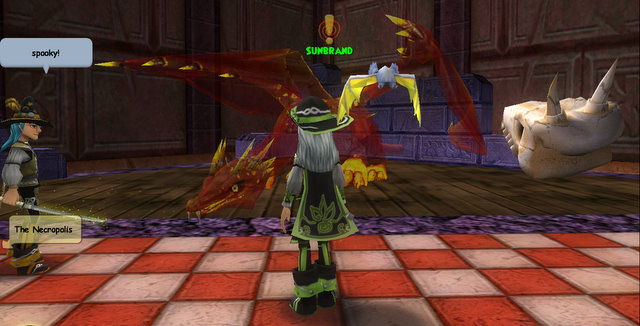
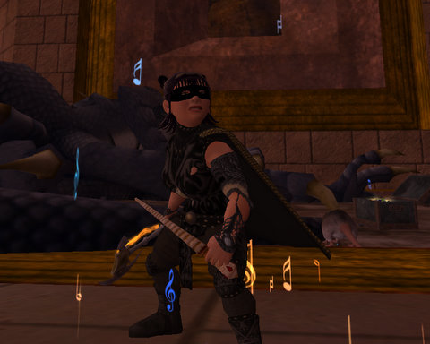
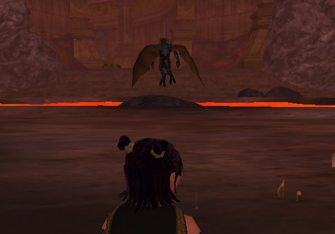
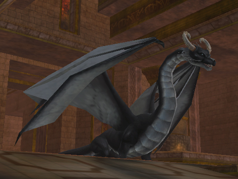

# EQ2: Dragon Wars

  
*This isn't Veeshan's Peak. That's Thomas Lionblood, the Friendly Necromancer, on the left, though.*

If your MMO doesn't have dragons in it, it's just not a fantasy MMO, is it? You can take out wizards and plucky farm boys and enchanted princesses and evil kings and all that, but if you lose the dragons, well, you've lost me as a player.

There's just a deep need inside every person to seek out a dragon, and then kill it. Be the dragon killer -- be a hero.

There's got to be a self-help book about that. "Slaying the Dragons in your Life". [OMG there IS](http://www.amazon.com/Slaying-Dragon-Small-Steps-Great/dp/0060392185).

Proves my point, though.

Some of you may be wondering where the last of the Adventures in Monopoly: Darkfall arc is. Well, it's all set up on my dining room table, I have the story written, there's going to be some twists in the story that will be pretty fun, but -- last night was a Veeshan's Peak raid night and it went later than I thought. One of the things I really hated when I raided five or six nights a week was never having a chance to do *anything else*. I was never more disgusted with myself than when I was a full time raider.

So even though we raided Sunday and cleared three more dragons -- dragons required for eventual access to Trakanon's Lair, I didn't go. I signed up for three nights a week, and at least for myself, that's as much time as I can spend playing just one game.

Given all that, it was really, really satisfying to finally kill Nexona. We used the same strats as before, but this time, it just worked. When raids work, it's almost boring. Well, actually, it isn't all that thrilling for a support class like myself; my job is basically to keep my raid wide arcane resists up and to sing Perfection of the Maestro as often as I can, cast Jester on people that are about to cast a long-refresh spell, and help out on the shiny killing when needed. But it's great to be part of a team that is working together.

I don't remember what she dropped. I haven't been rolling on the armor patterns that drop, but since I haven't been doing enough TSO dungeons to gear up in the latest expansion, I should really start trying to get some.

Nexona's death opened up the second wing of Veeshan's Peak.

The first boss in the second wing is the Taskmaster. He oversees the work of an army of drudges as they continually mine away the cavern walls. He is so proud of his little trick he learned. He has the power to summon everyone in the entire zone to him. He follows that up with an area-of-effect snare, and then, as you struggle to get away from him by slogging through waist-deep lava, he unleashes a devastating AE that takes away most of your health and leaves you with a DoT that drains the rest of it if the first blast didn't get you.

That one trick is all he has.

He doesn't cast his snare immediately after he ports the raid (well, not always. Sometimes he does). There's usually a couple of seconds where, if you run really fast, you can get out of range before he snares and DoTs you.

So that's the raid. Do as much damage as you can. When he ports you -- RUN. Wait for AE. Head back in and do more killing. Every 25% come some adds, so kill them, too.

It's harder than it sounds. We did pretty well Saturday, but failed to kill him. Sunday I skipped, but the raid apparently skipped him for awhile and went on to kill Hoshkar and two other dragons.

Last night we tried him again, and he died.

I'd love to think I had something to do with that, but probably it was, again, just learning how to work as a team. The real kudos likely belong to the healers who managed to keep everyone mostly vertical during the fight.

  
*Hey, look, EQ2 COMES with a screenshot button! Who needs FRAPS?*

I didn't realize FRAPS wasn't running for most of the night, so there's no pictures of the engineer dragon who finished the second floor, or the dragon(s?) that came before Silverwing in the third wing.

Silverwing, though -- that's a fun fight. Every so often -- every 10%, maybe? -- Silverwing goes invulnerable. One person in the raid is singled out and has to find a statue only they can see, and deactivate it, making Silverwing vulnerable again.

It's not that hard to find the statue, but it's hard to click it when little sparks keep hitting you -- unless you have deactivated the obelisk nearby with the machine key taken from the workbench near the Taskmaster. Assuming you can reach your obelisk. They are archetype-specific, and the healer one is up on a ledge.

Poor healers :/

I was chosen twice. The first time, I found it easily enough, but kept getting interrupted and was eventually slain. The second time, all the obelisks were reprogrammed with the machine key, and after a couple of interruptions, I was able to make Silverwing vulnerable again.

Now that we know the drill, it shouldn't be that hard to kill her. We came close a couple of times, but the kinds of hitches that make raids go wrong, went wrong. She should die Thursday night, though, followed by Phara Dar, and I'll finally have been part of a raid force that cleared Veeshan's Peak in EverQuest 2.

Now, back in EverQuest, it was a little harder *cough*.

