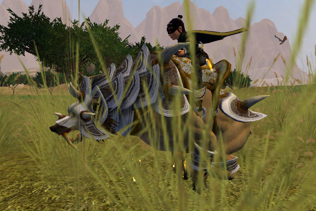

# EQ2: Setting Free the Bear

*Posted by Tipa on 2009-02-04 08:23:42*

We started Veeshan's Peak last night, but it didn't go all that well. We were supposed to clear up to the Taskmaster, and then finish it on Thursday. As the night wore on, we were just going to clear up past Nexona. And then at the end, we would have been happy to just have Druushk dead before we finished for the night.

We couldn't even do that. Druushk hasn't been a problem for awhile. Why last night? It seemed like a fairly low attendance night. Were people skipping the first night of VP? I don't know. But Thursday, we start in on Druushk again, and I hope we're back to form and we just get her dead. Kasul needs his Mythical, and it would be wonderful to have a second Mythical in Nostalgia.

I don't think it's too much of a spoiler to say that Bear gets a little time off the Monopoly board in tonight's Adventures in Monopoly. He just looks so HAPPY to be free. This is entirely unlike Bear -- he should be shaking down the merchants at the Crossroads, but instead he runs around madly like the newest cub.

I'd never redeemed my dire bear mount from the Shadow Odyssey box because, hey, I'm a bard. Who needs HELP running? Little streamlined halfling of swiftness, I am. Even Bear was a little confused until I explained my plan to him. And then he got really excited.

I haven't been watching the Station Marketplace lately. They have a couple new armor sets in there now. I quite like the one with the huge oversized wizard hat. Could there be new appearance armor in my future? Unlikely. I worked for a long time to get my current set. It would have to be something pretty darn unique to get me to switch, and the thing about these new armors is that they look okay, but there's nothing about them that will get people turning to stare at you as you run past.

| 
 | 

 | 

 |

| 
 | 

 | 

 |

| 
 | 

 | 
 |

