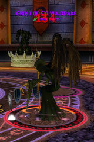
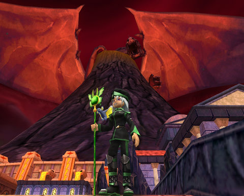
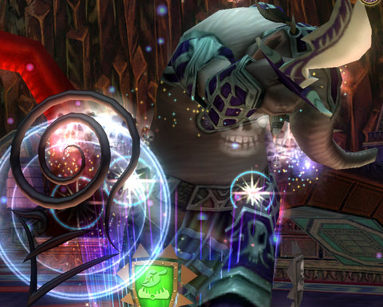
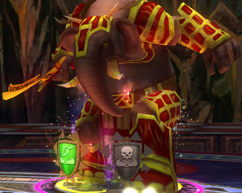
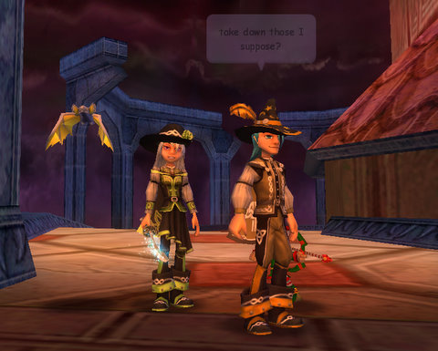
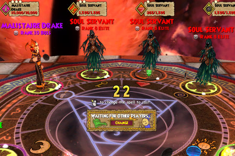
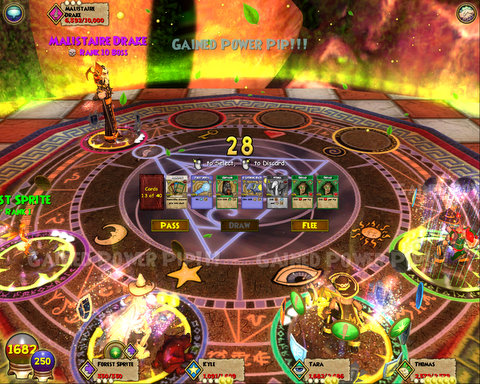
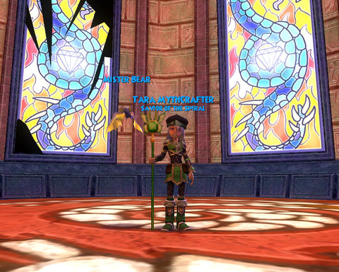
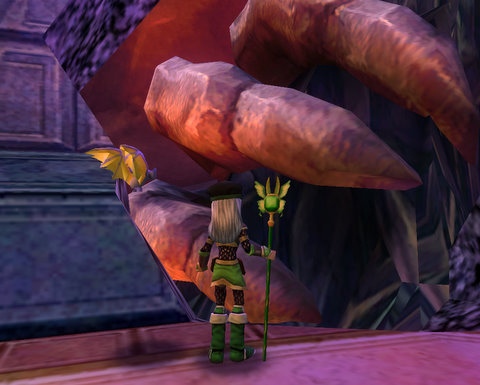
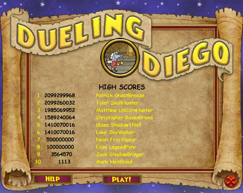

# Wizard 101: Crown of Fire

*Posted by Tipa on 2009-02-10 08:32:31*

Malistaire death number one, and counting. Killing Malistaire with the quest to kill him might actually just give you his robe; last night, [Thomas](http://thefriendlynecromancer.blogspot.com/) got his, while his son's character got a balance robe (not sure if it was the one Balance wizards would get), and I got an athame off of him. So either you get your robe first time, or the chances are even worse than I thought.

This wasn't my run, though -- it was Thomas'. I was just along for the ride as we brought the story that started in Wizard City so long ago to its end. The tragic tale of a Death magic professor who was so torn up by the death of his wife, Sylvia, that he turned five worlds upside down to bring her back to life.

I first met Sylvia Drake in the Necropolis. She wasn't doing well; her spirit had been twisted into a dark wraith who nonetheless used Life magic, which made it more of an epic battle than I had expected. Nonetheless, I managed to defeat her while she cackled all the time about how happy she was that her dear hubby had brought her back to enjoy this warped existence.

Malistaire's brother, Cyrus, was deeply disturbed by this news. He had no idea that Malistaire was capable of doing such a horrible thing to the woman he loved. My only mission was now to find Malistaire and defeat him before he could unleash the Dragon Titan, the immense beast who perches atop Dragonspyre and whose armies devastated the ancient school of magic, and in trying to bring true life back to his wife, destroy everything, everywhere, forever.

This job, of course, the job of staving off ultimate destruction, is best left to neophyte Ravenwood students because... hmmm.... okay, I GUESS Cyrus Drake can't help, but there are plenty of other Ravenwood professors who could battle Malistaire, right? Though if they were all as wimpy as Cyrus and Malistaire turned out to be, maybe we students are better wizards than we think.

  
*The Dragon Titan*

I'm not far enough in my progress through Dragonspyre to face Malistaire on my own; I'm in a place called the Crucible, killing bunches and bunches of minotaurs and drakken as part of the Dragonspyre Academy admission process.

But Thomas invited me along (well, invited my Sprite Guardian who is madly in love with him to come along; he needed me to summon her and then I could just paint my nails or something) to take on the final instance, and there's no way I could refuse.

After a couple trash fights, we met the Gurtok Piercer. This guy drops class-based athames. This was the second time I killed him, and once I got a Balance athame and this time, a Death athame. He always seems to drop an athame, it does seem that you have to kill him multiple times to get your own.

Next up: The Gurtok Firebender. Firebender? Like, from the Fire Nation? This guy supposedly drops class-based rings, but I can't confirm that. I've killed him twice, and both times he has dropped a classless level 50+ ring of some type. I wonder if the information on Wizard 101 Central is out of date? Because some things don't seem to match up. Here's the ring he dropped for me last night, compared to the one I am wearing:

After the Firebender died, we detoured through the Howling Cave where we defeated an encounter that I failed at solo last weekend and opened the way to the third of three crystal stands that must be activated simultaneously. I'm not sure they have to done at the same moment, because I'm pretty sure we didn't. Nonetheless, activating the three of them with the three of us unlocked the door to the Crown of Fire, the ultimate zone of Dragonspyre.

  
*Thomas and I just inside the Crown of Fire*

First battle is actually two separate fights of Rank 8 ice wraiths that must be completed at around the same time. Thomas took on one while I and the other wizard took the other. The fights were easy. We dealt our killing blows at around the same time and unlocked the doors to Malistaire's chamber.

  
*The bad guys (note huge dragon titan eye watching from behind)*

Malistaire was protected by a shield of force summoned by a group of nasty looking death wizards. I love Death-based mobs. The one sort of monster Life wizards can do severe damage on. Love love love fighting those. These last encounters are all death mobs. Not so much fun for Thomas "Where's My PRISM?" Lionblood, but a walk in the park for me.

Anyway, we defeated them quickly and then moved on to confront Malistaire himself. Since our first day at Ravenwood, we'd been following his trail of destruction to this place. Now he'd pay for all he'd done.

  
*The good guys*

Cyrus Drake appeared at that moment, accompanied by the now-cleansed spirit of Sylvia Drake, and both implored Malistaire to stop his mad scheme to bring the Dragon Titan back to full wakefulness when there is no hope that it could ever be controlled. Malistaire accused Cyrus of casting an illusion of Sylvia to torment him and cast him out.

It would be up to us to defeat him. At 10,000 health, Malistaire was the most imposing boss I'd ever fought, but he didn't really fight that hard.

When it was all over, Sylvia returned, and led Malistaire off to his final reward, the lovers united in death.

Me, I ran around taking pictures.

  
*With the title from killing Malistaire, in front of some broken windows*

  
*Through the windows of the Crown of Fire, you can see bits and pieces of the Dragon Titan -- here, an immense claw*

This isn't related to our adventures in Dragonspyre, but does anyone besides me think the high score list in Dueling Diego just might be borked? Software bug or just massive cheating? I don't know!

