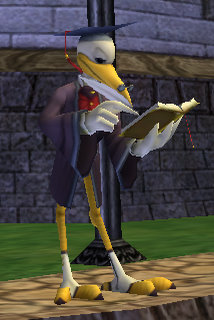

# Wizard 101: World beyond Dragonspyre due out in summer

Professor Greyrose of the Ravenwood faculty confirmed that there would be [a new world to explore this summer](https://www.wizard101.com/site/posts/list/3524.ftl), and that it would raise the level cap beyond level 50.

> As you adventure through Dragonpsyre, you will be able to complete quests and receive amazing new items. Once you reach level 50, you will not be able to gain more experience. However, you will be able to advance beyond level 50 when we move into the summer semester at Ravenwood.

My guess? A bird world, which would be home to the relatives of Gamma and Mr. Lincoln. Perhaps in the branches of a giant, giant tree.... We'll find out this summer if we'll be moving into Grizzleheim or Celestia next.

What I really want to know is, how do they use their wings and fly with all those robes and hats? Wouldn't the drag be a deal killer?

I do hope that whichever the next world is, they make the fights less tedious. As the health of the mobs spiral, our damage really hasn't. I got my last damage spell, the centaur, way back midway through Marleybone. When the level 48 spells are released, mine will be a group-wide heal and absorb shield, which is nice, but won't help me solo at all.

There's a great thread about [the possible sixth world, Celestia](http://www.wizard101central.com/forums/showthread.php?t=5255), over at [Wizard 101 Central](http://www.wizard101central.com/).

I know, haven't finished Dragonspyre (on my own) yet, and already looking forward to the next world. come on, appearance slots and player owned and decorated islands!
