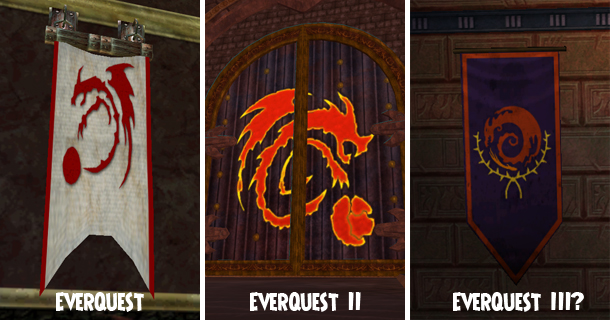
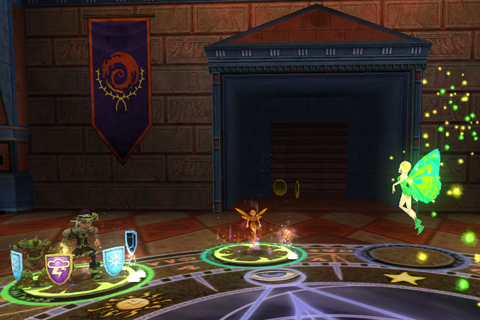
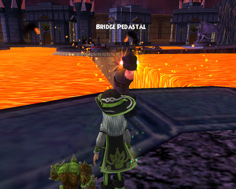

# The clandestine Norrath/Dragonspyre connection

Norrath, the planet itself, wasn't discovered by humans or elves or iksar or the ancient snake people or even the gods. It was discovered by the great she-dragon Veeshan, who chose this nondescript planet on which to raise her brood. She marked the planet with a swipe of her claws, claiming it as her own to all who could read her sign.

Her brood, the First, and all their many descendants chose that event as their emblem, until the time when the awakened Sleeper, Kerafrym, tore the moon of Luclin apart, and in defiance of Veeshan, chose for his symbol, himself, curled in the same way, bursting the moon. Veeshan may have been content to leave her mark on some forgotten frozen continent, but Kerafrym's mark would be laid across the entire SKY.

Those are the first and second pictures above; Veeshan on the left, Kerafrym in the middle, in EverQuest and EverQuest II respectively.

So, who is that in the THIRD picture, with nearly the exact same symbol? Veeshan? Some other dragon from Norrath's future?

Nope, the picture was taken in Wizard 101's Dragonspyre. I saw that last night while finishing my Crucible quests that grant me admittance to Dragonspyre Academy, and was so overjoyed to see a little bit of home in the game. Homage or coincidence? I don't know, but I loved to see it there.

Made me happy.

I dinged 50 (yay!) and started in on the Labyrinth last night -- a zone with eight boss fights in a row. The first two are Life bosses. After the first one, I gave up for the night, it was getting late. Those Life bosses are a real chore, not fun at all. Why can't all bosses be from the Death school?

