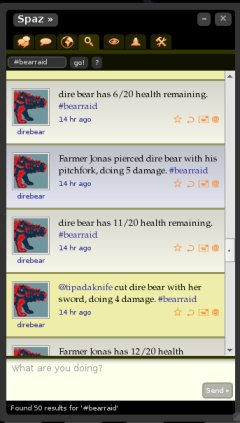

# #bearraid: Revenge of the Bear

*Posted by Tipa on 2009-02-23 08:16:32*

Based on last week's run-through of the very bare beginnings of still-very-fluid Twitter RPG, I rewrote the entire thing from scratch. It has very solid underpinnings now. The timeline loop -- rock solid. Fights with multiple monsters and players worked fine, though it was somewhat chaotic and I was having trouble keeping track of every actor's health without the handy visual aid of health bars to keep me informed.

The first issue? The game was TOO FAST. Seriously. I had to keep slowing it down, finally slowing it to a twentieth of its initial speed, so that someone following the fight on Twitter wouldn't have to keep refreshing their Twitter client to see it. The rate the fight progresses should be about the same rate a Twitter client would refresh.

This issue became yet more serious when I found out Twitter, not surprisingly, limits the number of tweets you can send out in an hour to 100. There's no way I can guarantee that this limit won't be exceeded except by basically running the fight internally, then spacing out the fight's log evenly over how long it would take not to exceed this limit. While this would eliminate the long pauses where everyone is waiting for their next turn, it would mean you would set up your action and reactions to the fight before the fight, then the fight would happen, and then you would be given the rewards -- but you would not have any real-time control over the fight itself.

This might not actually be a bad thing, given that the fights have to be slow enough to deal with Twitter's limitations. As long as setting up the fight was fun, and the rewards were fun, and reading how the fight went was fun.

Which... brings up the second issue. What you're reading on the right is my last run of #bearraid before I took it offline last night. It's a combat log. That's all it is.

I was doing a postmortem of the whole thing with my guildy Kasul, explained to him my disappointment with Twitter's limits and the non-excitement of reading combat logs, and we came up with a couple of ideas. This is why it's really important to get feedback really early (and, Kasul, be brutal if you have to. If this game isn't fun, it's nothing).

We decided it needed a sense of place. Right now, the combat takes place in a vacuum. Where are they? You don't know. Why are they fighting? A mystery.

A couple of things we can do right off. When you miss, you shouldn't just miss. Your tripped over a rusting gear, buried halfway in the ground. A swinging pendulum deflected your blow. Your opponent ducked behind the remains of a broken wall. Something appropriate for the environment.

Suddenly, you're no longer floating in space. You're fighting amongst the ruins of a factory.

Adding in the actions and reactions will give the actors some personality as well. When you're low on health, I'll heal you. But no, I'm out of action points so I'll comfort you with some soft words instead. Giving your character some of the player's personality will make them seem slightly less like bots.

But what this game really needs to turn it from a combat log into something fun, is a STORY. A progression of encounters that, completed successfully, bring you through a story. Perhaps, like Wing Commander, even if you lose a battle, that just brings you to a different branch of the story. Depending how you do, how you tune your character and who else fights alongside you, depends how the story ends.

Now, that game is starting to sound a little fun. A lot of work still, more work than I started with, but it's all about the fun and telling a fun story.

Follow @direbear on Twitter, or search on #bearraid, or both. to keep up to date on what's happening with the game. If you would be willing to be occasionally spammed and would like to participate in some battles, send me your Twitter ID and you'll soon be in the fray.

There will be a web component where players can personalize their character and choose their battles, but that's not even going to start until the battles themselves are fun to watch.

