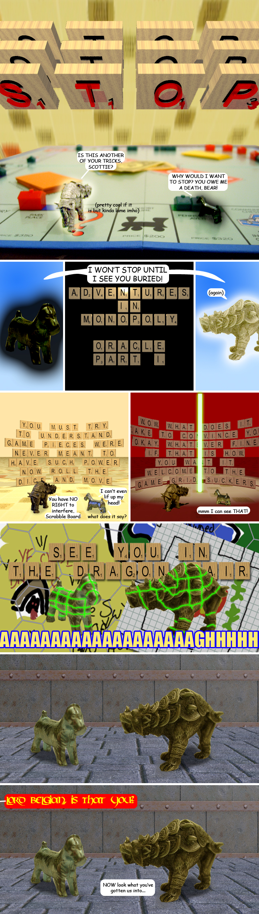
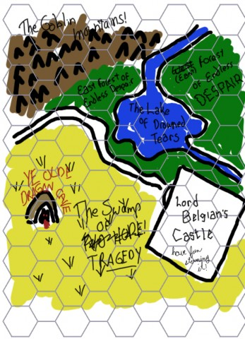

# Adventures in Monopoly: Oracle, Part I

*Posted by Tipa on 2009-03-01 17:00:59*

When we left our intrepid band, Scottie and Bear were about to rip each other to shreds. Scottie was still a little hurt because Bear, having killed him, forced him to live a life of undeath. Bear was angry that Scottie and Car had stranded him on Boardwalk, which had suddenly sprung a Casino Hotel. From its throne in the mysterious Game Closet, the Scrabble board heard the tumult and descended to the Prime Playing Plane to mediate between the two and urge them to get back to buying and selling real estate, like proper Monopoly playing pieces.

---

This was a fun comic. I had trouble figuring out a good way to get Scottie and Bear interacting with the Scrabble board, so I decided to render the Scrabble tiles in POVRay, and I wrote a script in Python to place them. Each time I did a new panel, I worked on the script more, and so every panel where you see Scrabble tiles, they look closer to a real tile. In the last panel that they appear, I think it would be hard to tell they weren't real tiles.

The dungeon is also rendered. I found a dungeon pack for POVRay, but I couldn't figure out how to use it, so I found some likely textures on the web and tossed a wall and a floor up with appropriate height fields so that had some texture to them.

I was talking to someone last night when I got the idea to use TRON to take Bear and Scottie into the dungeon, where I wanted them. Next week, they will meet a new enemy -- and a new friend -- and they will learn how to work together. In Part III, we'll meet the dragon, and if we're really lucky -- Lord Belgian himself!

Here's the world map you can see part of in the third to last panel. 

