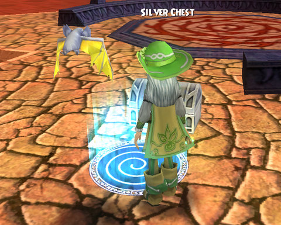
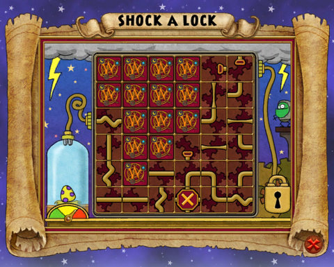
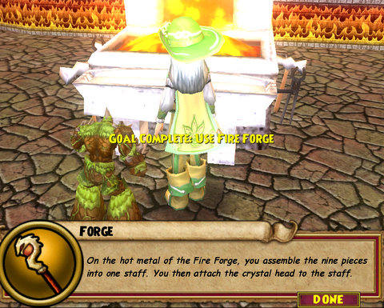

# Wizard 101: Opening Silver Chests

*Posted by Tipa on 2009-03-05 06:46:30*

Has it ever happened to you? You're skipping merrily along some barren Dragonspyre (or Marleybone) street, and you see a sparkling silver chest sitting there in the road or behind a tower. You open it and are transported to a new mini-game that is over before you've figured out what to do?

What the heck do you do with them?

In many ways, this puzzle is like the train mini-game that everyone knows and loves as the easiest way to refill potion bottles, except here, instead of just rotating the tiles, you are sliding them around.

After a few seconds pause, the spark will come from the plug on the left and slowly travel among the connections until it reaches a dead end, or the plug on the upper right, which will shock open the box.

You make connections by clicking on one tile, and then click on any other flipped tile to swap them..

If you need more time, try to make a loop for the spark to stay in while you make the rest of the connections. If you can do this, you can take all the time you need to solve the puzzle and open the chest.

What's inside? Find a silver chest, practice your shocking skills and find out!

I have finally managed to kill enough spiders to have the crystal for my dragonrider staff forged, and I fashioned the staff itself at the forge in the Fire school in Dragonspyre Academy. After a perilous and solo climb through a tower to obtain the Last Dragon Egg, I am now off to find a crystal hammer with which to tap the egg just lightly enough so that my baby drake can claw its way out.

I imagine I will be sent to fight through various towers many more times to get some knickknack or other for my drake before I am allowed to ride it to meet Malistaire. But the end is in sight!

