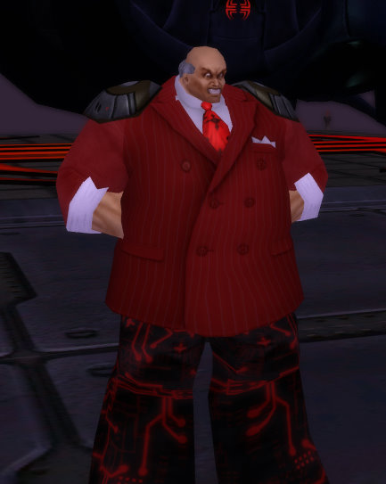

# The League of Cruelty presents: Rush O Mon

*Posted by Tipa on 2009-03-08 11:45:51*

Name: Rush O Mon

Power: Rush O Mon uses the power of his voice, transmitted and amplified by the twin stereo transmitters on his shoulders, to attack and defeat his many opponents.

Weaknesses: Various addictions, powerful ego.

Supergroup affiliation: Leader and prophet of the Dittoheads. He has also taken shadow control of the minority governing party.

Gotta love character creators.

